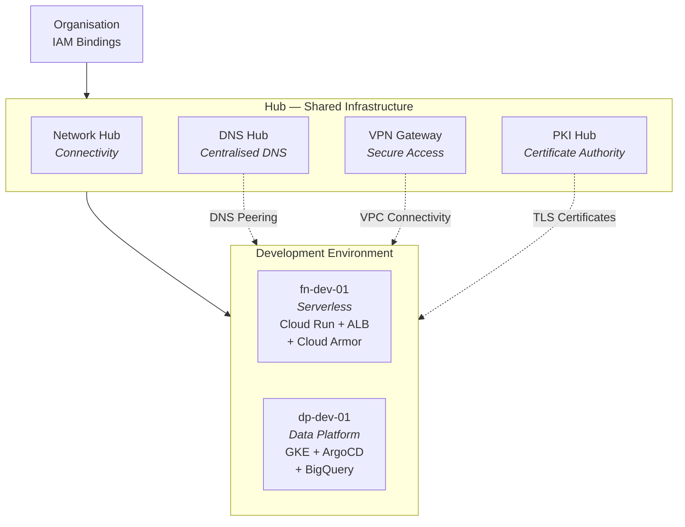

# Terragrunt GCP Organisation Automation

This repository manages Google Cloud Platform (GCP) infrastructure using Terragrunt and OpenTofu, following a hub-and-spoke architecture with hierarchical, template-based configuration.

## Workflow Status

[](https://github.com/example-org/terragrunt-gcp-org-automation/actions/workflows/terragrunt-main-engine.yml)
[](https://github.com/example-org/terragrunt-gcp-org-automation/actions/workflows/manage-compute-instance.yml)
[](https://github.com/example-org/terragrunt-gcp-org-automation/actions/workflows/manage-sql-instance.yml)
[](https://github.com/example-org/terragrunt-gcp-org-automation/actions/workflows/manage-gke-cluster.yml)
[](https://github.com/example-org/terragrunt-gcp-org-automation/actions/workflows/upload-vm-scripts.yml)

## Table of Contents

- [Overview](#overview)
- [Architecture](#architecture)
- [Repository Structure](#repository-structure)
- [Quick Start](#quick-start)
- [Essential Commands](#essential-commands)
- [Template System](#template-system)
- [Documentation](#documentation)
- [CI/CD Workflows](#cicd-workflows)
- [Development Best Practices](#development-best-practices)
- [References](#references)

## Overview

This infrastructure-as-code repository implements a hierarchical configuration approach for managing GCP resources across multiple environments. It uses:

- **OpenTofu v1.9.1** (Terraform alternative) as the infrastructure provisioning engine
- **Terragrunt v0.80.2** for configuration management and DRY infrastructure code
- **31 reusable templates** for standardised resource configuration
- **Hub-and-spoke architecture** with centralised DNS, networking, PKI, and VPN
- **Two sub-environment patterns** demonstrating serverless and data platform architectures
- **GitHub Actions** for automated CI/CD workflows with dependency-aware execution

> **Note**: This repository uses `root.hcl` instead of `terragrunt.hcl` as the root configuration file.

## Architecture

### Hub-and-Spoke Model



- **DNS Hub** — Centralised DNS resolution with forwarding and peering
- **Network Hub** — Shared network connectivity
- **PKI Hub** — Certificate Authority Service for private TLS certificates
- **VPN Gateway** — Secure access to cloud resources
- **Development** — Two sub-environment patterns:
  - **functions (fn-dev-01)** — Serverless Cloud Run pattern with ALB and Cloud Armor
  - **platform (dp-dev-01)** — Data platform with private GKE, ArgoCD, and BigQuery

### Configuration Hierarchy

```
root.hcl → account.hcl → env.hcl → project.hcl → region.hcl
```

Each level adds progressively more specific configuration, merged via `_common/base.hcl`.

### IP Allocation

| Project | VPC CIDR | PSA Range | GKE Master |
|---------|----------|-----------|------------|
| vpn-gateway | 10.11.0.0/16 | — | — |
| fn-dev-01 | 10.20.0.0/16 | 10.20.200.0/24 | — |
| dp-dev-01 | 10.30.0.0/16 | 10.30.200.0/24 | 172.16.0.48/28 |

## Repository Structure

```
terragrunt-gcp-org-automation/
├── _common/                           # Common configurations
│   ├── base.hcl                       # Centralised hierarchy reader
│   ├── common.hcl                     # Shared variables and module versions
│   ├── providers.hcl                  # Provider configuration
│   └── templates/                     # 31 reusable resource templates
├── docs/                              # Detailed documentation (40 guides)
├── scripts/                           # Helper scripts
├── .github/
│   ├── workflows.disabled/            # CI/CD workflows (enable by moving to workflows/)
│   ├── actions/                       # Composite GitHub Actions
│   ├── scripts/                       # Workflow support scripts
│   ├── workflow-config/               # Resource type definitions
│   └── CODEOWNERS                     # Review requirements
├── live/
│   └── non-production/                # Account level
│       ├── account.hcl                # Account-wide variables
│       ├── org-iam-bindings/          # Organisation-level IAM
│       ├── hub/                       # Shared infrastructure
│       │   ├── dns-hub/               # Centralised DNS
│       │   ├── network-hub/           # Network connectivity
│       │   ├── pki-hub/               # Certificate Authority Service
│       │   └── vpn-gateway/           # VPN access
│       └── development/               # Development environment
│           ├── env.hcl
│           ├── folder/
│           ├── folder-iam-bindings/
│           ├── functions/             # Serverless pattern
│           │   └── fn-dev-01/             # Cloud Run + ALB + Cloud Armor
│           └── platform/              # Data platform pattern
│               └── dp-dev-01/             # GKE + ArgoCD + BigQuery
├── root.hcl                           # Root configuration
├── QUICKSTART.md                      # Quick start guide
└── CLAUDE.md                          # AI assistant instructions
```

## Quick Start

1. **Bootstrap Infrastructure (Recommended)**
   ```bash
   # Clone the repository
   git clone https://github.com/example-org/terragrunt-gcp-org-automation.git
   cd terragrunt-gcp-org-automation

   # Run the bootstrap script to set up foundational infrastructure
   ./scripts/org-bootstrap.sh

   # This creates:
   # - GCP Folder: org-bootstrap
   # - GCP Project: org-automation
   # - Service Account: tofu-sa-org with organisation-level permissions
   # - State Bucket: org-tofu-state
   # - Billing Bucket: org-billing-usage-reports

   # Set up authentication
   export GOOGLE_APPLICATION_CREDENTIALS="$HOME/tofu-sa-org-key.json"
   source scripts/setup_env.sh
   ```

2. **Manual Setup (Alternative)**

   Prerequisites: OpenTofu >= 1.9.1, Terragrunt >= 0.80.2, Google Cloud SDK

   ```bash
   source scripts/setup_env.sh
   export GOOGLE_APPLICATION_CREDENTIALS="/path/to/service-account-key.json"

   # Deploy in dependency order:
   # 1. Folder → 2. Project → 3. VPC Network → 4. PSA → 5. Resources
   cd live/non-production/development/folder
   terragrunt init && terragrunt apply
   ```

For detailed instructions, see [Bootstrap Guide](docs/BOOTSTRAP.md), [QUICKSTART.md](QUICKSTART.md), and [GCP Authentication](docs/GCP_AUTHENTICATION.md).

## Essential Commands

```bash
# Navigate to resource directory first
cd live/non-production/development/platform/dp-dev-01/resource

# Standard workflow
terragrunt init
terragrunt plan
terragrunt apply

# Common flags
terragrunt plan --terragrunt-non-interactive
terragrunt apply --auto-approve

# Pre-commit hooks
./scripts/setup-pre-commit.sh
pre-commit run --all-files

# Resource dependency analysis
python scripts/parse_resource_order.py

# Manual workflow execution
gh workflow run manage-compute-instance.yml --field action=deploy --field instance=project/instance
gh workflow run manage-sql-instance.yml --field action=deploy --field instance=project/instance
gh workflow run manage-gke-cluster.yml --field action=deploy --field cluster=project/cluster
```

## Template System

### Base Configuration

The `_common/base.hcl` file centralises hierarchy reading. Include it with `expose = true` to access merged configuration from all levels:

```hcl
include "base" {
  path   = "${get_repo_root()}/_common/base.hcl"
  expose = true
}
# Access via: include.base.locals.merged, include.base.locals.standard_labels
```

### Available Templates (31)

All templates live in `_common/templates/` and module versions are centralised in `_common/common.hcl`.

| Category | Templates |
|----------|-----------|
| **Infrastructure** | `folder.hcl`, `project.hcl`, `network.hcl`, `private_service_access.hcl` |
| **Compute** | `compute_instance.hcl`, `instance_template.hcl`, `gke.hcl` |
| **Networking** | `cloud-router.hcl`, `cloud-nat.hcl`, `external_ip.hcl`, `internal_ip.hcl`, `firewall_rules.hcl`, `vpc_peering.hcl`, `ncc.hcl` |
| **Serverless** | `cloud-run.hcl`, `cloud_armor.hcl` |
| **Storage** | `cloud_storage.hcl`, `bigquery.hcl`, `artifact_registry.hcl` |
| **Database** | `cloud_sql.hcl`, `cloud_sql_postgres.hcl` |
| **DNS** | `cloud_dns.hcl`, `cloud_dns_peering.hcl` |
| **Security** | `secret_manager.hcl`, `iam_bindings.hcl` |
| **IAM** | `org_iam_bindings.hcl`, `folder_iam_bindings.hcl`, `service_account.hcl`, `workload_identity.hcl` |
| **PKI** | `certificate_authority_service.hcl`, `certificate_manager.hcl` |

### Template Usage Pattern

```hcl
include "root" {
  path = find_in_parent_folders("root.hcl")
}

include "base" {
  path   = "${get_repo_root()}/_common/base.hcl"
  expose = true
}

include "template_name" {
  path           = "${get_repo_root()}/_common/templates/template_name.hcl"
  merge_strategy = "deep"
}

dependency "project" {
  config_path = "../project"
  mock_outputs = {
    project_id = "mock-project-id"
  }
  mock_outputs_allowed_terraform_commands = ["validate", "plan", "init"]
}

inputs = {
  project_id = dependency.project.outputs.project_id
  # resource-specific inputs...
}
```

## Documentation

### Getting Started

| Document | Description |
|----------|-------------|
| [Bootstrap Guide](docs/BOOTSTRAP.md) | Automated GCP foundation setup |
| [OpenTofu Setup](docs/OPENTOFU_SETUP.md) | OpenTofu installation and configuration |
| [GCP Authentication](docs/GCP_AUTHENTICATION.md) | Service account authentication |
| [Root Configuration](docs/ROOT_CONFIGURATION.md) | root.hcl configuration details |
| [Architecture Summary](docs/ARCHITECTURE_SUMMARY.md) | High-level architecture and design decisions |
| [Architecture Diagram](docs/ARCHITECTURE_DIAGRAM.md) | Visual infrastructure diagrams |

### Environment Guides

| Document | Description |
|----------|-------------|
| [Development Infrastructure](docs/DEVELOPMENT_INFRASTRUCTURE.md) | Development environment with two sub-environments |
| [Network Architecture](docs/NETWORK_ARCHITECTURE.md) | VPC design, subnets, and connectivity patterns |
| [IP Allocation](docs/IP_ALLOCATION.md) | CIDR allocation across all projects |
| [GitOps Architecture](docs/GITOPS_ARCHITECTURE.md) | ArgoCD and GitOps workflow patterns |

### Template Guides

| Document | Description |
|----------|-------------|
| [Configuration Templates](docs/CONFIGURATION_TEMPLATES.md) | Overview of the template system |
| [Folder Template](docs/FOLDER_TEMPLATE.md) | GCP folder creation |
| [Project Template](docs/PROJECT_TEMPLATE.md) | Project Factory module |
| [Network Template](docs/NETWORK_TEMPLATE.md) | VPC network configuration |
| [Private Service Access](docs/PRIVATE_SERVICE_ACCESS_TEMPLATE.md) | Private connectivity for managed services |
| [Compute Template](docs/COMPUTE_TEMPLATE.md) | Compute instances and instance templates |
| [GKE Template](docs/GKE_TEMPLATE.md) | Private GKE clusters with ArgoCD bootstrap |
| [Cloud Run Template](docs/CLOUD_RUN_TEMPLATE.md) | Serverless Cloud Run services |
| [Cloud SQL (MSSQL)](docs/SQLSERVER_TEMPLATE.md) | SQL Server instances |
| [Cloud SQL (PostgreSQL)](docs/CLOUD_SQL_POSTGRES_TEMPLATE.md) | PostgreSQL instances |
| [BigQuery Template](docs/BIGQUERY_TEMPLATE.md) | BigQuery datasets |
| [Buckets Template](docs/BUCKETS_TEMPLATE.md) | Cloud Storage buckets |
| [Artifact Registry](docs/ARTIFACT_REGISTRY_TEMPLATE.md) | Container image and package registries |
| [Cloud DNS](docs/CLOUD_DNS_TEMPLATE.md) | DNS zones and records |
| [Cloud DNS Private Zones](docs/CLOUD_DNS_PRIVATE_ZONES.md) | Private DNS zone patterns |
| [Cloud Armor](docs/CLOUD_ARMOR_TEMPLATE.md) | WAF security policies |
| [Certificate Manager](docs/CERTIFICATE_MANAGER_TEMPLATE.md) | Managed TLS certificates |
| [CAS / PKI](docs/CAS_PKI.md) | Certificate Authority Service |
| [Secrets Template](docs/SECRETS_TEMPLATE.md) | Secret Manager resources |
| [IAM Bindings](docs/IAM_BINDINGS_TEMPLATE.md) | Project-level IAM |
| [Org IAM Bindings](docs/ORG_IAM_BINDINGS_TEMPLATE.md) | Organisation-level IAM |
| [Service Accounts](docs/SERVICE_ACCOUNTS_TEMPLATE.md) | Service account management |
| [Workload Identity](docs/WORKLOAD_IDENTITY_TEMPLATE.md) | Workload Identity Federation for GKE |
| [VPC Peering](docs/VPC_PEERING_GUIDE.md) | VPC peering configuration |
| [VPC Peering & VPN](docs/VPC_PEERING_AND_VPN_GATEWAY.md) | Combined peering and VPN patterns |
| [NCC & VPN Gateway](docs/NCC_AND_VPN_GATEWAY.md) | Network Connectivity Center |

### Operations

| Document | Description |
|----------|-------------|
| [GitHub Workflows](docs/WORKFLOWS.md) | CI/CD automation and workflow guide |
| [Module Versioning](docs/MODULE_VERSIONING.md) | Centralised module version management |
| [Secret Management](docs/SECRET_MANAGEMENT.md) | Secret management best practices |
| [Web Server Example](docs/WEB_SERVER_EXAMPLE.md) | Compute instance deployment example |

## CI/CD Workflows

Workflows are located in `.github/workflows.disabled/`. Move to `.github/workflows/` to activate.

### Main Engine

The **Terragrunt Main Engine** (`terragrunt-main-engine.yml`) orchestrates infrastructure deployment:
- Detects changed resources automatically via `detect_changes.py`
- Respects dependency order across 30+ resource types (defined in `resource-definitions.yml`)
- Runs `plan` on PRs, `apply` on merge to main
- Parallel execution where dependencies allow

### Management Workflows

| Workflow | Purpose |
|----------|---------|
| `manage-compute-instance.yml` | Deploy/destroy compute instances |
| `manage-sql-instance.yml` | Manage SQL Server instances |
| `manage-gke-cluster.yml` | Manage GKE clusters |
| `upload-vm-scripts.yml` | Deploy VM scripts to GCS buckets |

### Supporting Files

- `.github/actions/detect-infrastructure-changes/` — Composite action for change detection
- `.github/scripts/detect_changes.py` — Python-based change detection logic
- `.github/workflow-config/resource-definitions.yml` — Resource type definitions and dependencies
- `.github/CODEOWNERS` — Security review requirements for IAM changes

## Development Best Practices

### Infrastructure Development
1. **Always use Terragrunt** — never use terraform/tofu directly
2. **Check existing templates** in `_common/templates/` before creating resources
3. **Use `include "base"`** for consistent hierarchy reading
4. **Update module versions** centrally in `_common/common.hcl`
5. **Test with `terragrunt plan`** before applying
6. **Follow the dependency order**: Folder → Project → VPC → PSA → Resources

### Security
1. **Never commit secrets** — use Google Secret Manager
2. **Use dedicated service accounts** with least privilege
3. **Enable audit logging** for all projects
4. **Private networking** by default for databases and internal services
5. **SSL/TLS enforcement** for all database connections
6. **Pre-commit hooks** for secret detection and HCL formatting

### Code Quality
1. Run `pre-commit run --all-files` before committing
2. Use `parse_resource_order.py` to verify dependencies
3. Document significant changes in the appropriate `docs/` file
4. Follow established naming conventions (`org-` prefix for shared resources)

## References

- [Terragrunt Documentation](https://terragrunt.gruntwork.io/docs/)
- [OpenTofu Documentation](https://opentofu.org/docs/)
- [Google Cloud Documentation](https://cloud.google.com/docs)
- [terraform-google-modules](https://github.com/terraform-google-modules) — Official GCP modules
- [Gruntwork Reference Architecture](https://github.com/gruntwork-io/terragrunt-infrastructure-live-example)
