# GCP Infrastructure Architecture Diagram

This document contains the comprehensive architecture diagram for the GCP infrastructure managed by this repository.

## Overview

The diagram shows the complete infrastructure hierarchy from the GCP Organization level down to individual resources, including:

- **Organizational Structure**: GCP Organization, Billing Account, and Folder hierarchy
- **Account Structure**: Non-production account with development environment
- **Project Resources**: All services and resources within the dev-01 project
- **Network Architecture**: VPC networks, private service access, and firewall rules
- **Compute Infrastructure**: Linux and Windows server instances
- **Storage Services**: Cloud Storage buckets, BigQuery datasets, and Cloud SQL
- **Security Components**: Secret Manager, IAM bindings, and service accounts
- **Management Tools**: OpenTofu (Terraform) state storage

## Architecture Diagram

```mermaid
graph TB
    %% External Resources
    BillingAccount["💳 Billing Account<br/>org-billing-account"]
    AllowedIPs["🏠 Allowed IP Ranges<br/>• Office Network: 10.0.0.0/24<br/>• VPN Range: 192.168.1.0/24<br/>• Private Network: 172.16.0.0/16<br/>• Public Range: 203.0.113.0/24"]
    
    %% GCP Organization Container
    subgraph GCPOrg["🏢 GCP Organization<br/>ID: org-123456789012 | Domain: example-org.com"]
        
        %% Bootstrap Folder Structure
        subgraph BootstrapFolder["📁 Bootstrap Folder<br/>ID: folders/123456789012"]
        subgraph BootstrapProject["🗂️ GCP Project: org-automation"]
            
            %% Service Account
            OrgSA["🔧 OpenTofu Org Service Account<br/>tofu-sa-org@<br/>org-automation.iam.gserviceaccount.com"]
            
            %% Storage Buckets
            subgraph "🗄️ Bootstrap Storage"
                StateStorage["🏗️ Main Infrastructure State<br/>GCS Bucket: org-tofu-state<br/>Location: europe-west2"]
                BillingStorage["📊 Billing Usage Reports<br/>GCS Bucket: org-billing-usage-reports<br/>Location: europe-west2"]
            end
        end
    end
    
    %% Development Folder Structure
    subgraph DevelopmentFolder["📁 Development Folder"]
        subgraph Dev01Project["🗂️ GCP Project: dev-01"]
            
            %% Network infrastructure
            DevVPCNetwork["🌐 VPC Network<br/>vpc-network<br/>Region: europe-west2<br/>Subnet CIDR: 10.30.0.0/16"]
            
            %% Project Service Account
            DevProjectSA["🔧 Project Service Account<br/>non-production-dev-01-tf@<br/>dev-01.iam.gserviceaccount.com"]
            
            %% Network Security
            subgraph DevNetworkSecurity["🔒 Network Security"]
                subgraph "🛡️ Firewall Rules"
                    DevFirewallRules["🛡️ Access Rules<br/>• SSH (Port 22)<br/>• HTTP (Port 80)<br/>• HTTPS (Port 443)<br/>Target tags: linux-server, web-server"]
                end
                
                subgraph "🌍 External IPs"
                    DevLinuxServerIP["📍 Linux Server External IP<br/>dev-01-linux-server-01"]
                    DevWebServerIP["📍 Web Server External IP<br/>dev-01-web-server-01"]
                end
            end
            
            %% Storage services
            subgraph "🪣 Dev Cloud Storage"
                DataBucket["📦 Data Storage<br/>dev-01-data-bucket"]
                StaticContentBucket["🌐 Static Content<br/>dev-01-static-content"]
            end
            
            %% Database services
            subgraph "🗄️ Dev Database Services"
                DevCloudSQL["🗄️ Cloud SQL Server 2019<br/>dev-01-sql-server-main<br/>Zone: europe-west2-a<br/>Private Service Access"]
                DevBigQuery["📊 BigQuery Dataset<br/>analytics-dataset<br/>Location: EU"]
            end
            
            %% Compute Engine section
            subgraph "💻 Dev Compute Engine"
                DevLinuxServer["🐧 Linux Server VM<br/>dev-01-linux-server-01<br/>Zone: europe-west2-a<br/>Type: e2-micro"]
                DevWebServer["🌐 Web Server VM<br/>dev-01-web-server-01<br/>Zone: europe-west2-a<br/>Type: e2-medium<br/>Nginx web server"]
            end
            
            subgraph "🔐 Dev Secret Manager"
                DevAppSecrets["🔑 Application Secrets<br/>• app-secret<br/>• ssl-cert-email<br/>• ssl-domains"]
            end
            
            subgraph "🔐 Dev IAM Bindings"
                DevIAMBindings["👤 Service Account Permissions<br/>• Storage Object Admin<br/>• Secret Manager Accessor<br/>• Logging Writer<br/>• Monitoring Writer<br/>• Project-level Admin (TF SA)"]
            end
            
            %% Private Service Access
            DevPSA["🔒 Private Service Access<br/>servicenetworking.googleapis.com<br/>IP Range: 10.100.0.0/24"]
        end
    end
    
    %% End of GCP Organization
    end
    
    %% Dev Network connections
    DevVPCNetwork --> DevLinuxServer
    DevVPCNetwork --> DevWebServer
    DevVPCNetwork --> DevPSA
    DevPSA --> DevCloudSQL
    
    %% Dev Firewall connections
    DevFirewallRules --> DevVPCNetwork
    AllowedIPs --> DevFirewallRules
    
    %% Dev External IP connections
    DevLinuxServerIP --> DevLinuxServer
    DevWebServerIP --> DevWebServer
    
    %% Dev Secret connections
    DevLinuxServer --> DevAppSecrets
    DevWebServer --> DevAppSecrets
    
    %% Dev Storage connections
    DevLinuxServer --> DataBucket
    DevWebServer --> StaticContentBucket
    
    %% External connections
    BillingAccount --> GCPOrg
    
    %% Bootstrap connections
    OrgSA --> StateStorage
    OrgSA --> BillingStorage
    
    %% Dev Service Account connections
    DevProjectSA --> Dev01Project
    DevProjectSA --> DevIAMBindings
    
    %% Styling with high contrast text
    classDef orgLevel fill:#e1f5fe,stroke:#0277bd,stroke-width:3px,color:#000000
    classDef folderLevel fill:#f8f9fa,stroke:#495057,stroke-width:3px,color:#000000
    classDef bootstrapLevel fill:#e8f5e9,stroke:#2e7d32,stroke-width:2px,color:#000000
    classDef projectLevel fill:#f3e5f5,stroke:#7b1fa2,stroke-width:2px,color:#000000
    classDef devProjectLevel fill:#ffe0b2,stroke:#e65100,stroke-width:2px,color:#000000
    classDef computeLevel fill:#e8f5e8,stroke:#388e3c,stroke-width:2px,color:#000000
    classDef storageLevel fill:#fff3e0,stroke:#f57c00,stroke-width:2px,color:#000000
    classDef networkLevel fill:#fce4ec,stroke:#c2185b,stroke-width:2px,color:#000000
    classDef securityLevel fill:#ffebee,stroke:#d32f2f,stroke-width:2px,color:#000000
    classDef externalLevel fill:#f1f3f4,stroke:#5f6368,stroke-width:2px,color:#000000
    classDef serviceAccountLevel fill:#e8eaf6,stroke:#3f51b5,stroke-width:2px,color:#000000
    
    class GCPOrg orgLevel
    class BillingAccount externalLevel
    class BootstrapFolder,DevelopmentFolder folderLevel
    class BootstrapProject bootstrapLevel
    class Dev01Project devProjectLevel
    class OrgSA,DevProjectSA serviceAccountLevel
    class DevLinuxServer,DevWebServer computeLevel
    class DataBucket,StaticContentBucket,StateStorage,BillingStorage storageLevel
    class DevCloudSQL,DevBigQuery storageLevel
    class DevVPCNetwork networkLevel
    class DevAppSecrets,DevFirewallRules,DevIAMBindings,DevPSA securityLevel
    class AllowedIPs,DevLinuxServerIP,DevWebServerIP externalLevel
```

## Component Details

### Organizational Level
- **GCP Organization**: Top-level container (ID: org-123456789012) for example-org.com domain
- **Billing Account**: org-billing-account - Manages costs and billing for all projects
- **Allowed IP Ranges**: Specific IP addresses and ranges allowed through firewall rules

### Bootstrap Infrastructure
- **Bootstrap Folder**: Core infrastructure management folder (ID: folders/123456789012)
- **org-automation Project**: Central project for infrastructure automation
  - **OpenTofu State Bucket**: `org-tofu-state` - Stores Terragrunt/OpenTofu state files
  - **Billing Reports Bucket**: `org-billing-usage-reports` - Centralized billing data
  - **Organizational Service Account**: `tofu-sa-org@org-automation.iam.gserviceaccount.com` 
    - Organization-wide permissions for infrastructure management
    - Used by GitHub Actions workflows for CI/CD

### Infrastructure Management
- **Service Accounts**: Identity and access management for automation
  - **Organizational Service Account**: Organization-wide infrastructure operations via tofu-sa-org
  - **Development Project Service Account**: `non-production-dev-01-tf@dev-01.iam.gserviceaccount.com` - Project operations

### Development Project Resources
- **VPC Network**: Isolated network for development resources
  - Subnet CIDR: `10.30.0.0/16`
  - Region: `europe-west2`
- **External IPs**: Dedicated IPs for each compute instance
- **Compute Infrastructure**:
  - **Linux Server VM**: General purpose Linux server (e2-micro) in europe-west2-a
  - **Web Server VM**: Nginx web server (e2-medium) in europe-west2-a
- **Storage**:
  - **Data Bucket**: General application data storage
  - **Static Content Bucket**: Static web content hosting
- **Database Services**:
  - **Cloud SQL**: SQL Server 2019 instance with Private Service Access
  - **BigQuery**: Analytics dataset in EU region
- **Security & Secrets**:
  - **Application Secrets**: app-secret, ssl-cert-email, ssl-domains
  - **IAM Bindings**: Granular permissions for service accounts

## Key Architecture Patterns

### Folder Hierarchy
- **bootstrap**: Core infrastructure management and automation resources
- **development**: Development environment containing dev-01 project

### Network Security
- VPC network with private subnet (10.30.0.0/16)
- Firewall rules restrict access to specific IP addresses
- External IPs are assigned per instance for public access
- Private Service Access for Cloud SQL connectivity

### Security Model
- Dedicated service accounts for least privilege access
- Secrets stored in Google Secret Manager
- Tag-based firewall rules for granular control
- IAM bindings at both project and resource levels

### Storage Architecture
- **Cloud Storage Buckets**: 
  - data-bucket: General application data storage
  - static-content: Static web content hosting
- **BigQuery**: analytics-dataset for data warehousing
- **Cloud SQL**: sql-server-main for relational database needs
- Support for different storage classes and lifecycle policies

## Usage

This diagram can be viewed in any Markdown renderer that supports Mermaid diagrams, including:
- GitHub
- GitLab
- Markdown editors with Mermaid support
- Documentation sites (GitBook, Confluence, etc.)

To edit the diagram, modify the Mermaid code block above and the changes will be reflected in the rendered output.