# GCP Infrastructure Architecture Diagram

This document provides a comprehensive visual representation of the GCP infrastructure managed by this repository, with clear relationship indicators and simplified connections.

## Overview

The infrastructure implements a hierarchical architecture with:
- **Organizational Structure**: GCP Organization → Folders (Bootstrap, Hub, Development) → Projects
- **Hub Services**: VPN gateway, centralised DNS, network connectivity, and PKI
- **Platform (dp-dev-01)**: GKE clusters, VMs, SQL Server, ArgoCD — fully private, VPN-only access
- **Functions (fn-dev-01)**: Cloud Run services, Load Balancer, Cloud Armor, PostgreSQL — serverless pattern
- **Network Architecture**: Fully private VPCs with egress-only internet access via Cloud NAT
- **VPN Access**: Users connect to all development projects via hub VPN Gateway with VPC peering
- **Security Components**: Secret Manager, IAM bindings, firewall rules, and Certificate Authority

## Visual Conventions

| Arrow Colour | Zone | Meaning |
|:-------------|:-----|:--------|
| **🔵 Blue** | Internet | Traffic to/from the public internet |
| **🔴 Red** | Public edge | VPN tunnel and public-facing endpoints |
| **🟢 Green** | Fully private | Internal traffic that never leaves private VPCs |

| Shape | Meaning |
|:------|:--------|
| **(Rounded rectangle)** | All nodes use rounded shapes with bold borders |
| **Bold text** | All labels use bold text for readability |

## Complete Infrastructure Architecture

## Detailed Component Views

### Network Architecture Detail

### GitOps Architecture Detail

### Security Layer Detail

```mermaid
flowchart TD
    subgraph SecurityComponents["<b>Security Architecture</b>"]
        subgraph SecretsManagement["<b>Secrets Management</b>"]
            SM("<b>Secret Manager</b>")
            subgraph SecretTypes["<b>Secret Categories</b>"]
                GKE_SEC("<b>GKE Secrets<br/>• OAuth Tokens<br/>• Webhooks<br/>• Service Accounts</b>")
                APP_SEC("<b>App Secrets<br/>• SSL Certs<br/>• API Keys</b>")
                DB_SEC("<b>Database<br/>• Admin Password<br/>• DBA Password</b>")
            end
            SM ==> SecretTypes
        end

        subgraph AccessControl["<b>Access Control</b>"]
            IAM_BIND("<b>IAM Bindings</b>")
            SA("<b>Service Accounts</b>")
            RBAC("<b>GKE RBAC</b>")
        end

        subgraph NetworkSecurity["<b>Network Security</b>"]
            FW("<b>Firewall Rules</b>")
            PSA("<b>Private Service<br/>Access</b>")
            NAT_SEC("<b>NAT Gateway<br/>Security</b>")
        end
    end

    SecretsManagement -.-> AccessControl
    AccessControl ==> NetworkSecurity

    classDef secrets fill:#f8bbd0,stroke:#c2185b,stroke-width:3px,font-weight:bold,color:#000
    classDef access fill:#e1bee7,stroke:#7b1fa2,stroke-width:3px,font-weight:bold,color:#000
    classDef netsec fill:#ffcdd2,stroke:#c62828,stroke-width:3px,font-weight:bold,color:#000

    class SM,GKE_SEC,APP_SEC,DB_SEC secrets
    class IAM_BIND,SA,RBAC access
    class FW,PSA,NAT_SEC netsec

    linkStyle 0 stroke:#c2185b,stroke-width:3px
    linkStyle 1 stroke:#7b1fa2,stroke-width:2px
    linkStyle 2 stroke:#7b1fa2,stroke-width:3px

    style SecurityComponents fill:#fce4ec,stroke:#c2185b,stroke-width:3px,color:#000
    style SecretsManagement fill:#fce4ec,stroke:#c2185b,stroke-width:2px,color:#000
    style AccessControl fill:#f3e5f5,stroke:#7b1fa2,stroke-width:2px,color:#000
    style NetworkSecurity fill:#ffebee,stroke:#c62828,stroke-width:2px,color:#000
```

## Resource Dependency Graph

## IP Allocation Overview

## Deployment Flow

## Key Features Highlighted

### 1. **Hierarchical Organization**
- Clear folder structure: Organization → Folders → Projects → Resources
- Environment separation (Development/Perimeter/Production)
- Sub-environments: **Platform** (dp-dev-01) for GKE/VMs, **Functions** (fn-dev-01) for Cloud Run

### 2. **Hub Services**
- **vpn-gateway**: VPN server and VPC peering to all development projects
- **dns-hub**: Centralised Cloud DNS zone management
- **network-hub**: Network connectivity centre
- **pki-hub**: Certificate Authority Service for internal PKI

### 3. **Network Security**
- Fully private VPCs — no public ingress to development projects
- User access exclusively via VPN through hub VPN Gateway with VPC peering
- Egress-only internet access through Cloud NAT for outbound traffic (image pulls, updates)
- Firewall rules and Private Service Access

### 4. **GitOps Integration**
- ArgoCD for continuous delivery (dp-dev-01)
- External Secrets Operator
- GitHub repository synchronisation

### 5. **Serverless Pattern (fn-dev-01)**
- Cloud Run services behind Load Balancer with Cloud Armor WAF
- Cloud SQL PostgreSQL for persistent data
- Artifact Registry for container images
- Dedicated service accounts for deployment and runtime

### 6. **Scalability**
- Support for multiple GKE clusters and Cloud Run services
- Reserved IP ranges for growth
- Modular Terragrunt configuration

## Navigation

- [Architecture Summary](ARCHITECTURE_SUMMARY.md) - Design principles and rationale
- [Network Architecture](NETWORK_ARCHITECTURE.md) - Detailed network design
- [GitOps Architecture](GITOPS_ARCHITECTURE.md) - ArgoCD and deployment patterns
- [IP Allocation](IP_ALLOCATION.md) - IP address management
- [Current State](CURRENT_STATE.md) - Live infrastructure status