# GCP Infrastructure Architecture Diagram

This document provides a comprehensive visual representation of the GCP infrastructure managed by this repository, with clear relationship indicators and simplified connections.

## Overview

The infrastructure implements a hierarchical architecture with:
- **Organizational Structure**: GCP Organization with folder hierarchy
- **Environment Separation**: Development, perimeter, and production environments
- **Network Architecture**: Fully private VPC with egress-only internet access via NAT
- **VPN Access**: Users connect to private resources exclusively through a hub VPN Gateway
- **Compute Resources**: GKE clusters, VMs, and SQL Server
- **GitOps Platform**: ArgoCD for continuous delivery
- **Security Components**: Secret Manager, IAM bindings, and firewall rules

## Visual Conventions

| Arrow Colour | Zone | Meaning |
|:-------------|:-----|:--------|
| **🔵 Blue** | Internet | Traffic to/from the public internet |
| **🔴 Red** | Public edge | VPN tunnel and public-facing endpoints |
| **🟢 Green** | Fully private | Internal traffic that never leaves private VPCs |

| Shape | Meaning |
|:------|:--------|
| **(Stadium/Pill)** | All nodes use maximum-rounded pill shapes with bold borders |
| **Bold text** | All labels use bold text for readability |

## Complete Infrastructure Architecture

```mermaid
graph TB
    %% ── External ────────────────────────────────────────────────
    subgraph External["<b>🌐 External Environment</b>"]
        Internet(["<b>Internet</b>"])
        GitHub(["<b>GitHub Repositories</b>"])
        Users(["<b>Users / Clients</b>"])
    end

    %% ── GCP Organization ────────────────────────────────────────
    subgraph GCPOrg["<b>🏢 GCP Organization (example-org.com)</b>"]

        %% Bootstrap
        subgraph Bootstrap["<b>📁 Bootstrap Folder</b>"]
            subgraph BootstrapProj["<b>🗂️ org-automation Project</b>"]
                StateStorage(["<b>📦 Terraform State<br/>org-tofu-state bucket</b>"])
                OrgSA(["<b>🔑 Org Service Account<br/>tofu-sa-org@</b>"])
            end
        end

        %% Hub
        subgraph Hub["<b>📁 Hub Folder</b>"]
            subgraph VPNGateway["<b>🗂️ vpn-gateway Project</b>"]
                VPNServer(["<b>VPN Server</b>"])
                VPNVPC(["<b>VPN Gateway VPC</b>"])
                VPCPeering(["<b>VPC Peering</b>"])
            end
        end

        %% Development
        subgraph Development["<b>📁 Development Folder</b>"]
            subgraph DevProj["<b>🗂️ dp-dev-01 Project (Fully Private)</b>"]

                %% Network
                subgraph Network["<b>🌐 Network Layer (Private Only)</b>"]
                    VPC(["<b>VPC Network<br/>10.132.0.0/16</b>"])

                    subgraph Subnets["<b>Subnet Configuration</b>"]
                        DMZ(["<b>DMZ: 10.132.0.0/21</b>"])
                        Private(["<b>Private: 10.132.8.0/21</b>"])
                        GKESub(["<b>GKE: 10.132.64.0/18</b>"])
                    end

                    subgraph NATGateway["<b>NAT Gateway (Egress Only)</b>"]
                        Router(["<b>Cloud Router<br/>BGP ASN: 64514</b>"])
                        CloudNAT(["<b>Cloud NAT</b>"])
                        NATExtIP(["<b>NAT External IP</b>"])
                        Router ==> CloudNAT
                        CloudNAT ==> NATExtIP
                    end

                    VPC ==> Subnets
                    Subnets ==> Router
                end

                %% Compute
                subgraph Compute["<b>💻 Compute Resources</b>"]
                    subgraph GKECluster["<b>GKE Infrastructure</b>"]
                        GKE(["<b>GKE Cluster<br/>cluster-01</b>"])
                        ArgoCD(["<b>ArgoCD Bootstrap</b>"])
                        GKE ==> ArgoCD
                    end

                    subgraph VirtualMachines["<b>Virtual Machines</b>"]
                        LinuxVM(["<b>Linux Server VM</b>"])
                        WebVM(["<b>Web Server VM</b>"])
                        SQLVM(["<b>SQL Server VM</b>"])
                    end
                end

                %% Security
                subgraph Security["<b>🔒 Security Components</b>"]
                    Secrets(["<b>Secret Manager<br/>13 secrets</b>"])
                    IAM(["<b>IAM Bindings</b>"])
                    Firewall(["<b>Firewall Rules</b>"])
                end

                %% Storage
                subgraph Storage["<b>💾 Storage Services</b>"]
                    GCS(["<b>Cloud Storage Buckets</b>"])
                    BigQuery(["<b>BigQuery Datasets</b>"])
                    CloudSQL(["<b>Cloud SQL Instances</b>"])
                end
            end
        end
    end

    %% ── Traffic flows ───────────────────────────────────────────
    %% 🔴 Red — VPN / public edge
    Users ==>|"<b>VPN tunnel</b>"| VPNServer
    VPNServer ==> VPNVPC

    %% 🟢 Green — private peering
    VPNVPC ==>|"<b>VPC Peering</b>"| VPC

    %% 🔵 Blue — internet egress
    NATExtIP ==>|"<b>egress only</b>"| Internet

    %% 🟢 Green — internal flows
    ArgoCD ==>|"<b>pull via NAT</b>"| CloudNAT
    GitHub -.->|"<b>synced via egress</b>"| ArgoCD
    VirtualMachines ==> CloudNAT
    GKE ==> CloudNAT

    %% 🟢 Green — data / security flows
    Secrets -.-> ArgoCD
    Secrets -.-> VirtualMachines
    IAM -.-> Compute
    Firewall ==> Network
    StateStorage -.-> Development
    CloudSQL -.-> VirtualMachines

    %% ── Node styles ─────────────────────────────────────────────
    classDef internet fill:#bbdefb,stroke:#1565c0,stroke-width:3px,font-weight:bold,color:#0d47a1
    classDef public fill:#ffcdd2,stroke:#c62828,stroke-width:3px,font-weight:bold,color:#b71c1c
    classDef bootstrap fill:#b2dfdb,stroke:#00695c,stroke-width:3px,font-weight:bold,color:#004d40
    classDef hub fill:#ffe0b2,stroke:#e65100,stroke-width:3px,font-weight:bold,color:#bf360c
    classDef network fill:#c8e6c9,stroke:#2e7d32,stroke-width:3px,font-weight:bold,color:#1b5e20
    classDef compute fill:#dcedc8,stroke:#33691e,stroke-width:3px,font-weight:bold,color:#1b5e20
    classDef security fill:#f8bbd0,stroke:#c2185b,stroke-width:3px,font-weight:bold,color:#880e4f
    classDef storage fill:#e1bee7,stroke:#7b1fa2,stroke-width:3px,font-weight:bold,color:#4a148c

    class Internet,GitHub internet
    class Users,VPNServer public
    class StateStorage,OrgSA bootstrap
    class VPNVPC,VPCPeering hub
    class VPC,DMZ,Private,GKESub,Router,CloudNAT,NATExtIP network
    class GKE,ArgoCD,LinuxVM,WebVM,SQLVM compute
    class Secrets,IAM,Firewall security
    class GCS,BigQuery,CloudSQL storage

    %% ── Link styles (by index) ──────────────────────────────────
    %% 0-4: internal structural (green)
    linkStyle 0 stroke:#2e7d32,stroke-width:3px
    linkStyle 1 stroke:#2e7d32,stroke-width:3px
    linkStyle 2 stroke:#2e7d32,stroke-width:3px
    linkStyle 3 stroke:#2e7d32,stroke-width:3px
    linkStyle 4 stroke:#2e7d32,stroke-width:3px
    %% 5-6: VPN / public edge (red)
    linkStyle 5 stroke:#c62828,stroke-width:3px
    linkStyle 6 stroke:#c62828,stroke-width:3px
    %% 7: VPC peering (green)
    linkStyle 7 stroke:#2e7d32,stroke-width:3px
    %% 8: NAT → Internet (blue)
    linkStyle 8 stroke:#1565c0,stroke-width:3px
    %% 9-12: internal egress (green)
    linkStyle 9 stroke:#2e7d32,stroke-width:3px
    %% 10: GitHub sync (blue — comes from internet)
    linkStyle 10 stroke:#1565c0,stroke-width:3px
    linkStyle 11 stroke:#2e7d32,stroke-width:3px
    linkStyle 12 stroke:#2e7d32,stroke-width:3px
    %% 13-18: internal data/security (green)
    linkStyle 13 stroke:#2e7d32,stroke-width:2px
    linkStyle 14 stroke:#2e7d32,stroke-width:2px
    linkStyle 15 stroke:#2e7d32,stroke-width:2px
    linkStyle 16 stroke:#2e7d32,stroke-width:3px
    linkStyle 17 stroke:#2e7d32,stroke-width:2px
    linkStyle 18 stroke:#2e7d32,stroke-width:2px

    %% ── Subgraph styles ─────────────────────────────────────────
    %% Organisation
    style GCPOrg fill:#fafafa,stroke:#424242,stroke-width:3px,color:#212121
    style External fill:#ffebee,stroke:#c62828,stroke-width:3px,color:#b71c1c

    %% Folders — warm yellow
    style Bootstrap fill:#fff8e1,stroke:#f9a825,stroke-width:3px,color:#f57f17
    style Hub fill:#fff8e1,stroke:#f9a825,stroke-width:3px,color:#f57f17
    style Development fill:#fff8e1,stroke:#f9a825,stroke-width:3px,color:#f57f17

    %% Projects — cool indigo
    style BootstrapProj fill:#e8eaf6,stroke:#3949ab,stroke-width:3px,color:#1a237e
    style VPNGateway fill:#e8eaf6,stroke:#3949ab,stroke-width:3px,color:#1a237e
    style DevProj fill:#e8eaf6,stroke:#3949ab,stroke-width:3px,color:#1a237e

    %% Resource groups inside project
    style Network fill:#e8f5e9,stroke:#2e7d32,stroke-width:2px
    style Subnets fill:#c8e6c9,stroke:#2e7d32,stroke-width:2px
    style NATGateway fill:#fff3e0,stroke:#e65100,stroke-width:2px
    style Compute fill:#f1f8e9,stroke:#33691e,stroke-width:2px
    style GKECluster fill:#dcedc8,stroke:#33691e,stroke-width:2px
    style VirtualMachines fill:#dcedc8,stroke:#33691e,stroke-width:2px
    style Security fill:#fce4ec,stroke:#c2185b,stroke-width:2px
    style Storage fill:#f3e5f5,stroke:#7b1fa2,stroke-width:2px
```

## Detailed Component Views

### Network Architecture Detail

### GitOps Architecture Detail

### Security Layer Detail

```mermaid
flowchart TD
    subgraph SecurityComponents["<b>Security Architecture</b>"]
        subgraph SecretsManagement["<b>Secrets Management</b>"]
            SM(["<b>Secret Manager</b>"])
            subgraph SecretTypes["<b>Secret Categories</b>"]
                GKE_SEC(["<b>GKE Secrets<br/>• OAuth Tokens<br/>• Webhooks<br/>• Service Accounts</b>"])
                APP_SEC(["<b>App Secrets<br/>• SSL Certs<br/>• API Keys</b>"])
                DB_SEC(["<b>Database<br/>• Admin Password<br/>• DBA Password</b>"])
            end
            SM ==> SecretTypes
        end

        subgraph AccessControl["<b>Access Control</b>"]
            IAM_BIND(["<b>IAM Bindings</b>"])
            SA(["<b>Service Accounts</b>"])
            RBAC(["<b>GKE RBAC</b>"])
        end

        subgraph NetworkSecurity["<b>Network Security</b>"]
            FW(["<b>Firewall Rules</b>"])
            PSA(["<b>Private Service<br/>Access</b>"])
            NAT_SEC(["<b>NAT Gateway<br/>Security</b>"])
        end
    end

    SecretsManagement -.-> AccessControl
    AccessControl ==> NetworkSecurity

    classDef secrets fill:#f8bbd0,stroke:#c2185b,stroke-width:3px,font-weight:bold,color:#880e4f
    classDef access fill:#e1bee7,stroke:#7b1fa2,stroke-width:3px,font-weight:bold,color:#4a148c
    classDef netsec fill:#ffcdd2,stroke:#c62828,stroke-width:3px,font-weight:bold,color:#b71c1c

    class SM,GKE_SEC,APP_SEC,DB_SEC secrets
    class IAM_BIND,SA,RBAC access
    class FW,PSA,NAT_SEC netsec

    linkStyle 0 stroke:#c2185b,stroke-width:3px
    linkStyle 1 stroke:#7b1fa2,stroke-width:2px
    linkStyle 2 stroke:#7b1fa2,stroke-width:3px

    style SecurityComponents fill:#fce4ec,stroke:#c2185b,stroke-width:3px
    style SecretsManagement fill:#fce4ec,stroke:#c2185b,stroke-width:2px
    style AccessControl fill:#f3e5f5,stroke:#7b1fa2,stroke-width:2px
    style NetworkSecurity fill:#ffebee,stroke:#c62828,stroke-width:2px
```

## Resource Dependency Graph

## IP Allocation Overview

## Deployment Flow

## Key Features Highlighted

### 1. **Hierarchical Organization**
- Clear folder structure from Organization to Projects
- Environment separation (Development/Perimeter/Production)
- Logical resource grouping

### 2. **Network Security**
- Fully private VPC — no public ingress to dp-dev-01
- User access exclusively via VPN through hub VPN Gateway with VPC peering
- Egress-only internet access through Cloud NAT for outbound traffic (image pulls, updates)
- Firewall rules and Private Service Access

### 3. **GitOps Integration**
- ArgoCD for continuous delivery
- External Secrets Operator
- GitHub repository synchronization

### 4. **Comprehensive Monitoring**
- State tracking in GCS
- Secret management
- IAM controls

### 5. **Scalability**
- Support for multiple GKE clusters
- Reserved IP ranges for growth
- Modular Terragrunt configuration

## Navigation

- [Architecture Summary](ARCHITECTURE_SUMMARY.md) - Design principles and rationale
- [Network Architecture](NETWORK_ARCHITECTURE.md) - Detailed network design
- [GitOps Architecture](GITOPS_ARCHITECTURE.md) - ArgoCD and deployment patterns
- [IP Allocation](IP_ALLOCATION.md) - IP address management
- [Current State](CURRENT_STATE.md) - Live infrastructure status