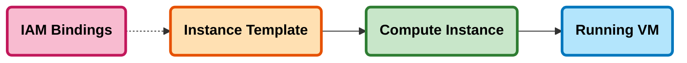

# Compute Instance Template

This document describes the two-step pattern for deploying Google Cloud VMs using the `terraform-google-vm` module (v13.2.4) through Terragrunt templates.

## Overview

Every VM is created in two stages:

1. **Instance Template** (`_common/templates/instance_template.hcl`) -- defines the machine spec, image, disks, and service account.
2. **Compute Instance** (`_common/templates/compute_instance.hcl`) -- creates the actual VM from that template.

This separation means templates can be reused, and all instances from the same template share an identical baseline configuration.

## Architecture



## Directory Structure

Each VM lives in its own subdirectory under `compute/`:

```
compute/
  compute.hcl                       # Shared config (dependencies, mocks, labels)
  linux-server-01/
    terragrunt.hcl                  # Instance template
    startup-script.sh               # Startup script
    iam-bindings/
      terragrunt.hcl               # IAM for the instance service account
    vm/
      terragrunt.hcl               # Compute instance
  web-server-01/
    terragrunt.hcl
    scripts/
      nginx-bootstrap.sh
      nginx-setup.sh
    iam-bindings/
      terragrunt.hcl
    vm/
      terragrunt.hcl
  sql-server-01/
    terragrunt.hcl
    vm/
      terragrunt.hcl
```

Live path: `live/non-production/development/platform/dp-dev-01/europe-west2/compute/`

## Configuration

### Environment-aware Defaults

Settings are selected automatically from `compute_instance_settings` in `_common/common.hcl` based on `environment_type`:

| Setting | Production | Non-Production |
|---------|-----------|---------------|
| Machine type | e2-standard-2 | e2-medium |
| Disk type | pd-ssd | pd-standard |
| Disk size | 50 GB | 10 GB |
| Network tier | PREMIUM | STANDARD |
| Deletion protection | Yes | No |

### Common Configuration (`compute.hcl`)

The `compute.hcl` file at the compute directory root provides shared settings inherited by all VMs: dependency paths, mock outputs, default network config, service account scopes, OS Login metadata, and standard labels.

## Usage

### 1. Instance Template (terragrunt.hcl)

```hcl
include "root" {
  path = find_in_parent_folders("root.hcl")
}

include "base" {
  path   = "${get_repo_root()}/_common/base.hcl"
  expose = true
}

include "instance_template" {
  path           = "${get_repo_root()}/_common/templates/instance_template.hcl"
  merge_strategy = "deep"
}

include "compute_common" {
  path = find_in_parent_folders("compute.hcl")
}

locals {
  selected_env_config = lookup(
    include.base.locals.merged.compute_instance_settings,
    include.base.locals.merged.environment_type, {}
  )
}

inputs = merge(
  include.base.locals.merged,
  local.selected_env_config,
  {
    name_prefix          = "${include.base.locals.merged.name_prefix}-${include.base.locals.merged.project}-linux-server"
    project_id           = "${include.base.locals.merged.name_prefix}-${include.base.locals.merged.project_id}"
    source_image_family  = "debian-12"
    source_image_project = "debian-cloud"

    create_service_account = true
    service_account        = null

    metadata = {
      startup-script = file("${get_terragrunt_dir()}/startup-script.sh")
    }

    labels = merge(
      { instance = "linux-server", purpose = "general" },
      include.base.locals.merged.org_labels,
      include.base.locals.merged.env_labels,
      include.base.locals.merged.project_labels
    )
  }
)
```

### 2. Compute Instance (vm/terragrunt.hcl)

```hcl
include "root" {
  path = find_in_parent_folders("root.hcl")
}

include "base" {
  path   = "${get_repo_root()}/_common/base.hcl"
  expose = true
}

include "compute_template" {
  path           = "${get_repo_root()}/_common/templates/compute_instance.hcl"
  merge_strategy = "deep"
}

include "compute_common" {
  path = find_in_parent_folders("compute.hcl")
}

dependency "instance_template" {
  config_path = "../"
  mock_outputs = {
    self_link = "projects/mock/global/instanceTemplates/mock-template"
    name      = "mock-template"
  }
  mock_outputs_allowed_terraform_commands = ["validate", "plan"]
}

inputs = merge(
  include.base.locals.merged,
  {
    hostname          = "${include.base.locals.merged.name_prefix}-${include.base.locals.merged.project}-linux-server"
    project_id        = dependency.project.outputs.project_id
    zone              = "${include.base.locals.merged.region}-a"
    instance_template = dependency.instance_template.outputs.self_link
    num_instances     = 1
  }
)
```

## Startup Script Pattern

Scripts can be inlined via the `metadata` block or downloaded from a GCS bucket at boot. The bucket-download pattern is useful for scripts that change independently of infrastructure:

```bash
#!/bin/bash
set -e
SCRIPTS_BUCKET="${name_prefix}-${project_name}-vm-scripts"
SCRIPTS_DIR="/opt/scripts"
mkdir -p $SCRIPTS_DIR

if gsutil ls gs://$SCRIPTS_BUCKET/$(hostname)/ 2>/dev/null; then
  gsutil -m cp -r gs://$SCRIPTS_BUCKET/$(hostname)/* $SCRIPTS_DIR/
  chmod +x $SCRIPTS_DIR/*.sh
  [ -f "$SCRIPTS_DIR/bootstrap.sh" ] && $SCRIPTS_DIR/bootstrap.sh
fi
```

For Windows VMs (e.g., SQL Server), use the `windows-startup-script-ps1` metadata key instead.

## Dependencies

Deployment order for a complete VM stack:

1. **Project** --> VPC Network --> Secrets / Buckets
2. **Instance Template** (creates service account)
3. **IAM Bindings** (grants roles to the service account)
4. **Compute Instance** (creates the VM from the template)

## Troubleshooting

- **Instance template not found** -- Ensure the template is deployed before the compute instance. Check the `config_path` in the dependency block.
- **Subnetwork project mismatch** -- Add `subnetwork_project` to both the instance template and compute instance inputs.
- **Service account errors** -- When using dedicated accounts, set `create_service_account = true` and `service_account = null`. Deploy IAM bindings after the template.
- **Script download failures** -- Verify the vm-scripts bucket exists, the service account has `storage.objectViewer`, and scripts have been uploaded.
- **Source image issues** -- Use separate `source_image_family` and `source_image_project` parameters rather than a combined image string.

## References

- [terraform-google-vm module](https://github.com/terraform-google-modules/terraform-google-vm)
- [Instance Templates documentation](https://cloud.google.com/compute/docs/instance-templates)
- [SQL Server Template Guide](SQLSERVER_TEMPLATE.md)
- [IAM Bindings Template Guide](IAM_BINDINGS_TEMPLATE.md)
