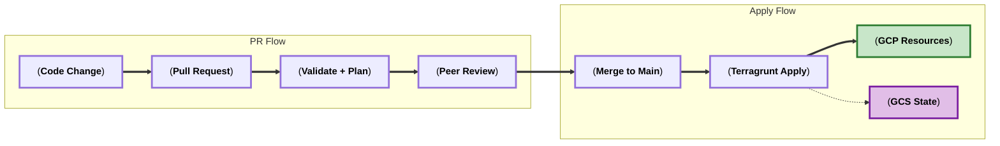
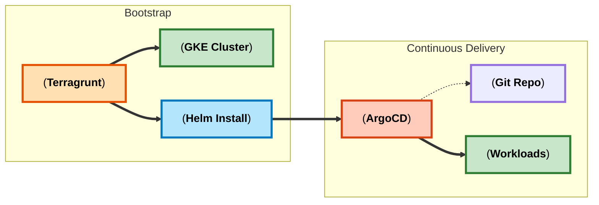
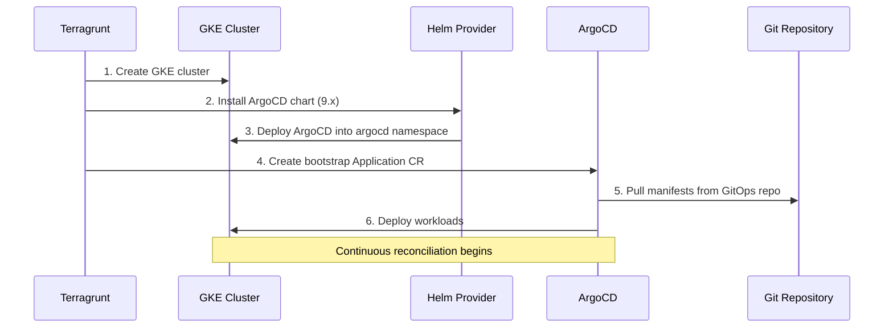
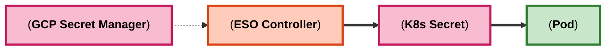

# GitOps Architecture & Continuous Delivery

This repository implements a two-layer GitOps model: Terragrunt configurations managed through GitHub Actions for GCP resource provisioning, and ArgoCD on GKE for continuous delivery of containerized applications.

## Overview

### Core Principles

- **Declarative** -- all infrastructure and application state is described declaratively in Git
- **Versioned** -- every change is versioned and immutable
- **Pull-based** -- ArgoCD pulls desired state; CI/CD never pushes directly to clusters
- **Continuously reconciled** -- agents observe actual state and converge toward desired state

### Delivery Model

We use **continuous delivery**: every change that passes CI is deployable, but production requires manual approval. Development environments auto-deploy on merge.

## Architecture

### Infrastructure Pipeline (Terragrunt)

```mermaid
flowchart LR
    subgraph "PR Flow"
        CODE["(<b>Code Change</b>)"]
        PR["(<b>Pull Request</b>)"]
        VALIDATE["(<b>Validate + Plan</b>)"]
        REVIEW["(<b>Peer Review</b>)"]
    end

    subgraph "Apply Flow"
        MERGE["(<b>Merge to Main</b>)"]
        APPLY["(<b>Terragrunt Apply</b>)"]
        GCP["(<b>GCP Resources</b>)"]
        STATE["(<b>GCS State</b>)"]
    end

    CODE ==> PR
    PR ==> VALIDATE
    VALIDATE ==> REVIEW
    REVIEW ==> MERGE
    MERGE ==> APPLY
    APPLY ==> GCP
    APPLY -.-> STATE

    style CODE stroke-width:3px,color:#000
    style PR stroke-width:3px,color:#000
    style VALIDATE stroke-width:3px,color:#000
    style REVIEW stroke-width:3px,color:#000
    style MERGE stroke-width:3px,color:#000
    style APPLY stroke-width:3px,color:#000
    style GCP fill:#c8e6c9,stroke:#2e7d32,stroke-width:3px,color:#000
    style STATE fill:#e1bee7,stroke:#7b1fa2,stroke-width:3px,color:#000
```

1. Developer opens a PR with Terragrunt changes
2. GitHub Actions runs `terragrunt validate` and `terragrunt plan`, posts the plan to the PR
3. Peer review and approval
4. Merge triggers `terragrunt apply` against the target environment
5. State is persisted to the GCS bucket `org-tofu-state`

### Application Pipeline (ArgoCD on GKE)

```mermaid
flowchart LR
    subgraph "Bootstrap"
        TG["(<b>Terragrunt</b>)"]
        GKE["(<b>GKE Cluster</b>)"]
        HELM["(<b>Helm Install</b>)"]
    end

    subgraph "Continuous Delivery"
        GIT["(<b>Git Repo</b>)"]
        ARGO["(<b>ArgoCD</b>)"]
        K8S["(<b>Workloads</b>)"]
    end

    TG ==> GKE
    TG ==> HELM
    HELM ==> ARGO
    ARGO -.-> GIT
    ARGO ==> K8S

    style TG fill:#ffe0b2,stroke:#e65100,stroke-width:3px,color:#000
    style GKE fill:#c8e6c9,stroke:#2e7d32,stroke-width:3px,color:#000
    style HELM fill:#b3e5fc,stroke:#0277bd,stroke-width:3px,color:#000
    style GIT stroke-width:3px,color:#000
    style ARGO fill:#ffccbc,stroke:#d84315,stroke-width:3px,color:#000
    style K8S fill:#c8e6c9,stroke:#2e7d32,stroke-width:3px,color:#000
```

## ArgoCD Bootstrap Process

ArgoCD is deployed as part of the Terragrunt dependency chain. After the GKE cluster is provisioned, a `bootstrap-argocd` resource installs ArgoCD via Helm and creates an initial Application pointing at the GitOps repository.

```mermaid
sequenceDiagram
    participant TG as Terragrunt
    participant GKE as GKE Cluster
    participant HELM as Helm Provider
    participant ARGO as ArgoCD
    participant GIT as Git Repository

    TG->>GKE: 1. Create GKE cluster
    TG->>HELM: 2. Install ArgoCD chart (9.x)
    HELM->>GKE: 3. Deploy ArgoCD into argocd namespace
    TG->>ARGO: 4. Create bootstrap Application CR
    ARGO->>GIT: 5. Pull manifests from GitOps repo
    ARGO->>GKE: 6. Deploy workloads
    Note over ARGO,GKE: Continuous reconciliation begins
```

**Codebase locations:**

| Resource | Path |
|----------|------|
| GKE cluster | `live/non-production/development/platform/dp-dev-01/europe-west2/gke/cluster-01/` |
| ArgoCD bootstrap | `live/non-production/development/platform/dp-dev-01/europe-west2/gke/cluster-01/bootstrap-argocd/` |
| ArgoCD template | `_common/templates/argocd.hcl` |
| GKE template | `_common/templates/gke.hcl` |

## Secret Management

Secrets are managed through External Secrets Operator (ESO), which syncs secrets from GCP Secret Manager into Kubernetes:

```mermaid
flowchart LR
    SM["(<b>GCP Secret Manager</b>)"]
    ESO["(<b>ESO Controller</b>)"]
    K8S["(<b>K8s Secret</b>)"]
    POD["(<b>Pod</b>)"]

    SM -.-> ESO
    ESO ==> K8S
    K8S ==> POD

    style SM fill:#f8bbd0,stroke:#c2185b,stroke-width:3px,color:#000
    style ESO fill:#ffccbc,stroke:#d84315,stroke-width:3px,color:#000
    style K8S fill:#f8bbd0,stroke:#c2185b,stroke-width:3px,color:#000
    style POD fill:#c8e6c9,stroke:#2e7d32,stroke-width:3px,color:#000
```

ESO polls Secret Manager on a configurable interval and updates Kubernetes secrets automatically. Pod restarts are triggered by secret changes when using rolling update annotations.

## Environment Promotion

| Environment | Auto-deploy | Approval | Notes |
|-------------|-------------|----------|-------|
| Development | Yes | No | Merge to main triggers apply |
| Staging | Yes | Yes | Requires reviewer approval |
| Production | No | Yes | Manual workflow dispatch |

## Key Practices

- All changes flow through Git -- no manual `kubectl apply` or console edits
- ArgoCD detects drift and self-heals; manual cluster changes are overwritten
- Infrastructure and application repos are separate concerns joined at the GKE cluster boundary
- Secrets never enter Git; ESO bridges GCP Secret Manager to Kubernetes
- Use `terragrunt plan` output in PRs to review infrastructure changes before merge

## References

- [ArgoCD Documentation](https://argo-cd.readthedocs.io/)
- [Terragrunt Documentation](https://terragrunt.gruntwork.io/)
- [External Secrets Operator](https://external-secrets.io/)
- [GitOps Principles](https://opengitops.dev/)
