# GitOps Architecture & Continuous Delivery

**Version**: 1.0.0  
**Last Updated**: 2025-08-20  
**Author**: Infrastructure Team

## Table of Contents
- [Executive Summary](#executive-summary)
- [Continuous Delivery Pipeline Architecture](#continuous-delivery-pipeline-architecture)
- [Infrastructure as Code GitOps](#infrastructure-as-code-gitops)
- [Infrastructure Deployment Pipeline](#infrastructure-deployment-pipeline)
- [GitOps Implementation on GKE](#gitops-implementation-on-gke)
- [Infrastructure GitOps Workflow](#infrastructure-gitops-workflow)
- [Multi-Environment Infrastructure Management](#multi-environment-infrastructure-management)
- [End-to-End Deployment Flow](#end-to-end-deployment-flow)
- [Secret Management in GitOps](#secret-management-in-gitops)
- [Infrastructure Observability in GitOps](#infrastructure-observability-in-gitops)
- [Monitoring & Observability](#monitoring--observability)
- [Security & Compliance](#security--compliance)
- [Best Practices & Anti-patterns](#best-practices--anti-patterns)
- [Future Roadmap](#future-roadmap)
- [References](#references)

## Executive Summary

GitOps represents a paradigm shift in infrastructure and application management, using Git as the single source of truth for both infrastructure as code and application deployments. This document outlines our comprehensive GitOps architecture that spans the entire stack:

- **Infrastructure GitOps**: Terragrunt configurations managed through GitHub Actions for GCP resource provisioning
- **Application GitOps**: ArgoCD on GKE for continuous delivery of containerized applications
- **Unified Workflow**: Single Git-based workflow from infrastructure provisioning to application deployment

### Core Principles

**GitOps Fundamentals:**
- **Declarative**: Everything is described declaratively
- **Versioned**: All changes are versioned and immutable
- **Pulled Automatically**: Software agents pull desired state
- **Continuously Reconciled**: Agents continuously observe and reconcile state

**Continuous Delivery vs Continuous Deployment:**
- **Continuous Delivery**: Every change is deployable but requires manual approval for production
- **Continuous Deployment**: Every change that passes tests is automatically deployed to production
- **Our Approach**: Continuous delivery with environment-specific deployment policies

### Technology Stack

| Component | Version | Purpose |
|-----------|---------|---------|
| **Infrastructure Layer** | | |
| OpenTofu | v1.9.1 | Infrastructure provisioning |
| Terragrunt | v0.80.2 | DRY configuration management |
| GitHub Actions | Latest | CI/CD automation |
| Google Provider | v6.14.1 | GCP resource management |
| **Application Layer** | | |
| ArgoCD | v8.1.3 | GitOps continuous delivery |
| External Secrets Operator | v0.9.11 | Secret synchronization |
| GKE | v37.0.0 | Kubernetes platform |
| Helm | v3.x | Package management |
| **Core** | | |
| Git | Latest | Single source of truth |
| GCS | Latest | Remote state storage |

## Continuous Delivery Pipeline Architecture

### High-Level Pipeline Flow

```mermaid
flowchart TB
    subgraph "Developer Workflow"
        DEV["👨‍💻 Developer"]
        CODE["📝 Code Changes"]
        PR["🔄 Pull Request"]
    end
    
    subgraph "Version Control"
        GIT["📦 Git Repository"]
        MAIN["🎯 Main Branch"]
        FEATURE["🌿 Feature Branch"]
    end
    
    subgraph "CI Pipeline"
        CI["🔧 GitHub Actions"]
        BUILD["🏗️ Build & Test"]
        VALIDATE["✅ Validate"]
        PACKAGE["📦 Package"]
    end
    
    subgraph "GitOps Controller"
        ARGOCD["🚀 ArgoCD"]
        SYNC["🔄 Sync Engine"]
        DIFF["📊 Diff Engine"]
    end
    
    subgraph "Kubernetes Clusters"
        DEV_CLUSTER["🔬 Development"]
        STAGING_CLUSTER["🎭 Staging"]
        PROD_CLUSTER["🏭 Production"]
    end
    
    subgraph "Observability"
        GRAFANA["📊 Grafana"]
        PROMETHEUS["🔍 Prometheus"]
        ALERTS["🚨 AlertManager"]
    end
    
    DEV --> CODE
    CODE --> FEATURE
    FEATURE --> PR
    PR --> CI
    CI --> BUILD
    BUILD --> VALIDATE
    VALIDATE --> PACKAGE
    PACKAGE --> MAIN
    MAIN --> ARGOCD
    ARGOCD --> SYNC
    SYNC --> DIFF
    DIFF --> DEV_CLUSTER
    DIFF --> STAGING_CLUSTER
    DIFF --> PROD_CLUSTER
    
    DEV_CLUSTER --> PROMETHEUS
    STAGING_CLUSTER --> PROMETHEUS
    PROD_CLUSTER --> PROMETHEUS
    PROMETHEUS --> GRAFANA
    PROMETHEUS --> ALERTS
```



## Infrastructure as Code GitOps

### Infrastructure Repository Structure

```
terragrunt-gcp-org-automation/
├── 📁 live/                       # Environment configurations
│   ├── non-production/           # Non-production environments
│   │   ├── development/         # Development environment
│   │   │   └── dev-01/         # Development project
│   │   └── perimeter/          # Perimeter/DMZ environment
│   └── production/             # Production environments
│
├── 🔧 _common/                   # Shared configurations
│   ├── common.hcl              # Module versions
│   └── templates/              # Resource templates
│
├── 🤖 .github/                   # GitHub Actions
│   ├── workflows/              # CI/CD workflows
│   └── actions/               # Composite actions
│
└── 📚 docs/                      # Documentation
```

### Infrastructure Deployment Pipeline

```mermaid
flowchart LR
    subgraph "Infrastructure GitOps Flow"
        subgraph "Code Changes"
            INFRA_CODE["📝 Terragrunt Code"]
            COMMIT["💾 Git Commit"]
            PUSH["⬆️ Git Push"]
        end
        
        subgraph "CI/CD Pipeline"
            GH_ACTIONS["🤖 GitHub Actions"]
            TG_VALIDATE["✅ Terragrunt Validate"]
            TG_PLAN["📋 Terragrunt Plan"]
            APPROVAL["👤 Manual Approval"]
            TG_APPLY["🚀 Terragrunt Apply"]
        end
        
        subgraph "State Management"
            GCS_STATE["🗄️ GCS State Bucket"]
            STATE_LOCK["🔒 State Locking"]
        end
        
        subgraph "GCP Resources"
            PROJECTS["🏢 Projects"]
            NETWORKS["🌐 Networks"]
            GKE["⚙️ GKE Clusters"]
            COMPUTE["🖥️ Compute"]
        end
    end
    
    INFRA_CODE --> COMMIT
    COMMIT --> PUSH
    PUSH --> GH_ACTIONS
    GH_ACTIONS --> TG_VALIDATE
    TG_VALIDATE --> TG_PLAN
    TG_PLAN --> APPROVAL
    APPROVAL --> TG_APPLY
    TG_APPLY --> GCS_STATE
    GCS_STATE --> STATE_LOCK
    TG_APPLY --> PROJECTS
    TG_APPLY --> NETWORKS
    TG_APPLY --> GKE
    TG_APPLY --> COMPUTE
```



## GitOps Implementation on GKE

### ArgoCD Architecture

```mermaid
flowchart TB
    subgraph "ArgoCD GitOps Architecture"
        subgraph "Git Repositories"
            APP_REPO["📦 Application Repo"]
            CONFIG_REPO["⚙️ Config Repo"]
            HELM_REPO["📊 Helm Charts"]
        end
        
        subgraph "ArgoCD Components"
            API_SERVER["🖥️ API Server"]
            REPO_SERVER["📚 Repo Server"]
            APP_CONTROLLER["🎮 Application Controller"]
            REDIS["💾 Redis Cache"]
            DEX["🔐 Dex OAuth"]
        end
        
        subgraph "ArgoCD CRDs"
            APPLICATION["📱 Application"]
            APPPROJECT["📁 AppProject"]
            APPSET["🔄 ApplicationSet"]
        end
        
        subgraph "Target Clusters"
            DEV_K8S["🔬 Dev Cluster"]
            STAGING_K8S["🎭 Staging Cluster"]
            PROD_K8S["🏭 Prod Cluster"]
        end
        
        subgraph "Workloads"
            DEPLOYMENTS["📦 Deployments"]
            SERVICES["🔌 Services"]
            INGRESS["🌐 Ingress"]
            CONFIGMAPS["📋 ConfigMaps"]
            SECRETS["🔐 Secrets"]
        end
    end
    
    APP_REPO --> REPO_SERVER
    CONFIG_REPO --> REPO_SERVER
    HELM_REPO --> REPO_SERVER
    
    REPO_SERVER --> APP_CONTROLLER
    APP_CONTROLLER --> APPLICATION
    APPLICATION --> APPPROJECT
    APPPROJECT --> APPSET
    
    APP_CONTROLLER --> DEV_K8S
    APP_CONTROLLER --> STAGING_K8S
    APP_CONTROLLER --> PROD_K8S
    
    DEV_K8S --> DEPLOYMENTS
    DEV_K8S --> SERVICES
    DEV_K8S --> INGRESS
    DEV_K8S --> CONFIGMAPS
    DEV_K8S --> SECRETS
    
    API_SERVER --> APP_CONTROLLER
    REDIS --> APP_CONTROLLER
    DEX --> API_SERVER
```



### ArgoCD Bootstrap Process


## Infrastructure GitOps Workflow

### Pull Request Workflow

```mermaid
flowchart TD
    subgraph "Developer Flow"
        DEV_BRANCH["🌿 Feature Branch"]
        LOCAL_TEST["🧪 Local Testing"]
        COMMIT["💾 Commit Changes"]
        PUSH["⬆️ Push to GitHub"]
    end
    
    subgraph "Pull Request"
        PR_CREATE["📝 Create PR"]
        PR_CHECKS["✅ Automated Checks"]
        PR_REVIEW["👥 Peer Review"]
        PR_APPROVE["✔️ Approval"]
        PR_MERGE["🔀 Merge to Main"]
    end
    
    subgraph "CI/CD Checks"
        LINT["🔍 Linting"]
        FMT["📐 Formatting"]
        VALIDATE["✅ Validation"]
        PLAN["📋 Plan Output"]
        SECURITY["🔐 Security Scan"]
    end
    
    subgraph "Deployment"
        AUTO_DEPLOY["🚀 Auto Deploy (Dev)"]
        MANUAL_DEPLOY["👤 Manual Deploy (Prod)"]
    end
    
    DEV_BRANCH --> LOCAL_TEST
    LOCAL_TEST --> COMMIT
    COMMIT --> PUSH
    PUSH --> PR_CREATE
    
    PR_CREATE --> PR_CHECKS
    PR_CHECKS --> LINT
    PR_CHECKS --> FMT
    PR_CHECKS --> VALIDATE
    PR_CHECKS --> PLAN
    PR_CHECKS --> SECURITY
    
    PR_CHECKS --> PR_REVIEW
    PR_REVIEW --> PR_APPROVE
    PR_APPROVE --> PR_MERGE
    
    PR_MERGE --> AUTO_DEPLOY
    PR_MERGE --> MANUAL_DEPLOY
```



## Multi-Environment Infrastructure Management

### Environment Promotion Strategy

```mermaid
flowchart LR
    subgraph "Environment Progression"
        subgraph "Development"
            DEV_INFRA["🏗️ Infrastructure"]
            DEV_APPS["📱 Applications"]
            DEV_TEST["🧪 Testing"]
        end
        
        subgraph "Staging"
            STG_INFRA["🏗️ Infrastructure"]
            STG_APPS["📱 Applications"]
            STG_TEST["🧪 Integration Tests"]
        end
        
        subgraph "Production"
            PROD_INFRA["🏗️ Infrastructure"]
            PROD_APPS["📱 Applications"]
            PROD_MONITOR["📊 Monitoring"]
        end
    end
    
    DEV_INFRA --> DEV_APPS
    DEV_APPS --> DEV_TEST
    DEV_TEST -->|Promote| STG_INFRA
    
    STG_INFRA --> STG_APPS
    STG_APPS --> STG_TEST
    STG_TEST -->|Promote| PROD_INFRA
    
    PROD_INFRA --> PROD_APPS
    PROD_APPS --> PROD_MONITOR
```



### Environment Configuration Management

```yaml
# Environment-specific configurations
environments:
  development:
    auto_deploy: true
    approval_required: false
    resource_limits:
      cpu: "limited"
      memory: "limited"
    retention: "7d"
    
  staging:
    auto_deploy: true
    approval_required: true
    resource_limits:
      cpu: "moderate"
      memory: "moderate"
    retention: "30d"
    
  production:
    auto_deploy: false
    approval_required: true
    resource_limits:
      cpu: "unlimited"
      memory: "unlimited"
    retention: "365d"
```

## End-to-End Deployment Flow

### Complete GitOps Flow


## Secret Management in GitOps

### External Secrets Operator Architecture

```mermaid
flowchart TB
    subgraph "Secret Management Flow"
        subgraph "Secret Stores"
            GCP_SM["🔐 GCP Secret Manager"]
            VAULT["🏦 HashiCorp Vault"]
            AWS_SM["🔑 AWS Secrets Manager"]
        end
        
        subgraph "External Secrets Operator"
            ESO_CONTROLLER["🎮 ESO Controller"]
            SECRET_STORE["📚 SecretStore CRD"]
            EXTERNAL_SECRET["🔐 ExternalSecret CRD"]
        end
        
        subgraph "Kubernetes"
            K8S_SECRET["🔒 K8s Secret"]
            POD["📦 Pod"]
            CONTAINER["🐳 Container"]
        end
    end
    
    GCP_SM --> SECRET_STORE
    VAULT --> SECRET_STORE
    AWS_SM --> SECRET_STORE
    
    SECRET_STORE --> ESO_CONTROLLER
    EXTERNAL_SECRET --> ESO_CONTROLLER
    ESO_CONTROLLER --> K8S_SECRET
    
    K8S_SECRET --> POD
    POD --> CONTAINER
```



### Secret Rotation Workflow


## Infrastructure Observability in GitOps

### Observability Stack

```mermaid
flowchart TB
    subgraph "Observability Architecture"
        subgraph "Data Sources"
            INFRA["🏗️ Infrastructure Metrics"]
            APPS["📱 Application Metrics"]
            LOGS["📝 Logs"]
            TRACES["🔍 Traces"]
        end
        
        subgraph "Collection"
            PROMETHEUS["📊 Prometheus"]
            LOKI["📚 Loki"]
            TEMPO["⚡ Tempo"]
        end
        
        subgraph "Storage"
            THANOS["💾 Thanos"]
            GCS["☁️ GCS Buckets"]
        end
        
        subgraph "Visualization"
            GRAFANA["📈 Grafana"]
            ALERTS["🚨 AlertManager"]
        end
        
        subgraph "Notification"
            SLACK["💬 Slack"]
            PAGERDUTY["📟 PagerDuty"]
            EMAIL["📧 Email"]
        end
    end
    
    INFRA --> PROMETHEUS
    APPS --> PROMETHEUS
    LOGS --> LOKI
    TRACES --> TEMPO
    
    PROMETHEUS --> THANOS
    THANOS --> GCS
    LOKI --> GCS
    TEMPO --> GCS
    
    THANOS --> GRAFANA
    LOKI --> GRAFANA
    TEMPO --> GRAFANA
    
    GRAFANA --> ALERTS
    ALERTS --> SLACK
    ALERTS --> PAGERDUTY
    ALERTS --> EMAIL
```



## Monitoring & Observability

### Key Metrics

#### Infrastructure Metrics
- **Resource Utilization**: CPU, Memory, Disk, Network
- **Availability**: Uptime, SLA compliance
- **Performance**: Latency, Throughput, Error rates
- **Cost**: Resource spending, budget tracking

#### GitOps Metrics
- **Sync Status**: Applications in sync/out of sync
- **Deployment Frequency**: Deployments per day/week
- **Lead Time**: Commit to production time
- **MTTR**: Mean time to recovery

### Alerting Strategy

```yaml
# Alert Configuration Example
alerts:
  - name: "Application Out of Sync"
    condition: "argocd_app_sync_status != 1"
    duration: "5m"
    severity: "warning"
    
  - name: "Deployment Failed"
    condition: "argocd_app_health_status == 0"
    duration: "1m"
    severity: "critical"
    
  - name: "High Error Rate"
    condition: "error_rate > 0.01"
    duration: "5m"
    severity: "warning"
    
  - name: "Certificate Expiry"
    condition: "cert_expiry_days < 30"
    duration: "1h"
    severity: "warning"
```

## Security & Compliance

### Security Controls

#### Infrastructure Security
1. **Infrastructure as Code Scanning**
   - Static analysis of Terragrunt configurations
   - Policy validation with OPA/Sentinel
   - Secret detection in code

2. **Runtime Security**
   - Network policies
   - Pod security policies
   - RBAC configuration
   - Service mesh (Istio/Linkerd)

3. **Supply Chain Security**
   - Image scanning
   - Dependency scanning
   - SBOM generation
   - Signature verification

#### GitOps Security

```mermaid
flowchart LR
    subgraph "Security Layers"
        subgraph "Repository"
            BRANCH_PROTECT["🔒 Branch Protection"]
            SIGNED_COMMITS["✍️ Signed Commits"]
            PR_REVIEWS["👥 PR Reviews"]
        end
        
        subgraph "CI/CD"
            SAST["🔍 SAST Scanning"]
            SECRETS_SCAN["🔐 Secret Scanning"]
            POLICY_CHECK["📋 Policy Validation"]
        end
        
        subgraph "Runtime"
            ADMISSION["🚪 Admission Control"]
            NETWORK_POLICY["🌐 Network Policies"]
            RBAC["👤 RBAC"]
        end
        
        subgraph "Monitoring"
            AUDIT_LOGS["📝 Audit Logs"]
            COMPLIANCE["✅ Compliance Checks"]
            ANOMALY["🔍 Anomaly Detection"]
        end
    end
    
    BRANCH_PROTECT --> SIGNED_COMMITS
    SIGNED_COMMITS --> PR_REVIEWS
    PR_REVIEWS --> SAST
    SAST --> SECRETS_SCAN
    SECRETS_SCAN --> POLICY_CHECK
    POLICY_CHECK --> ADMISSION
    ADMISSION --> NETWORK_POLICY
    NETWORK_POLICY --> RBAC
    RBAC --> AUDIT_LOGS
    AUDIT_LOGS --> COMPLIANCE
    COMPLIANCE --> ANOMALY
```



### Compliance Framework

| Requirement | Implementation | Validation |
|------------|---------------|------------|
| **Data Encryption** | TLS everywhere, encrypted storage | Automated TLS checks |
| **Access Control** | RBAC, OAuth2/OIDC | Access reviews |
| **Audit Logging** | Centralized logging | Log analysis |
| **Change Management** | GitOps workflow | PR audit trail |
| **Disaster Recovery** | Automated backups | Recovery testing |
| **Compliance Scanning** | Policy as Code | Continuous validation |

## Best Practices & Anti-patterns

### Best Practices

#### Infrastructure as Code
1. **Version Everything**: All configurations in Git
2. **DRY Principle**: Use templates and modules
3. **Environment Parity**: Minimize environment differences
4. **Immutable Infrastructure**: Replace, don't modify
5. **Progressive Delivery**: Gradual rollouts

#### GitOps Workflow
1. **Pull-based Deployments**: ArgoCD pulls changes
2. **Declarative Configuration**: Describe desired state
3. **Git as Source of Truth**: All changes through Git
4. **Automated Reconciliation**: Self-healing infrastructure
5. **Observability First**: Monitor everything

### Anti-patterns to Avoid

#### Common Mistakes
1. ❌ **Manual Changes**: Making changes outside Git
2. ❌ **Secrets in Git**: Storing secrets in repositories
3. ❌ **Monolithic Configurations**: Large, complex files
4. ❌ **Ignoring Drift**: Not detecting configuration drift
5. ❌ **Poor Testing**: Deploying without validation

#### GitOps Anti-patterns
1. ❌ **Push-based Deployments**: CI/CD pushing to clusters
2. ❌ **Imperative Scripts**: Using scripts instead of declarations
3. ❌ **Shared Clusters**: Multiple teams on one cluster
4. ❌ **No Rollback Strategy**: Unable to revert changes
5. ❌ **Insufficient RBAC**: Over-privileged access

## Future Roadmap

### Short-term Goals (Q1-Q2)
- [ ] Implement Progressive Delivery with Flagger
- [ ] Add Policy as Code with OPA
- [ ] Enhance secret rotation automation
- [ ] Implement cost optimization strategies
- [ ] Add automated compliance scanning

### Medium-term Goals (Q3-Q4)
- [ ] Multi-cloud GitOps support
- [ ] Service mesh integration
- [ ] Advanced observability with distributed tracing
- [ ] Automated disaster recovery testing
- [ ] ML-based anomaly detection

### Long-term Vision
- [ ] Full autonomous operations
- [ ] Self-healing infrastructure
- [ ] Predictive scaling
- [ ] Zero-trust security model
- [ ] Complete compliance automation

## Implementation Checklist

### Phase 1: Foundation
- [x] Set up Git repositories
- [x] Configure Terragrunt structure
- [x] Implement CI/CD pipelines
- [x] Deploy GKE clusters
- [x] Install ArgoCD

### Phase 2: Core GitOps
- [x] Configure ArgoCD applications
- [x] Implement External Secrets
- [x] Set up monitoring stack
- [x] Configure RBAC
- [x] Enable audit logging

### Phase 3: Advanced Features
- [ ] Progressive delivery
- [ ] Policy as Code
- [ ] Service mesh
- [ ] Advanced observability
- [ ] Cost optimization

### Phase 4: Optimization
- [ ] Performance tuning
- [ ] Security hardening
- [ ] Compliance automation
- [ ] Disaster recovery
- [ ] Multi-region support

## References

### Documentation
- [ArgoCD Documentation](https://argo-cd.readthedocs.io/)
- [Terragrunt Documentation](https://terragrunt.gruntwork.io/)
- [External Secrets Operator](https://external-secrets.io/)
- [GitOps Principles](https://www.gitops.tech/)
- [OpenGitOps](https://opengitops.dev/)

### Tools & Resources
- [Flux vs ArgoCD Comparison](https://www.weave.works/blog/flux-vs-argo-cd)
- [GitOps Toolkit](https://toolkit.fluxcd.io/)
- [Progressive Delivery with Flagger](https://flagger.app/)
- [Policy as Code with OPA](https://www.openpolicyagent.org/)
- [CNCF GitOps Working Group](https://github.com/cncf/tag-app-delivery/tree/main/gitops-wg)

### Best Practices Guides
- [Google SRE Books](https://sre.google/books/)
- [The Phoenix Project](https://itrevolution.com/the-phoenix-project/)
- [Accelerate](https://itrevolution.com/accelerate-book/)
- [Team Topologies](https://teamtopologies.com/)
- [Platform Engineering](https://platformengineering.org/)