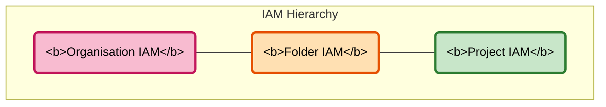

# IAM Bindings Template Guide

IAM bindings are managed at three levels -- organisation, folder, and project -- each with its own template. All three wrap the `terraform-google-iam` module (v8.1.0) and default to additive mode so existing bindings are never accidentally removed.

## Overview

| Level | Template | Module Sub-path | Scope Input |
|-------|----------|-----------------|-------------|
| Organisation | `_common/templates/org_iam_bindings.hcl` | `modules/organizations_iam` | `organizations` |
| Folder | `_common/templates/folder_iam_bindings.hcl` | `modules/folders_iam` | `folders` |
| Project | `_common/templates/iam_bindings.hcl` | `modules/projects_iam` | `projects` |

The project-level template also ships pre-defined role groups (`basic`, `compute`, `storage`, `secrets`) in `local.common_service_account_roles` for convenience.

## Architecture



Bindings inherit downwards: an org-level role applies to every folder and project beneath it, so assign roles at the narrowest scope possible.

## Directory Structure

```
live/non-production/
├── org-iam-bindings/                          # Organisation level
│   └── terragrunt.hcl
├── development/
│   ├── folder-iam-bindings/                   # Folder level
│   │   └── terragrunt.hcl
│   └── platform/dp-dev-01/
│       ├── iam-bindings/                      # Project level
│       │   └── terragrunt.hcl
│       └── compute/instance-name/
│           └── iam-bindings/                  # Instance-scoped project IAM
│               └── terragrunt.hcl
```

## Configuration

### Organisation-Level Bindings

```hcl
include "root" {
  path = find_in_parent_folders("root.hcl")
}

include "base" {
  path   = "${get_repo_root()}/_common/base.hcl"
  expose = true
}

include "org_iam_template" {
  path           = "${get_repo_root()}/_common/templates/org_iam_bindings.hcl"
  merge_strategy = "deep"
}

inputs = {
  organizations = ["ORG_ID"]
  mode          = "additive"

  bindings = {
    "roles/billing.viewer" = [
      "group:finance@example.com",
    ]
  }
}
```

### Folder-Level Bindings

```hcl
include "root" {
  path = find_in_parent_folders("root.hcl")
}

include "base" {
  path   = "${get_repo_root()}/_common/base.hcl"
  expose = true
}

include "folder_iam_template" {
  path           = "${get_repo_root()}/_common/templates/folder_iam_bindings.hcl"
  merge_strategy = "deep"
}

dependency "folder" {
  config_path = "../folder"
  mock_outputs = {
    id = "folders/123456789"
  }
  mock_outputs_allowed_terraform_commands = ["validate", "plan", "init"]
}

inputs = {
  folders = [dependency.folder.outputs.id]
  mode    = "additive"

  bindings = {
    "roles/viewer" = [
      "group:dev-team@example.com",
    ]
  }
}
```

### Project-Level Bindings

```hcl
include "root" {
  path = find_in_parent_folders("root.hcl")
}

include "base" {
  path   = "${get_repo_root()}/_common/base.hcl"
  expose = true
}

include "iam_template" {
  path           = "${get_repo_root()}/_common/templates/iam_bindings.hcl"
  merge_strategy = "deep"
}

dependency "project" {
  config_path = "../project"
  mock_outputs = {
    project_id = "mock-project-id"
  }
  mock_outputs_allowed_terraform_commands = ["validate", "plan", "init"]
}

dependency "instance_template" {
  config_path = "../"
  mock_outputs = {
    service_account_info = {
      email  = "mock@mock-project-id.iam.gserviceaccount.com"
      member = "serviceAccount:mock@mock-project-id.iam.gserviceaccount.com"
    }
  }
  mock_outputs_allowed_terraform_commands = ["validate", "plan", "init"]
}

inputs = {
  projects = [dependency.project.outputs.project_id]
  mode     = "additive"

  bindings = {
    "roles/secretmanager.secretAccessor" = [
      "serviceAccount:${dependency.instance_template.outputs.service_account_info.email}"
    ]
    "roles/logging.logWriter" = [
      "serviceAccount:${dependency.instance_template.outputs.service_account_info.email}"
    ]
    "roles/monitoring.metricWriter" = [
      "serviceAccount:${dependency.instance_template.outputs.service_account_info.email}"
    ]
  }
}
```

## Usage

### Deployment Order

1. **Project / Folder / Org** -- the target resource must exist
2. **Instance Template** (if binding to a compute SA) -- creates the service account
3. **IAM Bindings** -- grants permissions
4. **Compute Instance** -- uses the now-authorised service account

### Best Practices

- Always use `mode = "additive"` unless you intentionally own the full binding set.
- Prefer specific roles (`roles/storage.objectViewer`) over broad ones (`roles/editor`).
- Add comments explaining why each role is needed.
- Use dedicated service accounts per instance (`create_service_account = true`).

## Troubleshooting

- **Service Account Not Found** -- deploy the instance template before IAM bindings; confirm `create_service_account = true`.
- **Permission Denied** -- ensure the deploying identity has `roles/iam.serviceAccountAdmin` on the project.
- **Mock Output Mismatch** -- mock outputs must include `service_account_info.email` matching the `terraform-google-vm` module output.
- **Circular Dependencies** -- IAM bindings depend on the instance template, never the reverse.

### Validation Commands

```bash
# List service accounts
gcloud iam service-accounts list --project=PROJECT_ID

# Show IAM policy for a project
gcloud projects get-iam-policy PROJECT_ID

# Filter to a specific service account
gcloud projects get-iam-policy PROJECT_ID \
  --flatten="bindings[].members" \
  --filter="bindings.members:serviceAccount:SA_EMAIL"
```

## References

- [terraform-google-iam module](https://github.com/terraform-google-modules/terraform-google-iam)
- [Google Cloud IAM documentation](https://cloud.google.com/iam/docs)
- [IAM best practices](https://cloud.google.com/iam/docs/using-iam-securely)
