# IP Allocation Documentation

This document describes the IP allocation strategy and management for the GCP infrastructure managed through Terragrunt.

## Table of Contents

- [Overview](#overview)
- [IP Allocation Strategy](#ip-allocation-strategy)
- [Network Blocks](#network-blocks)
- [Environment Allocations](#environment-allocations)
- [CIDR Alignment Rules](#cidr-alignment-rules)
- [Tracking and Validation](#tracking-and-validation)
- [Future Planning](#future-planning)

## Overview

The infrastructure uses a hierarchical IP allocation scheme designed to:
- Support multiple environments (development, perimeter, production)
- Enable clear organizational structure
- Provide efficient address space utilization
- Allow for significant growth
- Prevent IP conflicts across environments

### Total Managed IP Space


- **Development Block**: 10.128.0.0/10 (4.2M IPs)
- **Perimeter Block**: 10.192.0.0/10 (4.2M IPs)
- **Production Block**: 10.0.0.0/8 (16.7M IPs)
- **Total**: ~25M IP addresses

## IP Allocation Strategy

### Hierarchical Structure

```mermaid
flowchart TB
    subgraph "IP Allocation Hierarchy"
        ORG["🏢 Organization<br/>25M IPs Total"]
        
        subgraph BLOCKS["Major Blocks"]
            DEV["📘 Development<br/>10.128.0.0/10<br/>4.2M IPs"]
            PERIM["🔒 Perimeter<br/>10.192.0.0/10<br/>4.2M IPs"]
            PROD["🚀 Production<br/>10.0.0.0/8<br/>16.7M IPs"]
        end
        
        subgraph ENVS["Environments (/16 each)"]
            DEV01["dp-dev-01<br/>10.132.0.0/16<br/>65,536 IPs"]
            DEV02["dev-02<br/>10.133.0.0/16<br/>Reserved"]
            MORE["...64 total"]
        end
        
        subgraph SUBNETS["Subnet Types"]
            DMZ["DMZ /21<br/>2,048 IPs"]
            PRIV["Private /21<br/>2,048 IPs"]
            PUB["Public /21<br/>2,048 IPs"]
            GKE["GKE /18<br/>16,384 IPs"]
        end
    end
    
    ORG --> BLOCKS
    DEV --> ENVS
    DEV01 --> SUBNETS
    
    classDef org fill:#E1F5FE,stroke:#01579B,stroke-width:3px
    classDef block fill:#E3F2FD,stroke:#1976D2,stroke-width:2px
    classDef env fill:#E8F5E9,stroke:#4CAF50,stroke-width:2px
    classDef subnet fill:#FFF3E0,stroke:#FF9800,stroke-width:1px
    
    class ORG org
    class BLOCKS,DEV,PERIM,PROD block
    class ENVS,DEV01,DEV02,MORE env
    class SUBNETS,DMZ,PRIV,PUB,GKE subnet
```



### Per-Environment Allocation

Each environment receives a /16 block (65,536 IPs) subdivided as:

| Subnet Type | CIDR Range | Size | Purpose |
|------------|------------|------|---------|
| DMZ | x.x.0.0/21 | 2,048 IPs | Controlled external access |
| Private | x.x.8.0/21 | 2,048 IPs | Internal resources |
| Public | x.x.16.0/21 | 2,048 IPs | Internet-facing resources |
| GKE | x.x.64.0/18 | 16,384 IPs | Kubernetes clusters |
| Reserved | x.x.24.0/13 | 8,192 IPs | Future expansion |

### GKE Secondary Ranges

Each GKE cluster requires secondary ranges for pods and services:

| Range Type | CIDR | Size | Supports |
|------------|------|------|----------|
| Pods | /21 | 2,048 IPs | ~250 nodes with 8 pods each |
| Services | /24 | 256 IPs | 256 Kubernetes services |

## Network Blocks

### Development Block Details

```mermaid
flowchart LR
    subgraph "Development Block (10.128.0.0/10)"
        subgraph ACTIVE["Active Environments"]
            DEV01["dp-dev-01<br/>10.132.0.0/16<br/>✅ Deployed"]
        end
        
        subgraph RESERVED["Reserved"]
            DEV02["dev-02<br/>10.133.0.0/16"]
            DEV03["dev-03<br/>10.134.0.0/16"]
            DEV04["dev-04<br/>10.135.0.0/16"]
        end
        
        subgraph AVAILABLE["Available"]
            AVAIL["60 Environments<br/>10.136.0.0 - 10.191.0.0"]
        end
    end
    
    classDef active fill:#C8E6C9,stroke:#4CAF50,stroke-width:2px
    classDef reserved fill:#FFE0B2,stroke:#FF9800,stroke-width:2px
    classDef available fill:#E3F2FD,stroke:#2196F3,stroke-width:2px
    
    class ACTIVE,DEV01 active
    class RESERVED,DEV02,DEV03,DEV04 reserved
    class AVAILABLE,AVAIL available
```



**Block**: 10.128.0.0/10  
**Range**: 10.128.0.0 - 10.191.255.255  
**Capacity**: 64 environments × 65,536 IPs

#### Active Environment: dp-dev-01


**dp-dev-01**: 10.132.0.0/16
- Status: ✅ Active
- Utilization: 51.6% (33,792 IPs allocated)
- Available: 48.4% (31,744 IPs)

```yaml
Primary Subnets:
  dmz:     10.132.0.0/21  (2,048 IPs)
  private: 10.132.8.0/21   (2,048 IPs)
  public:  10.132.16.0/21  (2,048 IPs)
  gke:     10.132.64.0/18  (16,384 IPs)

Secondary Ranges:
  cluster-01-pods:     10.132.128.0/21 (2,048 IPs)
  cluster-01-services: 10.132.192.0/24 (256 IPs)
  cluster-02-pods:     10.132.136.0/21 (reserved)
  cluster-02-services: 10.132.193.0/24 (reserved)
```

### Perimeter Block Details

**Block**: 10.192.0.0/10  
**Range**: 10.192.0.0 - 10.255.255.255  
**Purpose**: DMZ and shared infrastructure services

### Production Block Details

**Block**: 10.0.0.0/8  
**Range**: 10.0.0.0 - 10.255.255.255  
**Status**: Reserved for future production use

## CIDR Alignment Rules

### Critical Alignment Requirements

```mermaid
flowchart TB
    subgraph "CIDR Boundary Alignment Rules"
        subgraph "/21 Blocks"
            A21["Third octet ÷ 8 = integer<br/>✅ 10.132.0.0/21<br/>✅ 10.132.8.0/21<br/>❌ 10.132.4.0/21"]
        end
        
        subgraph "/18 Blocks"
            A18["Third octet ÷ 64 = integer<br/>✅ 10.132.64.0/18<br/>✅ 10.132.128.0/18<br/>❌ 10.132.32.0/18"]
        end
        
        subgraph "/19 Blocks"
            A19["Third octet ÷ 32 = integer<br/>✅ 10.132.32.0/19<br/>✅ 10.132.160.0/19<br/>❌ 10.132.48.0/19"]
        end
        
        subgraph "/24 Blocks"
            A24["Always aligned<br/>✅ Any x.x.x.0/24"]
        end
    end
    
    classDef valid fill:#C8E6C9,stroke:#4CAF50,stroke-width:2px
    classDef rules fill:#E3F2FD,stroke:#2196F3,stroke-width:2px
    
    class A21,A18,A19,A24 rules
```



Proper CIDR alignment is essential for valid network configuration:

1. **/21 blocks** must start at addresses divisible by 8
   - Valid: 10.132.0.0/21, 10.132.8.0/21, 10.132.16.0/21
   - Invalid: 10.132.4.0/21, 10.132.12.0/21

2. **/18 blocks** must start at addresses divisible by 64
   - Valid: 10.132.64.0/18, 10.132.128.0/18
   - Invalid: 10.132.32.0/18, 10.132.96.0/18

3. **/19 blocks** must start at addresses divisible by 32
   - Valid: 10.132.32.0/19, 10.132.160.0/19
   - Invalid: 10.132.48.0/19, 10.132.80.0/19

4. **/24 blocks** are naturally aligned (divisible by 1)

### Validation

Use the IP allocation checker to validate alignments:

```bash
cd scripts
python3 ip-allocation-checker.py validate
```

## Tracking and Validation

### Central Tracking File

All IP allocations are tracked in `ip-allocation.yaml`:

```yaml
metadata:
  schema_version: "1.1"
  last_updated: "2025-08-20"
  
development:
  block: "10.128.0.0/10"
  environments:
    dp-dev-01:
      block: "10.132.0.0/16"
      primary_subnets:
        dmz:
          cidr: "10.132.0.0/21"
```

### Validation Tools

#### IP Allocation Checker


The `scripts/ip-allocation-checker.py` tool provides:

```bash
# Validate all allocations for conflicts
python3 ip-allocation-checker.py validate

# Visualize current allocations
python3 ip-allocation-checker.py visualize

# Show available blocks
python3 ip-allocation-checker.py available

# Suggest next cluster allocation
python3 ip-allocation-checker.py next dp-dev-01
```

#### Automated Validation

CI/CD pipelines should include IP validation:

```yaml
- name: Validate IP Allocations
  run: |
    cd scripts
    python3 ip-allocation-checker.py validate
```

### Manual Verification

To manually verify an allocation:

1. Check the allocation doesn't overlap with existing ranges
2. Verify CIDR boundary alignment
3. Ensure sufficient space for growth
4. Update ip-allocation.yaml
5. Run validation script

## Future Planning

### Capacity Planning


Current capacity and growth potential:

| Environment Type | Total Capacity | Active | Reserved | Available |
|-----------------|---------------|---------|----------|-----------|
| Development | 64 environments | 1 | 3 | 60 |
| Perimeter | 64 environments | 0 | 2 | 62 |
| Production | 256 environments | 0 | 2 | 254 |

### Next Available Allocations

#### Development Environments
- dev-05: 10.136.0.0/16
- dev-06: 10.137.0.0/16
- dev-07: 10.138.0.0/16

#### GKE Clusters (dp-dev-01)
- cluster-02: Already reserved
- cluster-03: Already reserved
- cluster-04: Already reserved

### Growth Strategies

1. **Vertical Scaling**: Each environment can support 4-8 GKE clusters
2. **Horizontal Scaling**: 60+ development environments available
3. **Subnet Expansion**: Reserved ranges allow doubling subnet sizes
4. **Production Migration**: Full /8 block reserved for production

## Best Practices

### Allocation Guidelines

1. **Reserve Early**: Pre-allocate ranges for planned growth
2. **Document Everything**: Update ip-allocation.yaml immediately
3. **Use Standard Sizes**: Stick to predefined subnet sizes
4. **Maintain Consistency**: Follow naming conventions
5. **Validate Changes**: Run checker before applying changes

### Naming Conventions

```
Primary Subnets:  {project}-{environment}-{type}
Secondary Ranges: {cluster-id}-{pods|services}
External IPs:     {project}-{resource}-{purpose}
```

### Change Process

```mermaid
flowchart LR
    subgraph "IP Allocation Change Process"
        REQ["1️⃣ Identify<br/>Requirement"]
        CHECK["2️⃣ Check<br/>Available"]
        UPDATE["3️⃣ Update<br/>YAML"]
        VALIDATE["4️⃣ Run<br/>Validation"]
        CONFIG["5️⃣ Update<br/>Terragrunt"]
        APPLY["6️⃣ Apply<br/>Changes"]
        DOC["7️⃣ Document<br/>Changelog"]
    end
    
    REQ --> CHECK --> UPDATE --> VALIDATE --> CONFIG --> APPLY --> DOC
    
    classDef step fill:#E3F2FD,stroke:#2196F3,stroke-width:2px
    class REQ,CHECK,UPDATE,VALIDATE,CONFIG,APPLY,DOC step
```



## Troubleshooting

### Common Issues

#### CIDR Boundary Misalignment

**Error**: "Invalid CIDR boundary - /21 not aligned"

**Solution**: Ensure third octet is divisible by 8 for /21 blocks

#### IP Conflicts

**Error**: "IP conflict detected between subnets"

**Solution**: 
1. Run `python3 ip-allocation-checker.py visualize`
2. Identify overlapping ranges
3. Adjust allocation to next available block

#### Insufficient IPs

**Error**: "Not enough IPs in subnet"

**Solution**:
1. Check utilization with visualization tool
2. Consider using reserved expansion space
3. Evaluate if larger initial allocation needed

## External IP Management

### IP Categories


### NAT Gateway IPs

External IPs for NAT gateways are managed separately:

```yaml
external_ips:
  nat_gateways:
    - name: "dp-dev-01-nat-gateway"
      ip: "35.246.0.1"
      region: "europe-west2"
```

### Cluster Service IPs

Each GKE cluster requires external IPs for ingress:

```yaml
cluster_services:
  - name: "dp-dev-01-cluster-01-services"
    ip: "35.246.0.123"
    purpose: "Ingress controller"
```

### SQL Server IPs

Database servers may require external IPs:

```yaml
sql_servers:
  - name: "dp-dev-01-sql-server-01"
    ip: "35.246.0.200"
    purpose: "SQL Server access"
```

## References

- [ip-allocation.yaml](../ip-allocation.yaml) - Central tracking file
- [IP Allocation Checker](../scripts/ip-allocation-checker.py) - Validation tool
- [Network Architecture](NETWORK_ARCHITECTURE.md) - Network design documentation
- [GCP VPC Documentation](https://cloud.google.com/vpc/docs) - Google Cloud VPC guide
