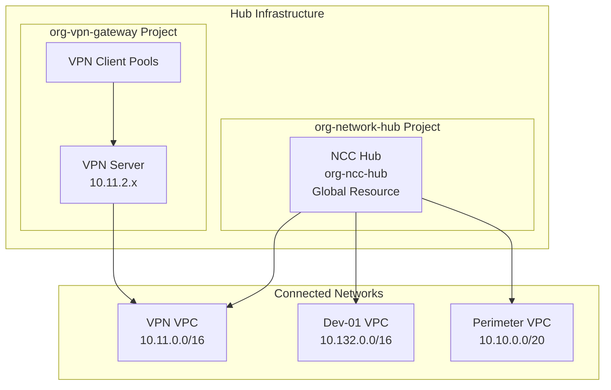

<!-- Space: PE -->
<!-- Title: NCC & VPN Gateway Infrastructure -->
<!-- Parent: Network Design -->
<!-- Label: ncc -->
<!-- Label: vpn -->
<!-- Label: network -->
<!-- Label: advanced -->
<!-- Label: security -->
<!-- Label: hub-spoke -->

# Network Connectivity Center (NCC) and VPN Gateway Infrastructure

> Legacy Notice (Oct 2025)
> - VPC Network Peering with VPN Gateway is now documented as the primary connectivity mechanism (see `docs/VPC_PEERING_AND_VPN_GATEWAY.md`).
> - This document remains as a legacy reference for the NCC hub/spokes implementation.

## Executive Summary

This document provides comprehensive documentation for the Network Connectivity Center (NCC) hub and VPN Gateway infrastructure that forms the backbone of network connectivity across the GCP organization. The NCC hub enables transitive routing between all VPCs without complex peering or VPN configurations, while the VPN Gateway provides secure remote access with role-based network segmentation.

## Table of Contents

- [Architecture Overview](#architecture-overview)
- [Network Connectivity Center (NCC)](#network-connectivity-center-ncc)
  - [NCC Hub Configuration](#ncc-hub-configuration)
  - [VPC Spokes](#vpc-spokes)
  - [Export Policies](#export-policies)
  - [BGP and Routing](#bgp-and-routing)
- [VPN Gateway Infrastructure](#vpn-gateway-infrastructure)
  - [VPN Server](#vpn-server)
  - [VPN Client Pools](#vpn-client-pools)
  - [Access Control](#access-control)
- [Implementation Details](#implementation-details)
  - [Directory Structure](#directory-structure)
  - [Module Configuration](#module-configuration)
  - [Dependencies](#dependencies)
- [Deployment Guide](#deployment-guide)
  - [Prerequisites](#prerequisites)
  - [Deployment Order](#deployment-order)
  - [Post-Deployment](#post-deployment)
- [Operations and Management](#operations-and-management)
  - [Monitoring](#monitoring)
  - [Backup and Recovery](#backup-and-recovery)
  - [Troubleshooting](#troubleshooting)
- [Security Architecture](#security-architecture)
- [Cost Analysis](#cost-analysis)
- [Future Enhancements](#future-enhancements)
- [References](#references)

## Architecture Overview

The hub infrastructure consists of two primary projects under the Hub Folder:

1. **org-network-hub**: Hosts the NCC hub for centralized VPC-to-VPC connectivity
2. **org-vpn-gateway**: Provides VPN access with VPN server and network segmentation



## Network Connectivity Center (NCC)

### NCC Hub Configuration

The Network Connectivity Center provides enterprise-grade connectivity with centralized routing management, enabling transitive routing between all connected VPCs.

#### Hub Specifications

| Property | Value |
|----------|-------|
| **Resource Name** | `org-ncc-hub` |
| **Project** | `org-network-hub` |
| **Location** | Global (GCP requirement) |
| **Module** | `terraform-google-modules/network//modules/network-connectivity-center@v12.0.0` |
| **Configuration Path** | `live/non-production/hub/network-hub/ncc-hub/` |
| **Routing Mode** | Transitive routing enabled |
| **Route Exchange** | Automatic via BGP |

#### Key Features

- **Centralized Management**: Single point of control for inter-VPC routing
- **Transitive Routing**: VPCs can communicate without direct peering
- **Dynamic Route Exchange**: Automatic route propagation via BGP
- **Scalability**: Easy addition of new VPC spokes
- **No NAT Required**: Direct private IP communication between spokes

### VPC Spokes

Three VPC networks are currently connected as spokes to the NCC hub:

| Spoke Name | VPC Network | CIDR Range | Project | Purpose |
|------------|-------------|------------|---------|---------|
| `vpn-gateway-spoke` | org-vpn-gateway-vpc | 10.11.0.0/16 | org-vpn-gateway | VPN access network |
| `dp-dev-01-spoke` | dp-dev-01-vpc-network | 10.132.0.0/16 | dp-dev-01 | Development environment |
| `data-staging-spoke` | data-staging-vpc-network | 10.10.0.0/20 | data-staging | Perimeter for external data |

### Export Policies

Each spoke implements specific export policies to control route advertisement:

#### VPN Gateway Spoke
```hcl
vpc_spokes = {
  "vpn-gateway-spoke" = {
    uri = dependency.vpn_vpc.outputs.network_id
    include_export_ranges = [
      "10.11.0.0/24",    # VPN gateway subnet
      "10.11.1.0/24",    # HA VPN subnet
      "10.11.2.0/24",    # VPN server subnet
      "10.11.3.0/24",    # Reserved subnet
      # Client pools (reserved for address documentation)
      "10.11.100.0/24",  # Default pool
      "10.11.101.0/24",  # Admin pool
      "10.11.111.0/24"   # Perimeter-restricted pool
    ]
  }
}
```

#### Development Spoke
```hcl
vpc_spokes = {
  "dp-dev-01-spoke" = {
    uri = dependency.dev01_vpc.outputs.network_id
    # Exclude public subnet
    exclude_export_ranges = ["10.132.16.0/21"]
    # Include only private CIDRs
    include_export_ranges = [
      "10.132.0.0/21",    # Perimeter subnet
      "10.132.8.0/21",    # Private subnet
      "10.132.64.0/20",   # GKE subnet
      "10.132.128.0/18",  # cluster-01 pod range
      "10.132.192.0/18",  # cluster-02 pod range (reserved)
      "10.132.80.0/24",   # cluster-01 service range
      "10.132.82.0/23",   # cluster-02 service range (reserved)
      "10.132.84.0/23"    # cluster-02 ingress range (reserved)
    ]
  }
}
```

#### Perimeter Spoke
```hcl
vpc_spokes = {
  "data-staging-spoke" = {
    uri = dependency.dmz_vpc.outputs.network_id
    include_export_ranges = [
      "10.10.0.0/20"      # All perimeter subnets
    ]
  }
}
```

### BGP and Routing

#### Cloud Router Configuration

Routers connected to NCC must use appropriate BGP settings:

| Setting | Value | Purpose |
|---------|-------|---------|
| **BGP Mode** | `STANDARD` | Best path selection (not `LEGACY`) |
| **ASN Range** | 64512-65534 | Private ASN space |
| **Advertisement Mode** | `CUSTOM` | Control route advertisement |
| **Advertised Groups** | `ALL_SUBNETS` | Advertise all subnet routes |

#### Route Propagation

Routes are automatically propagated between spokes through the NCC hub:

1. Each spoke advertises its routes to the hub
2. Hub aggregates and distributes routes to all spokes
3. Spokes install routes in their VPC routing tables
4. Traffic flows directly between VPCs (data plane bypass)

## VPN Gateway Infrastructure

### Overview

The VPN Gateway project (`org-vpn-gateway`) provides secure remote access to the entire network infrastructure through a fully automated VPN server with role-based access control.

### Infrastructure Components

| Component | Specification | Purpose |
|-----------|--------------|---------|
| **VPC Network** | 10.11.0.0/16 | Dedicated VPN network |
| **VPN Server** | e2-small instance | VPN server with MongoDB |
| **Cloud NAT** | Regional NAT gateway | Internet egress for VPN server |
| **Cloud Router** | BGP router (ASN 64514) | Network routing |
| **External IPs** | 2 static IPs | NAT gateway and VPN UI |
| **GCS Bucket** | vm-scripts bucket | Startup script storage |

### VPN Server

#### Server Configuration

| Setting | Value |
|---------|-------|
| **Instance Type** | e2-small (2 vCPU, 2GB RAM) |
| **OS** | Ubuntu 22.04 LTS |
| **MongoDB** | Local instance, auto-configured |
| **VPN Version** | Latest stable |
| **Network** | 10.11.2.x subnet |
| **Startup Method** | GCS URL-based scripts |

#### Automation Features

The VPN server is automated with:

1. **MongoDB Initialization**: Optimized mongod config for small instances
2. **Configuration Bypass**: Direct config setup (no setup key needed)
3. **Organization Creation**: Automatic creation of access tiers
4. **Server Configuration**: VPN servers auto-configured and started
5. **Route Management**: Routes configured for NCC connectivity
6. **Health Monitoring**: Built-in health check scripts
7. **Backup & Restore**: Daily backups to GCS; first-boot restore orchestrated by a one-shot systemd unit
8. **DNS Forwarding**: `dnsmasq` listens on the metadata-configured bind address (`dns-bind-address`, default `10.11.2.10`) and forwards `*.dev.example.io` (metadata key `dns-forward-domain`) to `169.254.169.254`, matching the Cloud DNS peering zones for VPN clients.  These values are controlled via `vpn_dns_settings` in `live/non-production/hub/vpn-gateway/europe-west2/compute/compute.hcl`.

### VPN Client Pools

Three VPN client pools provide role-based network segmentation:

| Pool Name | CIDR | Port | Access Level | Purpose |
|-----------|------|------|--------------|---------|
| **Default Pool** | 10.11.100.0/24 | 1194/udp | Full network access | Initial setup and testing |
| **Admin Pool** | 10.11.101.0/24 | 1194/udp | Full network access | Administrative access |
| **Perimeter-Restricted Pool** | 10.11.111.0/24 | 1195/udp | Perimeter only (1433, 3389) | Limited perimeter access |

**Note**: These pools are modeled as subnets in the VPC for address reservation but are not actual GCP subnets.

### DNS & Access Control

#### DNS for VPN Clients
- dnsmasq runs on the VPN server VM and forwards to Google metadata resolver.
- Bind address and forward domain are metadata-driven: `dns-bind-address` (default `10.11.2.10`), `dns-forward-domain` (default `dev.example.io`).
- iptables rules allow TCP/UDP 53 to reach dnsmasq from VPN clients.

#### Firewall Rules Matrix

The VPN Gateway implements comprehensive firewall rules across all projects:

##### VPN Gateway Project Rules
| Rule | Source | Target | Ports | Priority |
|------|--------|--------|-------|----------|
| allow-admin-pool | 10.11.101.0/24 | All resources | All | 900 |
| allow-perimeter-pool-restricted | 10.11.111.0/24 | perimeter-accessible | 1433, 3389 | 1100 |
| deny-perimeter-pool-to-non-perimeter | 10.11.111.0/24 | dev/gke tags | Deny all | 800 |
| allow-iap | 35.235.240.0/20 | All | 22, 3389 | 1000 |
| allow-internal | 10.11.0.0/16 | All | All | 1000 |
| allow-https | 0.0.0.0/0 | vpn-server | 443 | 1000 |
| allow-vpn-clients | 0.0.0.0/0 | vpn-server | 1194-1195/udp | 1000 |
| allow-vpn-dns | 10.11.100.0/24, 10.11.101.0/24, 10.11.111.0/24 | vpn-server | 53 (tcp/udp) | 1100 |

##### Cross-Project Rules
| Project | Rule | Purpose |
|---------|------|---------|
| **data-staging** | allow-admin-vpn-full | Admin pool full access |
| **data-staging** | allow-perimeter-vpn-restricted | Perimeter pool limited access |
| **data-staging** | deny-perimeter-vpn-other-ports | Block perimeter pool from SSH/HTTPS |
| **dp-dev-01** | deny-perimeter-pool-all | Block all perimeter pool access |
| **dp-dev-01** | allow-admin-vpn-full | Admin pool full access |

## Implementation Details

### Directory Structure

```
live/non-production/hub/
├── folder/                              # Hub folder configuration
│   └── terragrunt.hcl
├── network-hub/                        # NCC hub project
│   ├── project/
│   ├── vpc-network/
│   ├── ncc-hub/                        # NCC Hub configuration
│   │   ├── terragrunt.hcl
│   │   └── dependencies:
│   │       ├── vpn-gateway VPC
│   │       ├── dp-dev-01 VPC
│   │       └── data-staging VPC
│   └── ncc-spoke/                      # Legacy hub VPC spoke
└── vpn-gateway/                        # VPN Gateway project
    ├── project/
    ├── vpc-network/
    │   └── includes reserved pool subnets
    ├── ncc-spoke/                      # VPN VPC spoke to NCC
    ├── iam-service-accounts/
    ├── iam-bindings/
    ├── secrets/                        # VPN secrets
    │   ├── vpn-admin-password/
    │   ├── vpn-google-admin-email/
    │   ├── vpn-google-apps-domain/
    │   ├── vpn-google-json-key/
    │   ├── vpn-shared-passphrase/
    │   ├── vpn-psk-0/
    │   └── vpn-psk-1/
    ├── global/
    │   └── cloud-dns/
    │       └── peering/                # Peering zones for {project}.dev.example.io
    └── europe-west2/
        ├── compute/
        │   └── vpn-server/
        │       ├── terragrunt.hcl      # Instance template
        │       ├── vm/                  # VM instance
        │       └── scripts/             # VPN scripts
        ├── networking/
        │   ├── cloud-router/
        │   ├── cloud-nat/
        │   ├── external-ips/
        │   └── firewall-rules/
        └── buckets/
            └── vm-scripts/              # Script storage

### Backup & Restore (VPN Server)

- Backups are written to: `gs://org-vpn-gateway-vm-backups/vpn-server/mongodb-backups/` with `latest.tar.gz` maintained.
- First boot uses `vpn-configure.service` to restore from `latest.tar.gz`; otherwise runs configuration.
- Logs available in `journalctl -u vpn-configure` and `/var/log/vpn-configure.log`.
- Override backup location via instance metadata:
  - `vpn-backup-bucket` (default `org-vpn-gateway-vm-backups`)
  - `vpn-backup-prefix` (default `vpn-server`)

```

### Module Configuration

#### NCC Hub Module
```hcl
# _common/templates/ncc.hcl
terraform {
  source = "tfr:///terraform-google-modules/network//modules/network-connectivity-center?version=v12.0.0"
}

locals {
  # Hub configuration
  ncc_hub_name = "org-ncc-hub"
  ncc_hub_project_id = "org-network-hub"

  # Spoke configuration loaded from dependencies
  vpc_spokes = {
    # Each spoke configuration
  }
}
```

#### VPN Gateway Network
```hcl
# vpn-gateway/vpc-network/terragrunt.hcl
inputs = {
  subnets = [
    {
      subnet_name = "vpn-gateway-subnet"
      subnet_ip = "10.11.1.0/24"
      subnet_region = "europe-west2"
      purpose = "HA VPN and NAT gateway"
    },
    {
      subnet_name = "vpn-server-subnet"
      subnet_ip = "10.11.2.0/24"
      subnet_region = "europe-west2"
      purpose = "VPN server deployment"
    },
    # Reserved pool subnets for address documentation
    {
      subnet_name = "vpn-default-pool"
      subnet_ip = "10.11.100.0/24"
      purpose = "RESERVED: Default VPN client pool"
    },
    {
      subnet_name = "vpn-admin-pool"
      subnet_ip = "10.11.101.0/24"
      purpose = "RESERVED: Admin VPN client pool"
    },
    {
      subnet_name = "vpn-perimeter-pool"
      subnet_ip = "10.11.111.0/24"
      purpose = "RESERVED: Perimeter-restricted client pool"
    }
  ]
}
```

### Dependencies

#### NCC Hub Dependencies
- All VPC networks must exist before creating spokes
- Service Networking API must be enabled
- Network Connectivity Center API must be enabled
- Compute Engine API for Cloud Routers

#### VPN Gateway Dependencies
- VPC network must exist before VPN server deployment
- Secrets must be created in Secret Manager
- GCS bucket for startup scripts
- External IPs allocated before NAT configuration

## Deployment Guide

### Prerequisites

1. **Authentication**
   ```bash
   export GOOGLE_APPLICATION_CREDENTIALS=~/tofu-sa-org-key.json
   gcloud auth application-default login
   ```

2. **Required APIs**
   ```bash
   # Enable required APIs
   gcloud services enable compute.googleapis.com
   gcloud services enable networkconnectivity.googleapis.com
   gcloud services enable servicenetworking.googleapis.com
   gcloud services enable secretmanager.googleapis.com
   ```

3. **Folder Structure**
   - Hub folder must exist
   - Projects must be created
   - Billing account linked

### Deployment Order

#### Phase 1: Network Hub Project
```bash
# 1. Create network-hub project
cd live/non-production/hub/network-hub/project
terragrunt run apply

# 2. Deploy hub VPC network
cd ../vpc-network
terragrunt run apply

# 3. Create other VPC networks (dp-dev-01, data-staging)
# These must exist before NCC hub creation
cd ../../development/dp-dev-01/vpc-network
terragrunt run apply

cd ../../perimeter/data-staging/vpc-network
terragrunt run apply
```

#### Phase 2: VPN Gateway Project
```bash
# 1. Create vpn-gateway project
cd live/non-production/hub/vpn-gateway/project
terragrunt run apply

# 2. Deploy VPN VPC network with reserved pools
cd ../vpc-network
terragrunt run apply

# 3. Create service accounts
cd ../iam-service-accounts
terragrunt run apply

# 4. Configure IAM bindings
cd ../iam-bindings
terragrunt run apply

# 5. Create secrets (manual values required)
cd ../secrets
for secret in vpn-*; do
  cd $secret && terragrunt run apply && cd ..
done
```

#### Phase 3: NCC Hub and Spokes
```bash
# Deploy NCC hub with all spokes
cd live/non-production/hub/network-hub/ncc-hub
terragrunt run apply --auto-approve

# Note: This creates the hub and all three spokes in one operation
```

#### Phase 4: VPN Gateway Infrastructure
```bash
# 1. Deploy networking components
cd live/non-production/hub/vpn-gateway/europe-west2/networking

# Cloud Router
cd cloud-router && terragrunt run apply && cd ..

# External IPs
cd external-ips/vpn-server && terragrunt run apply && cd ../..
cd external-ips/nat-gateway && terragrunt run apply && cd ../..

# Cloud NAT
cd cloud-nat && terragrunt run apply && cd ..

# 2. Deploy firewall rules
cd firewall-rules
for rule in */; do
  cd $rule && terragrunt run apply && cd ..
done
cd ..

# 3. Upload VPN scripts to GCS
cd ../compute/vpn-server/scripts
gsutil cp *.sh gs://org-vpn-gateway-vm-scripts/vpn-server/

# 4. Deploy VPN server
cd ..
terragrunt run apply  # Instance template
cd vm
terragrunt run apply  # VM instance
```

### Post-Deployment

#### Verify NCC Hub Status
```bash
# Check hub
gcloud network-connectivity hubs describe org-ncc-hub \
  --project=org-network-hub --location=global

# List spokes
gcloud network-connectivity spokes list \
  --project=org-network-hub --location=global

# View route tables
gcloud network-connectivity hubs route-tables list \
  --hub=org-ncc-hub --project=org-network-hub --location=global
```

#### Access VPN Web UI
```bash
# Get external IP
gcloud compute instances describe org-vpn-gateway-vpn-server-001 \
  --zone=europe-west2-a \
  --project=org-vpn-gateway \
  --format="get(networkInterfaces[0].accessConfigs[0].natIP)"

# Wait 5-10 minutes for startup completion, then get credentials
gcloud compute ssh org-vpn-gateway-vpn-server-001 \
  --zone=europe-west2-a \
  --project=org-vpn-gateway \
  --tunnel-through-iap \
  --command="sudo vpn-server default-password"

# Access UI at https://<EXTERNAL_IP>
```

## Operations and Management

### Monitoring

#### NCC Hub Metrics
- **Hub Status**: Operational state of the hub
- **Spoke Connectivity**: Connection status of each spoke
- **Route Propagation**: Number of routes exchanged
- **Traffic Volume**: Inter-VPC traffic statistics

#### VPN Gateway Metrics
- **Server Status**: VPN server and MongoDB health
- **Connected Users**: Active VPN connections by pool
- **Bandwidth Usage**: Ingress/egress traffic
- **Authentication Events**: Login attempts and failures

#### Monitoring Commands
```bash
# NCC metrics
gcloud monitoring metrics-explorer \
  --project=org-network-hub \
  --metric=networkconnectivity.googleapis.com/hub/spoke_count

# VPN server logs
gcloud logging read "resource.type=gce_instance AND \
  resource.labels.instance_id=org-vpn-gateway-vpn-server-001" \
  --project=org-vpn-gateway --limit=50

# NAT gateway logs
gcloud logging read "resource.type=nat_gateway" \
  --project=org-vpn-gateway --limit=50
```

### Backup and Recovery

#### VPN Server Backup
```bash
# Manual backup
gcloud compute ssh org-vpn-gateway-vpn-server-001 \
  --project=org-vpn-gateway \
  --zone=europe-west2-a \
  --command="/usr/local/bin/vpn-backup.sh backup"

# List backups
gsutil ls gs://org-vpn-gateway-vm-scripts/vpn-configs/mongodb-backups/

# Restore from backup
gcloud compute ssh org-vpn-gateway-vpn-server-001 \
  --project=org-vpn-gateway \
  --zone=europe-west2-a \
  --command="/usr/local/bin/vpn-backup.sh restore <timestamp>"
```

#### NCC Hub Recovery
```bash
# In case of hub issues, recreate spokes
cd live/non-production/hub/network-hub/ncc-hub
terragrunt run destroy --auto-approve
# Wait 10 minutes (cooldown period)
terragrunt run apply --auto-approve
```

### Troubleshooting

#### Common NCC Issues

**Issue: Spoke Not Connected**
```bash
# Check VPC exists
gcloud compute networks describe <VPC_NAME> --project=<PROJECT_ID>

# Verify spoke status
gcloud network-connectivity spokes describe <SPOKE_NAME> \
  --project=<PROJECT_ID> --location=global

# Check for cooldown period (10 minutes after deletion)
```

**Issue: Routes Not Propagating**
```bash
# Check export ranges
gcloud network-connectivity spokes describe <SPOKE_NAME> \
  --project=<PROJECT_ID> --location=global \
  --format="value(linkedVpcNetwork.includeExportRanges,linkedVpcNetwork.excludeExportRanges)"

# Verify route tables
gcloud compute routes list --project=<PROJECT_ID> \
  --filter="network:<VPC_NAME>"
```

#### Common VPN Issues

**Issue: Cannot Access VPN UI**
```bash
# Check if startup script completed
gcloud compute instances get-serial-port-output \
  org-vpn-gateway-vpn-server-001 \
  --zone=europe-west2-a --project=org-vpn-gateway | tail -100

# Verify services running
gcloud compute ssh org-vpn-gateway-vpn-server-001 \
  --project=org-vpn-gateway --zone=europe-west2-a \
  --command="sudo systemctl status vpn-server mongod"
```

**Issue: VPN Clients Cannot Connect**
```bash
# Check firewall rules
gcloud compute firewall-rules list --project=org-vpn-gateway \
  --filter="name:allow-vpn-clients"

# Verify server status in VPN UI
# Ensure servers are started
```

## Security Architecture

### Defense in Depth

The infrastructure implements multiple security layers:

1. **Network Segmentation**
   - Separate VPCs for different environments
   - VPN client pool isolation
   - Firewall rules for access control

2. **Access Control**
   - Role-based VPN pools
   - IAM permissions per project
   - Network tags for resource targeting

3. **Encryption**
   - TLS for VPN web UI
   - OpenVPN encryption for VPN tunnels
   - Encrypted inter-VPC communication

4. **Monitoring**
   - VPC Flow Logs enabled
   - Cloud NAT connection logging
   - VPN authentication logging

### Security Best Practices

1. **VPN Configuration**
   - Enable OTP/2FA for all users
   - Rotate shared passphrases regularly
   - Use Google SSO in production

2. **Network Security**
   - Minimize external IP usage
   - Implement least-privilege firewall rules
   - Regular security audits

3. **Secret Management**
   - All secrets in Secret Manager
   - No hardcoded credentials
   - Regular rotation schedule

## Cost Analysis

### Monthly Cost Breakdown

| Component | Specification | Estimated Cost |
|-----------|--------------|----------------|
| **NCC Hub** | Global resource | $0 (no charge) |
| **NCC Spokes** | 3 spokes | $0 (no charge) |
| **VPN Server** | e2-small instance | ~$12 |
| **Static IPs** | 2 external IPs | ~$10 |
| **Cloud NAT** | Regional NAT | ~$45 |
| **Cloud Router** | BGP router | ~$0 |
| **GCS Storage** | Scripts/backups | ~$1 |
| **VPC Networks** | 4 VPCs | $0 |
| **Total** | **Per month** | **~$68** |

### Cost Optimization Tips

1. **Use committed use discounts** for VPN server
2. **Release unused external IPs** immediately
3. **Monitor NAT egress traffic** for cost control
4. **Set GCS lifecycle rules** for old backups
5. **Consider spot instances** for non-critical workloads

## Future Enhancements

### Short Term
- [ ] Implement Google SSO for VPN
- [ ] Add automated certificate rotation
- [ ] Deploy redundant VPN servers
- [ ] Implement advanced BGP policies

### Medium Term
- [ ] Multi-region NCC deployment
- [ ] Cloud VPN for hybrid connectivity
- [ ] Traffic engineering with BGP communities
- [ ] Enhanced monitoring dashboards

### Long Term
- [ ] Cloud Interconnect integration
- [ ] Zero-trust network access
- [ ] Advanced threat detection
- [ ] Cost optimization automation

## Operational Runbooks

### Daily Operations
- Monitor VPN connection status
- Check NCC hub health
- Review authentication logs
- Verify backup completion

### Weekly Tasks
- Rotate VPN user credentials
- Review firewall rule changes
- Analyze traffic patterns
- Update documentation

### Monthly Procedures
- Security audit of access logs
- Cost analysis and optimization
- Capacity planning review
- Disaster recovery testing

## Appendices

### A. Configuration Files

#### NCC Hub Terragrunt Configuration
```hcl
# live/non-production/hub/network-hub/ncc-hub/terragrunt.hcl
include "root" {
  path = find_in_parent_folders("root.hcl")
}

include "ncc_template" {
  path           = "${get_repo_root()}/_common/templates/ncc.hcl"
  merge_strategy = "deep"
}

dependencies {
  paths = [
    "../vpc-network",
    "../../../vpn-gateway/vpc-network",
    "../../../development/dp-dev-01/vpc-network",
    "../../../perimeter/data-staging/vpc-network"
  ]
}
```

### B. Script Locations

| Script | Location | Purpose |
|--------|----------|---------|
| vpn-install-enhanced.sh | gs://org-vpn-gateway-vm-scripts/vpn-server/ | Automated setup |
| vpn-backup.sh | /usr/local/bin/ (on server) | Backup/restore |
| vpn-health-check.sh | /usr/local/bin/ (on server) | Health monitoring |

### B1. Startup Behavior & Markers

- First-boot guard: startup scripts create and respect `\`/var/lib/vpn/.first_boot_complete\``.
  - First boot: runs restore-or-configure once, then writes marker.
  - Subsequent boots: skip all restore/config/cleanup; only start services and apply route fixes.
- Configuration marker: `\`/var/lib/vpn-configured\`` indicates successful configuration.
- Restore marker: `\`/var/lib/vpn/.restored_from_backup\`` indicates a backup restore occurred.

Implication: VM reboots preserve database state; database restoration and cleanup run only on a fresh, never-configured VM.

### C. Important URLs and Endpoints

| Service | URL/Endpoint |
|---------|-------------|
| VPN Web UI | https://<EXTERNAL_IP> |
| VPN Connection | <EXTERNAL_IP>:1194/udp (admin/default) |
| Perimeter VPN Connection | <EXTERNAL_IP>:1195/udp |
| GCS Scripts | gs://org-vpn-gateway-vm-scripts/vpn-server/ |

## References

### Google Cloud Documentation
- [Network Connectivity Center](https://cloud.google.com/network-connectivity/docs/network-connectivity-center)
- [Cloud Router](https://cloud.google.com/network-connectivity/docs/router)
- [Cloud NAT](https://cloud.google.com/nat/docs)
- [VPC Networks](https://cloud.google.com/vpc/docs)

### Terraform Modules
- [Network Connectivity Center Module](https://github.com/terraform-google-modules/terraform-google-network/tree/master/modules/network-connectivity-center)
- [VPC Module](https://github.com/terraform-google-modules/terraform-google-network)
- [VM Module](https://github.com/terraform-google-modules/terraform-google-vm)

### Internal Documentation
- [Main Repository Documentation](../README.md)
- [Network Architecture](NETWORK_ARCHITECTURE.md)
- [Architecture Summary](ARCHITECTURE_SUMMARY.md)

---
**Document Version**: 1.0.0
**Last Updated**: 2025-09-21
**Maintained By**: Infrastructure Team
**Review Schedule**: Monthly
