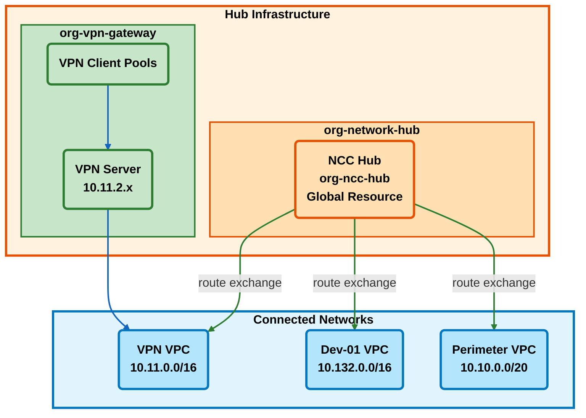

# Network Connectivity Center (NCC) and VPN Gateway Infrastructure

> **Legacy** -- This document describes the NCC hub-and-spoke connectivity model.
> VPC Network Peering with VPN Gateway is now the primary approach.
> See [VPC_PEERING_AND_VPN_GATEWAY.md](VPC_PEERING_AND_VPN_GATEWAY.md) for the current design.

## Architecture Overview

The hub infrastructure consists of two projects under the Hub Folder:

1. **org-network-hub** -- Hosts the NCC hub for centralised VPC-to-VPC connectivity.
2. **org-vpn-gateway** -- Provides VPN access with role-based network segmentation.

The NCC hub enables transitive routing between all connected VPCs without direct
peering. Each VPC registers as a spoke; the hub aggregates and distributes routes
automatically via BGP so traffic flows directly between spokes.


```mermaid
flowchart TB
    subgraph HUB["<b>Hub Infrastructure</b>"]
        subgraph NH["<b>org-network-hub</b>"]
            NCCHub("<b>NCC Hub</b><br/>org-ncc-hub<br/>Global Resource")
        end
        subgraph VG["<b>org-vpn-gateway</b>"]
            VPNServer("<b>VPN Server</b><br/>10.11.2.x")
            VPNPools("<b>VPN Client Pools</b>")
        end
    end

    subgraph SPOKES["<b>Connected Networks</b>"]
        VPNSpoke("<b>VPN VPC</b><br/>10.11.0.0/16")
        DevSpoke("<b>Dev-01 VPC</b><br/>10.132.0.0/16")
        PerimSpoke("<b>Perimeter VPC</b><br/>10.10.0.0/20")
    end

    NCCHub -->|"route exchange"| VPNSpoke
    NCCHub -->|"route exchange"| DevSpoke
    NCCHub -->|"route exchange"| PerimSpoke

    VPNServer --> VPNSpoke
    VPNPools --> VPNServer

    classDef hub fill:#ffe0b2,stroke:#e65100,stroke-width:3px,font-weight:bold,color:#000
    classDef network fill:#b3e5fc,stroke:#0277bd,stroke-width:3px,font-weight:bold,color:#000
    classDef compute fill:#c8e6c9,stroke:#2e7d32,stroke-width:3px,font-weight:bold,color:#000

    class NCCHub hub
    class VPNSpoke,DevSpoke,PerimSpoke network
    class VPNServer,VPNPools compute

    style HUB fill:#fff3e0,stroke:#e65100,stroke-width:3px,color:#000
    style NH fill:#ffe0b2,stroke:#e65100,stroke-width:2px,color:#000
    style VG fill:#c8e6c9,stroke:#2e7d32,stroke-width:2px,color:#000
    style SPOKES fill:#e1f5fe,stroke:#0277bd,stroke-width:3px,color:#000

    linkStyle 0,1,2 stroke:#2e7d32,stroke-width:2px
    linkStyle 3,4 stroke:#1565c0,stroke-width:2px
```

## NCC Hub Configuration

| Property | Value |
|----------|-------|
| **Resource Name** | `org-ncc-hub` |
| **Project** | `org-network-hub` |
| **Location** | Global |
| **Module** | `terraform-google-modules/network//modules/network-connectivity-center@v12.0.0` |
| **Config Path** | `live/non-production/hub/network-hub/ncc-hub/` |
| **Routing Mode** | Transitive routing enabled |

Key capabilities: centralised inter-VPC routing, dynamic route exchange via BGP,
no NAT required for spoke-to-spoke traffic, and easy addition of new spokes.

### Hub Terragrunt Configuration

```hcl
# live/non-production/hub/network-hub/ncc-hub/terragrunt.hcl
include "root" {
  path = find_in_parent_folders("root.hcl")
}

include "ncc_template" {
  path           = "${get_repo_root()}/_common/templates/ncc.hcl"
  merge_strategy = "deep"
}

dependencies {
  paths = [
    "../vpc-network",
    "../../../vpn-gateway/vpc-network",
    "../../../development/dp-dev-01/vpc-network",
    "../../../perimeter/data-staging/vpc-network"
  ]
}
```

## VPC Spokes

| Spoke Name | VPC Network | CIDR | Project | Purpose |
|------------|-------------|------|---------|---------|
| `vpn-gateway-spoke` | org-vpn-gateway-vpc | 10.11.0.0/16 | org-vpn-gateway | VPN access network |
| `dp-dev-01-spoke` | dp-dev-01-vpc-network | 10.132.0.0/16 | dp-dev-01 | Development environment |
| `data-staging-spoke` | data-staging-vpc-network | 10.10.0.0/20 | data-staging | Perimeter for external data |

Each spoke defines export policies that control which CIDRs are advertised to
the hub. For example, the development spoke excludes its public subnet and
explicitly lists only private, GKE, and service ranges.

### Export Policy Example (VPN Gateway Spoke)

```hcl
vpc_spokes = {
  "vpn-gateway-spoke" = {
    uri = dependency.vpn_vpc.outputs.network_id
    include_export_ranges = [
      "10.11.0.0/24",    # VPN gateway subnet
      "10.11.1.0/24",    # HA VPN subnet
      "10.11.2.0/24",    # VPN server subnet
      "10.11.3.0/24",    # Reserved subnet
      "10.11.100.0/24",  # Default client pool
      "10.11.101.0/24",  # Admin client pool
      "10.11.111.0/24"   # Perimeter-restricted pool
    ]
  }
}
```

## VPN Client Pools

Three pools provide role-based segmentation on the VPN gateway:

| Pool | CIDR | Port | Access Level |
|------|------|------|--------------|
| **Default** | 10.11.100.0/24 | 1194/udp | Full network access |
| **Admin** | 10.11.101.0/24 | 1194/udp | Full network access |
| **Perimeter-Restricted** | 10.11.111.0/24 | 1195/udp | Perimeter only (1433, 3389) |

These pools are modelled as reserved subnets in the VPC for address
documentation but are not actual GCP subnets carrying workload traffic.

## BGP and Routing

Cloud Routers connected to NCC use `STANDARD` BGP mode with private ASNs
(64512-65534) and `CUSTOM` advertisement mode advertising `ALL_SUBNETS`.
Routes propagate automatically: spokes advertise to the hub, the hub
distributes to all other spokes, and traffic flows directly between VPCs
(data-plane bypass).

## DNS for VPN Clients

`dnsmasq` on the VPN server forwards `*.dev.example.io` queries to the
Google metadata resolver (`169.254.169.254`), matching Cloud DNS peering
zones. The bind address and forward domain are metadata-driven
(`dns-bind-address`, `dns-forward-domain`) and configurable in
`live/non-production/hub/vpn-gateway/europe-west2/compute/compute.hcl`.

## Current Alternative

This NCC-based design has been superseded by VPC Network Peering, which
provides simpler configuration and lower operational overhead for the
current scale of the organisation.

See [VPC_PEERING_AND_VPN_GATEWAY.md](VPC_PEERING_AND_VPN_GATEWAY.md) for:
- VPC peering topology and configuration
- VPN gateway setup with the peering model
- Firewall rules and access control
- Deployment instructions

The VPN gateway project (`org-vpn-gateway`) and its client pools remain
largely the same in both designs; only the inter-VPC connectivity layer
changed from NCC spokes to VPC peering.
