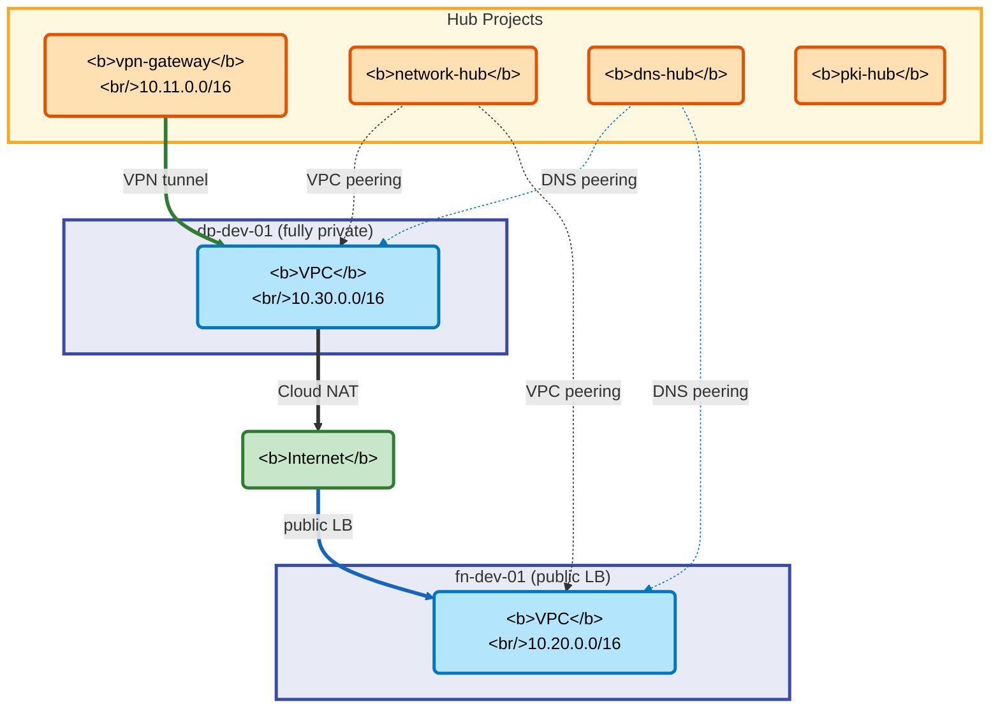
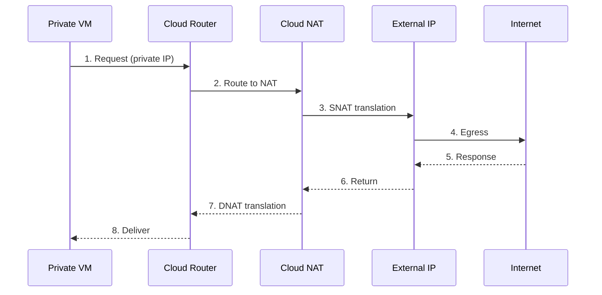

# Network Architecture

The infrastructure uses a hub-and-spoke VPC design with centralised egress through Cloud NAT, VPC peering from a hub project, and purpose-specific subnets per project. All networking modules are pinned in `_common/common.hcl`: network v12.0.0, cloud_router v7.1.0, cloud_nat v5.4.0.

For template configuration details, see [NETWORK_TEMPLATE.md](NETWORK_TEMPLATE.md). For IP range assignments, see [IP_ALLOCATION.md](IP_ALLOCATION.md).

## Architecture Overview


```mermaid
flowchart TB
    subgraph HUB["Hub Projects"]
        VPN("&lt;b&gt;vpn-gateway&lt;/b&gt;&lt;br/&gt;10.11.0.0/16")
        NETHUB("&lt;b&gt;network-hub&lt;/b&gt;")
        DNSHUB("&lt;b&gt;dns-hub&lt;/b&gt;")
        PKIHUB("&lt;b&gt;pki-hub&lt;/b&gt;")
    end

    subgraph DP["dp-dev-01 (fully private)"]
        DPVPC("&lt;b&gt;VPC&lt;/b&gt;&lt;br/&gt;10.30.0.0/16")
    end

    subgraph FN["fn-dev-01 (public LB)"]
        FNVPC("&lt;b&gt;VPC&lt;/b&gt;&lt;br/&gt;10.20.0.0/16")
    end

    INTERNET("&lt;b&gt;Internet&lt;/b&gt;")

    VPN ==>|"VPN tunnel"| DPVPC
    NETHUB -.->|"VPC peering"| DPVPC
    NETHUB -.->|"VPC peering"| FNVPC
    DNSHUB -.->|"DNS peering"| DPVPC
    DNSHUB -.->|"DNS peering"| FNVPC
    INTERNET ==>|"public LB"| FNVPC
    DPVPC ==>|"Cloud NAT"| INTERNET

    style HUB fill:#fff8e1,stroke:#f9a825,stroke-width:3px
    style DP fill:#e8eaf6,stroke:#3949ab,stroke-width:3px
    style FN fill:#e8eaf6,stroke:#3949ab,stroke-width:3px
    style VPN stroke-width:3px,color:#000,fill:#ffe0b2,stroke:#e65100
    style NETHUB stroke-width:3px,color:#000,fill:#ffe0b2,stroke:#e65100
    style DNSHUB stroke-width:3px,color:#000,fill:#ffe0b2,stroke:#e65100
    style PKIHUB stroke-width:3px,color:#000,fill:#ffe0b2,stroke:#e65100
    style DPVPC stroke-width:3px,color:#000,fill:#b3e5fc,stroke:#0277bd
    style FNVPC stroke-width:3px,color:#000,fill:#b3e5fc,stroke:#0277bd
    style INTERNET stroke-width:3px,color:#000,fill:#c8e6c9,stroke:#2e7d32

    linkStyle 0 stroke:#2e7d32
    linkStyle 3,4 stroke:#0277bd
    linkStyle 5 stroke:#1565c0
```

### Access Patterns

| Project | Access Model | Inbound | Outbound |
|---------|-------------|---------|----------|
| dp-dev-01 | Fully private | VPN only (via vpn-gateway hub) | Cloud NAT |
| fn-dev-01 | Public LB | Internet via Cloud Armor + LB | Cloud NAT |

## VPC Design

### dp-dev-01 Subnets

| Subnet | CIDR | IPs | Purpose |
|--------|------|-----|---------|
| DMZ | 10.30.0.0/21 | 2,048 | Load balancers, controlled access |
| Private | 10.30.8.0/21 | 2,048 | Databases, internal services |
| Public | 10.30.16.0/21 | 2,048 | Web servers, API endpoints |
| GKE | 10.30.64.0/20 | 4,096 | GKE nodes |
| CloudRun | 10.30.96.0/23 | 512 | Cloud Run VPC connector |

GKE secondary ranges:

| Range | CIDR | Purpose |
|-------|------|---------|
| cluster-01-pods | 10.30.128.0/17 | Pod IPs |
| cluster-01-services | 10.30.112.0/20 | Service IPs |

### fn-dev-01 Subnets

| Subnet | CIDR | IPs | Purpose |
|--------|------|-----|---------|
| Private | 10.20.0.0/21 | 2,048 | Internal services |
| Serverless | 10.20.8.0/23 | 512 | VPC connector / Direct VPC egress |

### vpn-gateway Subnets

| Subnet | CIDR | Purpose |
|--------|------|---------|
| vpn-gateway-subnet | 10.11.1.0/24 | HA VPN gateway + Cloud NAT |
| vpn-server-subnet | 10.11.2.0/24 | VPN server |
| vpn-default-pool | 10.11.100.0/24 | Default VPN client pool |
| vpn-admin-pool | 10.11.101.0/24 | Admin VPN pool |
| vpn-dmz-pool | 10.11.111.0/24 | DMZ-restricted VPN pool |

## Cloud Router and NAT

### Cloud Router

- **Region**: europe-west2
- **ASN**: 64514 (default private)
- **Advertises**: all subnets, connected VPN tunnels, peered networks

### Cloud NAT

Provides outbound internet for resources without external IPs:

| Setting | Value |
|---------|-------|
| Min ports/VM | 64 |
| Max ports/VM | 65,536 |
| TCP established timeout | 1200s |
| TCP transitory timeout | 30s |
| UDP/ICMP timeout | 30s |
| Logging | All connections |
| IP assignment | Static external IPs |

### NAT Traffic Flow


```mermaid
sequenceDiagram
    participant VM as Private VM
    participant Router as Cloud Router
    participant NAT as Cloud NAT
    participant IP as External IP
    participant Internet

    VM->>Router: 1. Request (private IP)
    Router->>NAT: 2. Route to NAT
    NAT->>IP: 3. SNAT translation
    IP->>Internet: 4. Egress

    Internet-->>IP: 5. Response
    IP-->>NAT: 6. Return
    NAT-->>Router: 7. DNAT translation
    Router-->>VM: 8. Deliver
```

## Security Zones

### Network Segmentation

- **DMZ**: controlled external access zone with load balancers
- **Private**: databases, internal services -- no external IPs
- **Public**: internet-facing resources behind Cloud NAT
- **GKE**: isolated Kubernetes workloads with private nodes
- **Serverless**: VPC connector subnet for Cloud Run

### Firewall Rules

```
networking/firewall-rules/
├── allow-sql-server-access/
├── gke-master-webhooks/
└── nat-gateway/
```

Key rules:
- `nat-enabled` tag on instances that need internet egress
- GKE master webhook rules for admission controllers
- SQL Server access restricted to private subnet

### Defence in Depth

1. No external IPs on compute instances
2. Private GKE nodes with authorised networks
3. VPC Flow Logs enabled on all production subnets
4. Cloud NAT connection logging for audit

## Deployment Order


```mermaid
flowchart LR
    P1("&lt;b&gt;1. Project&lt;/b&gt;") --> P2("&lt;b&gt;2. VPC&lt;/b&gt;")
    P2 --> P3("&lt;b&gt;3. External IPs&lt;/b&gt;")
    P3 --> P4("&lt;b&gt;4. Router&lt;/b&gt;")
    P4 --> P5("&lt;b&gt;5. NAT&lt;/b&gt;")
    P5 --> P6("&lt;b&gt;6. Firewall&lt;/b&gt;")
    P6 --> P7("&lt;b&gt;7. Private Access&lt;/b&gt;")
    P7 --> P8("&lt;b&gt;8. Resources&lt;/b&gt;")

    style P1 stroke-width:3px,color:#000,fill:#b3e5fc,stroke:#0277bd
    style P2 stroke-width:3px,color:#000,fill:#b3e5fc,stroke:#0277bd
    style P3 stroke-width:3px,color:#000,fill:#b3e5fc,stroke:#0277bd
    style P4 stroke-width:3px,color:#000,fill:#b3e5fc,stroke:#0277bd
    style P5 stroke-width:3px,color:#000,fill:#b3e5fc,stroke:#0277bd
    style P6 stroke-width:3px,color:#000,fill:#f8bbd0,stroke:#c2185b
    style P7 stroke-width:3px,color:#000,fill:#f8bbd0,stroke:#c2185b
    style P8 stroke-width:3px,color:#000,fill:#c8e6c9,stroke:#2e7d32
```

```bash
# Example: deploy dp-dev-01 networking
cd live/non-production/development/platform/dp-dev-01

# 1. VPC
cd vpc-network && terragrunt plan && terragrunt apply -auto-approve

# 2. External IPs
cd ../europe-west2/networking/external-ips/nat-gateway
terragrunt plan && terragrunt apply -auto-approve

# 3. Cloud Router
cd ../../cloud-router && terragrunt plan && terragrunt apply -auto-approve

# 4. Cloud NAT
cd ../cloud-nat && terragrunt plan && terragrunt apply -auto-approve

# 5. Firewall rules
cd ../firewall-rules/nat-gateway && terragrunt plan && terragrunt apply -auto-approve
```

Tag resources that need internet egress:

```hcl
tags = ["nat-enabled"]
```

## Cluster Services External IPs

Each GKE cluster gets dedicated static external IPs for services. External IPs are converted to sslip.io domains for zero-configuration DNS in development:

```
IP: 192.0.2.100  ->  Hex: c0000264  ->  Domain: c0000264.sslip.io
```

This provides automatic HTTPS via cert-manager with no DNS provider required.

## Troubleshooting

- **Port exhaustion** -- increase min ports: `gcloud compute routers nats update PROJECT-nat --router=PROJECT-router --region=europe-west2 --min-ports-per-vm=128`
- **No internet from VM** -- verify the instance has `nat-enabled` tag, Cloud NAT covers the subnet, and egress firewall rules exist.
- **CIDR boundary errors** -- /21 blocks must start at addresses divisible by 8; /18 at addresses divisible by 64. Run `python3 scripts/ip-allocation-checker.py validate`.
- **NAT log analysis** -- `gcloud logging read "resource.type=nat_gateway" --limit=50 --format=json`

## References

- [Google Cloud NAT](https://cloud.google.com/nat/docs)
- [Cloud Router](https://cloud.google.com/network-connectivity/docs/router)
- [VPC Firewall Rules](https://cloud.google.com/vpc/docs/firewalls)
- [GKE Networking](https://cloud.google.com/kubernetes-engine/docs/concepts/network-overview)
- [IP Allocation](IP_ALLOCATION.md)
- [Network Template](NETWORK_TEMPLATE.md)
