# Network Architecture Documentation

This document provides a comprehensive overview of the network architecture implemented in the terragrunt-gcp-org-automation infrastructure, focusing on the NAT gateway architecture, Cloud Router integration, and secure network design patterns.

For template implementation and configuration details, see [NETWORK_TEMPLATE.md](NETWORK_TEMPLATE.md).

## Table of Contents

- [Architecture Overview](#architecture-overview)
- [Network Components](#network-components)
- [NAT Gateway Architecture](#nat-gateway-architecture)
- [Cloud Router Configuration](#cloud-router-configuration)
- [Firewall Rules Structure](#firewall-rules-structure)
- [IP Allocation Strategy](#ip-allocation-strategy)
- [Traffic Flow Patterns](#traffic-flow-patterns)
- [Security Considerations](#security-considerations)
- [Implementation Guide](#implementation-guide)
- [Monitoring and Troubleshooting](#monitoring-and-troubleshooting)

## Architecture Overview

The network architecture implements a secure, scalable design with centralized egress control through NAT gateway, providing:

- **Centralized Egress**: All outbound internet traffic routes through NAT gateway
- **Cost Optimization**: Reduced external IP requirements
- **Enhanced Security**: Controlled egress points with logging
- **Scalability**: Supports multiple GKE clusters and compute resources
- **High Availability**: Regional redundancy with automatic failover

### Network Architecture Overview

```mermaid
flowchart TB
    subgraph "Network Architecture Overview"
        subgraph EXT ["External Connectivity"]
            INTERNET["🌐 Internet<br/>External Services"]
            EXT_IP["🌍 External IP<br/>NAT Gateway"]
        end
        
        subgraph VPC ["VPC Network (10.132.0.0/16)"]
            subgraph SUBNETS ["Network Subnets"]
                DMZ["🔒 DMZ 10.132.0.0/21"]
                PRIVATE["🔐 Private 10.132.8.0/21"]
                PUBLIC["🌐 Public 10.132.16.0/21"]
                GKE_NET["⚙️ GKE 10.132.64.0/18"]
            end
            
            FIREWALL["🔥 Firewall Rules"]
            NAT_INFRA["🚪 NAT Infrastructure<br/>Cloud NAT + Router"]
        end
        
        subgraph RES ["Compute Resources"]
            SQL["🗄️ Cloud SQL"]
            VMS["🖥️ Compute VMs"]
            GKE_CLUSTER["⚙️ GKE Clusters"]
        end
        
        subgraph SEC ["Security & Monitoring"]
            MONITORING["📊 Flow Logs & Access"]
        end
    end
    
    %% High-level group connections
    EXT <--> VPC
    VPC --> RES
    SEC -.-> RES
    
    classDef external fill:#FF9800,stroke:#333,stroke-width:3px,color:#fff
    classDef network fill:#2196F3,stroke:#333,stroke-width:3px,color:#fff
    classDef resource fill:#FF5722,stroke:#333,stroke-width:3px,color:#fff
    classDef security fill:#9C27B0,stroke:#333,stroke-width:3px,color:#fff
    
    class EXT external
    class VPC network
    class RES resource
    class SEC security
```



### Networking Components Organization

```mermaid
flowchart TD
    subgraph "Networking Components Organization"
        subgraph PROJ ["Foundation"]
            PROJECT["🏢 Project<br/>GCP Project Setup"]
        end
        
        subgraph NET ["Core Networking"]
            VPC["🌐 VPC Network<br/>networking/vpc-network/"]
            FIREWALL["🔥 Firewall Rules<br/>networking/firewall-rules/"]
        end
        
        subgraph CONN ["External Connectivity"]
            EXT_IPS["🌍 External IPs<br/>networking/external-ips/"]
            ROUTING["🔄 Routing Infrastructure<br/>cloud-router/ + cloud-nat/"]
        end
        
        subgraph RES ["Compute Resources"]
            WORKLOADS["⚙️ GKE Clusters + VMs<br/>gke/ + compute/"]
        end
    end
    
    %% High-level dependency flow
    PROJ --> NET
    NET --> CONN
    CONN --> RES
    
    classDef project fill:#E3F2FD,stroke:#1976D2,stroke-width:3px
    classDef network fill:#E8F5E8,stroke:#388E3C,stroke-width:3px
    classDef connectivity fill:#FFF3E0,stroke:#F57C00,stroke-width:3px
    classDef resource fill:#FFEBEE,stroke:#F44336,stroke-width:3px
    
    class PROJ project
    class NET network
    class CONN connectivity
    class RES resource
```



## Network Components

### Network Structure Overview

The following diagram shows the complete VPC network structure with all components and their relationships:

```mermaid
graph TB
    subgraph GCP["Google Cloud Organization"]
        subgraph VPC["VPC Network"]
            DMZ["DMZ Subnet<br/>10.132.0.0/21<br/>(2,048 IPs)"]
            Private["Private Subnet<br/>10.132.8.0/21<br/>(2,048 IPs)"]
            Public["Public Subnet<br/>10.132.16.0/21<br/>(2,048 IPs)"]
            
            subgraph GKE_Network["GKE Network"]
                GKE["GKE Primary Subnet<br/>10.132.64.0/18<br/>(16,384 IPs)"]
                
                subgraph Secondary["GKE Secondary Ranges"]
                    Pods["Pod Network<br/>cluster-01-pods<br/>10.132.128.0/21<br/>(2,048 IPs)"]
                    Services["Service Network<br/>cluster-01-services<br/>10.132.192.0/24<br/>(256 IPs)"]
                end
                
                GKE -.->|Secondary Range| Pods
                GKE -.->|Secondary Range| Services
            end
            
            subgraph NAT_Stack["NAT Gateway Stack"]
                Router["Cloud Router<br/>(Regional BGP Router)"]
                NAT["Cloud NAT<br/>(Network Address Translation)"]
                ExtIP["External IP Addresses<br/>(Dedicated NAT Gateway IPs)"]
            end
            
            DMZ --> Router
            Private --> Router
            Public --> Router
            GKE --> Router
            
            Router --> NAT
            NAT --> ExtIP
        end
    end
    
    ExtIP --> Internet["Internet 🌐"]
    
    style GCP fill:#e1f5fe,stroke:#01579b,stroke-width:2px
    style VPC fill:#fff3e0,stroke:#e65100,stroke-width:2px
    style GKE_Network fill:#e8eaf6,stroke:#3f51b5,stroke-width:2px,stroke-dasharray: 5 5
    style NAT_Stack fill:#f3e5f5,stroke:#4a148c,stroke-width:2px
    style DMZ fill:#ffebee,stroke:#c62828,stroke-width:2px
    style Private fill:#e8f5e9,stroke:#2e7d32,stroke-width:2px
    style Public fill:#e3f2fd,stroke:#1565c0,stroke-width:2px
    style GKE fill:#c5cae9,stroke:#303f9f,stroke-width:2px
    style Secondary fill:#e8eaf6,stroke:#5c6bc0,stroke-width:1px
    style Pods fill:#d1c4e9,stroke:#512da8,stroke-width:1px
    style Services fill:#d1c4e9,stroke:#512da8,stroke-width:1px
    style Router fill:#fce4ec,stroke:#880e4f,stroke-width:2px
    style NAT fill:#fce4ec,stroke:#880e4f,stroke-width:2px
    style ExtIP fill:#fce4ec,stroke:#880e4f,stroke-width:2px
    style Internet fill:#e0e0e0,stroke:#424242,stroke-width:2px
```



### 1. VPC Network Structure

The VPC network is organized into purpose-specific subnets:

#### Primary Subnets

| Subnet | CIDR | Purpose | Key Resources |
|--------|------|---------|---------------|
| DMZ | 10.132.0.0/21 | Controlled external access | Load balancers, bastion hosts |
| Private | 10.132.8.0/21 | Internal resources | Databases, internal services |
| Public | 10.132.16.0/21 | Internet-facing resources | Web servers, API endpoints |
| GKE | 10.132.64.0/18 | Kubernetes clusters | GKE nodes, workloads |

#### GKE Secondary Ranges

| Range | CIDR | Purpose | Capacity |
|-------|------|---------|----------|
| cluster-01-pods | 10.132.128.0/21 | Pod IPs | 2,048 IPs |
| cluster-01-services | 10.132.192.0/24 | Service IPs | 256 IPs |

### 2. Cloud Router

The Cloud Router provides dynamic routing using BGP (Border Gateway Protocol):

- **Region**: europe-west2
- **ASN**: 64514 (default private ASN)
- **Purpose**: Manages routes for Cloud NAT and VPN connections
- **Features**:
  - Automatic route advertisement
  - High availability with regional redundancy
  - Integration with Cloud NAT for dynamic NAT IP management

### 3. Cloud NAT (Network Address Translation)

Cloud NAT provides outbound internet connectivity for resources without external IPs:

- **Configuration**:
  - Minimum ports per VM: 64
  - Maximum ports per VM: 65,536
  - TCP established timeout: 1200 seconds
  - TCP transitory timeout: 30 seconds
  - UDP/ICMP timeout: 30 seconds
- **Logging**: All connections logged for security auditing
- **IP Assignment**: Static external IPs for predictable egress

## NAT Gateway Architecture

### Design Principles

1. **Centralized Egress Control**
   - All outbound traffic flows through NAT gateway
   - Consistent source IPs for whitelisting
   - Centralized logging and monitoring

2. **Cost Optimization**
   - Eliminates need for external IPs on individual VMs
   - Reduces external IP costs
   - Efficient port allocation

3. **Security Enhancement**
   - No direct inbound connections to private resources
   - Egress filtering capabilities
   - Comprehensive connection logging

### NAT Gateway Components Overview

```mermaid
flowchart TB
    subgraph "NAT Gateway Architecture"
        subgraph "Internet"
            INTERNET["🌐 Internet<br/>External Services"]
        end
        
        subgraph "External Connectivity"
            EXT_IP["🌍 External IP<br/>192.0.2.1<br/>STANDARD Tier"]
        end
        
        subgraph "GCP Project"
            subgraph "Cloud NAT Service"
                NAT["🚪 Cloud NAT<br/>dev-01-nat<br/>Manual IP Allocation"]
                ROUTER["🔄 Cloud Router<br/>dev-01-router<br/>ASN: 64512"]
            end
            
            subgraph "VPC Network (10.132.0.0/16)"
                subgraph "Private Subnets"
                    DMZ["🔒 DMZ Subnet<br/>10.132.0.0/21<br/>Private Google Access"]
                    PRIVATE["🔐 Private Subnet<br/>10.132.8.0/21<br/>Private Google Access"]
                    GKE["⚙️ GKE Subnet<br/>10.132.64.0/18<br/>Private Google Access"]
                end
            end
            
            subgraph "Compute Resources"
                VMS["🖥️ VM Instances<br/>No external IPs"]
                GKE_NODES["⚙️ GKE Nodes<br/>Private IP only"]
                SQL["🗄️ Cloud SQL<br/>Private IP"]
            end
            
            subgraph "Security"
                FIREWALL["🔥 Firewall Rules<br/>NAT Gateway Rules"]
                LOGS["📊 NAT Logs<br/>Outbound Traffic"]
            end
        end
    end
    
    %% External flow
    INTERNET <--> EXT_IP
    EXT_IP <--> NAT
    
    %% Internal routing
    NAT <--> ROUTER
    ROUTER <--> DMZ
    ROUTER <--> PRIVATE
    ROUTER <--> GKE
    
    %% Resource connections
    VMS -.-> PRIVATE
    GKE_NODES -.-> GKE
    SQL -.-> DMZ
    
    %% Outbound traffic flow
    VMS --> NAT
    GKE_NODES --> NAT
    SQL --> NAT
    
    %% Security and monitoring
    FIREWALL -.-> NAT
    NAT --> LOGS
    
    classDef internet fill:#FF9800,stroke:#333,stroke-width:2px,color:#fff
    classDef external fill:#2196F3,stroke:#333,stroke-width:2px,color:#fff
    classDef nat fill:#4CAF50,stroke:#333,stroke-width:2px,color:#fff
    classDef network fill:#9C27B0,stroke:#333,stroke-width:2px,color:#fff
    classDef compute fill:#FF5722,stroke:#333,stroke-width:2px,color:#fff
    classDef security fill:#607D8B,stroke:#333,stroke-width:2px,color:#fff
    
    class INTERNET internet
    class EXT_IP external
    class NAT,ROUTER nat
    class DMZ,PRIVATE,GKE network
    class VMS,GKE_NODES,SQL compute
    class FIREWALL,LOGS security
```



### NAT Gateway Benefits

1. **Security**: Private instances never need public IP addresses
2. **Control**: All outbound traffic routes through dedicated external IP
3. **Monitoring**: Centralized logging and monitoring of outbound traffic
4. **Cost**: Reduced costs compared to individual external IPs
5. **Scalability**: Single NAT Gateway serves entire VPC

### NAT Gateway Dependencies

The NAT Gateway components have specific dependency requirements. For template configuration and directory structure, see [NETWORK_TEMPLATE.md](NETWORK_TEMPLATE.md#directory-structure).

```hcl
# Example GKE cluster dependency on NAT Gateway
dependency "nat-gateway" {
  config_path = "../../networking/cloud-nat"
  mock_outputs = {
    name = "mock-nat-gateway"
  }
}

dependency "nat-external-ip" {
  config_path = "../../networking/external-ips/nat-gateway"
  mock_outputs = {
    addresses = ["192.168.1.1"]
  }
}

dependency "nat-firewall-rules" {
  config_path = "../../networking/firewall-rules/nat-gateway"
  mock_outputs = {
    firewall_rules = []
  }
}
```

### Implementation Details

#### Cloud Router Configuration

```hcl
# Cloud Router for NAT Gateway
resource "google_compute_router" "nat_router" {
  name    = "${var.project_name}-router"
  region  = var.region
  network = var.network_self_link

  bgp {
    asn               = 64514
    advertise_mode    = "CUSTOM"
    advertised_groups = ["ALL_SUBNETS"]
  }
}
```

#### Cloud NAT Configuration

```hcl
# Cloud NAT for outbound connectivity
resource "google_compute_router_nat" "nat_gateway" {
  name                               = "${var.project_name}-nat"
  router                             = google_compute_router.nat_router.name
  region                             = var.region
  nat_ip_allocate_option             = "MANUAL_ONLY"
  nat_ips                            = var.external_ip_addresses
  source_subnetwork_ip_ranges_to_nat = "LIST_OF_SUBNETWORKS"

  subnetwork {
    name                    = "${var.project_name}-vpc-network-gke"
    source_ip_ranges_to_nat = ["ALL_IP_RANGES"]
  }

  subnetwork {
    name                    = "${var.project_name}-vpc-network-public"
    source_ip_ranges_to_nat = ["ALL_IP_RANGES"]
  }

  min_ports_per_vm = 64
  max_ports_per_vm = 65536

  log_config {
    enable = true
    filter = "ALL"
  }
}
```

## Firewall Rules Structure

The firewall rules have been reorganized into a dedicated networking directory:

### Directory Organization

```
networking/
├── cloud-router/
├── cloud-nat/
├── external-ips/
│   └── nat-gateway/
└── firewall-rules/
    ├── allow-sql-server-access/
    ├── gke-master-webhooks/
    └── nat-gateway/
```

### Key Firewall Rules

#### 1. NAT Gateway Firewall Rules

```hcl
# Allow egress through NAT for tagged instances
resource "google_compute_firewall" "nat_egress" {
  name    = "${var.project_name}-allow-nat-egress"
  network = var.network_name

  allow {
    protocol = "tcp"
  }
  allow {
    protocol = "udp"
  }
  allow {
    protocol = "icmp"
  }

  direction          = "EGRESS"
  destination_ranges = ["0.0.0.0/0"]
  target_tags        = ["nat-enabled"]
}
```

#### 2. GKE Master to Webhooks Communication

```hcl
# Allow GKE master to communicate with admission webhooks
resource "google_compute_firewall" "gke_master_webhooks" {
  name    = "${var.project_name}-gke-master-webhooks"
  network = var.network_name

  allow {
    protocol = "tcp"
    ports    = ["443", "8443", "9443", "15017"]
  }

  source_ranges = [var.master_ipv4_cidr_block]
  target_tags   = ["gke-node"]
}
```

## IP Allocation Strategy

### Hierarchical IP Allocation

The network implements a comprehensive hierarchical IP allocation scheme that provides clear organizational structure and efficient address space utilization.

```mermaid
flowchart TB
    subgraph "IP Allocation Hierarchy"
        subgraph "Development Block (10.128.0.0/10)"
            TOTAL["📊 4.2M IPs Available<br/>64 environments × 65K IPs"]
            
            DEV_01["🔬 dev-01<br/>10.132.0.0/16<br/>65,536 IPs"]
            DEV_02["🔬 dev-02<br/>10.133.0.0/16<br/>(Future)"]
            DEV_XX["🔬 dev-xx<br/>..."]
        end
        
        subgraph "dev-01 Subnet Allocation (10.132.0.0/16)"
            subgraph "Primary Subnets"
                DMZ["🔒 DMZ<br/>10.132.0.0/21<br/>2,048 IPs<br/>External access control"]
                PRIVATE["🔐 Private<br/>10.132.8.0/21<br/>2,048 IPs<br/>Internal resources"]
                PUBLIC["🌐 Public<br/>10.132.16.0/21<br/>2,048 IPs<br/>Internet-facing"]
                GKE_NET["⚙️ GKE<br/>10.132.64.0/18<br/>16,384 IPs<br/>Kubernetes nodes"]
            end
            
            subgraph "GKE Secondary Ranges"
                PODS["🐳 Pods<br/>10.132.128.0/21<br/>2,048 IPs"]
                SERVICES["🔗 Services<br/>10.132.192.0/24<br/>256 IPs"]
            end
        end
    end
    
    %% Main hierarchy
    TOTAL --> DEV_01
    TOTAL --> DEV_02
    TOTAL --> DEV_XX
    
    %% dev-01 structure
    DEV_01 --> DMZ
    DEV_01 --> PRIVATE
    DEV_01 --> PUBLIC
    DEV_01 --> GKE_NET
    
    %% GKE secondary ranges
    GKE_NET -.-> PODS
    GKE_NET -.-> SERVICES
    
    classDef capacity fill:#E3F2FD,stroke:#1976D2,stroke-width:2px
    classDef environment fill:#E8F5E8,stroke:#388E3C,stroke-width:2px
    classDef subnet fill:#FFF3E0,stroke:#F57C00,stroke-width:2px
    classDef secondary fill:#F3E5F5,stroke:#7B1FA2,stroke-width:2px
    
    class TOTAL capacity
    class DEV_01,DEV_02,DEV_XX environment
    class DMZ,PRIVATE,PUBLIC,GKE_NET subnet
    class PODS,SERVICES secondary
```



#### Development Environment Subnet Allocation

Each development environment receives a /16 block. For example, dev-01 uses 10.132.0.0/16:

| Subnet Type | CIDR | Size | Purpose |
|------------|------|------|---------|  
| DMZ | 10.132.0.0/21 | 2,048 IPs | Controlled external access |
| Private | 10.132.8.0/21 | 2,048 IPs | Internal resources |
| Public | 10.132.16.0/21 | 2,048 IPs | Internet-facing resources |
| GKE | 10.132.64.0/18 | 16,384 IPs | Kubernetes clusters |

#### Dedicated GKE Subnet Pattern

For environments with GKE, use a dedicated subnet with secondary ranges. For complete template configuration examples, see [NETWORK_TEMPLATE.md](NETWORK_TEMPLATE.md#template-ip-configuration).

```hcl
# Primary GKE subnet
{
  subnet_name = "gke-subnet"
  subnet_ip   = "10.132.64.0/18"  # Large subnet for nodes
  # ... other configuration
}

# Secondary ranges for pods and services
secondary_ranges = {
  "gke-subnet" = [
    {
      range_name    = "cluster-01-pods"
      ip_cidr_range = "10.132.128.0/21"  # 2,048 IPs for pods
    },
    {
      range_name    = "cluster-01-services"
      ip_cidr_range = "10.132.192.0/24"  # 256 IPs for services
    }
  ]
}
```

#### IP Allocation Hierarchy

```
10.128.0.0/10 (Development Block - 4,194,304 IPs)
└── 10.132.0.0/16 (dev-01 Environment - 65,536 IPs)
    ├── 10.132.0.0/19 (Primary Subnets)
    │   ├── 10.132.0.0/21 (DMZ - 2,048 IPs)
    │   ├── 10.132.8.0/21 (Private - 2,048 IPs)
    │   ├── 10.132.16.0/21 (Public - 2,048 IPs)
    │   └── 10.132.24.0/21 (Reserved for future use)
    ├── 10.132.32.0/19 (Available - 8,192 IPs)
    ├── 10.132.64.0/18 (GKE Primary - 16,384 IPs)
    └── 10.132.128.0/17 (GKE Secondary Ranges)
        ├── 10.132.128.0/19 (Pod Networks)
        │   ├── 10.132.128.0/21 (cluster-01-pods)
        │   ├── 10.132.136.0/21 (cluster-02-pods reserved)
        │   ├── 10.132.144.0/21 (cluster-03-pods reserved)
        │   └── 10.132.152.0/21 (cluster-04-pods reserved)
        ├── 10.132.160.0/19 (Available - 8,192 IPs)
        └── 10.132.192.0/22 (Service Networks)
            ├── 10.132.192.0/24 (cluster-01-services)
            ├── 10.132.193.0/24 (cluster-02-services reserved)
            ├── 10.132.194.0/24 (cluster-03-services reserved)
            └── 10.132.195.0/24 (cluster-04-services reserved)
```

### CIDR Boundary Alignment

All allocations are aligned to proper CIDR boundaries:
- **/21 blocks** start at addresses divisible by 8
- **/18 blocks** start at addresses divisible by 64
- **/24 blocks** are naturally aligned
- **/19 blocks** start at addresses divisible by 32

### Capacity and Growth

- **Current Utilization**: 51.6% of dev-01 address space
- **Available for Growth**: 48.4% (31,616 IPs)
- **Multi-cluster Support**: Pre-allocated ranges for 4 GKE clusters
- **Environment Scaling**: Supports up to 64 development environments

### Benefits

- **Scalability**: Each environment can host 4-8 GKE clusters
- **Clarity**: Predictable IP allocation patterns
- **Efficiency**: Right-sized subnets based on actual usage
- **Management**: Automated validation and tracking tools

## Traffic Flow Patterns

### Outbound Traffic Flow

```mermaid
sequenceDiagram
    participant PR as 🖥️ Private Resources<br/>(VMs, GKE Nodes)
    participant SUB as 🌐 VPC Subnets<br/>(10.132.x.x/21)
    participant RTR as 🔄 Cloud Router<br/>(ASN 64512)
    participant NAT as 🚪 Cloud NAT<br/>(dev-01-nat)
    participant EXT as 🌍 External IP<br/>(192.0.2.1)
    participant INT as 🌐 Internet<br/>(External Services)
    
    Note over PR: Outbound Connection Initiated
    PR->>SUB: 1. TCP/UDP Request<br/>Source: 10.132.x.x<br/>Dest: External Service
    
    Note over SUB: Subnet Routing
    SUB->>RTR: 2. Route via Default Gateway<br/>Check routing table
    
    Note over RTR: Router Processing
    RTR->>NAT: 3. Forward to NAT Gateway<br/>BGP route selection
    
    Note over NAT: Network Address Translation
    NAT->>EXT: 4. SNAT Translation<br/>10.132.x.x → 192.0.2.1<br/>Port allocation
    
    Note over EXT: External Connectivity
    EXT->>INT: 5. Outbound Request<br/>Source: 192.0.2.1<br/>Dest: External Service
    
    Note over INT: Response Flow
    INT->>EXT: 6. Response Packet<br/>Source: External Service<br/>Dest: 192.0.2.1
    
    Note over EXT: Return Path
    EXT->>NAT: 7. Forward Response<br/>Dest: 192.0.2.1 (NAT IP)
    
    Note over NAT: Reverse Translation
    NAT->>RTR: 8. DNAT Translation<br/>192.0.2.1 → 10.132.x.x<br/>Session tracking
    
    Note over RTR: Internal Routing
    RTR->>SUB: 9. Route to Subnet<br/>Dest: 10.132.x.x
    
    Note over SUB: Final Delivery
    SUB->>PR: 10. Deliver Response<br/>Complete connection
    
    Note over PR,INT: 🔒 All traffic flows through single NAT IP for security & monitoring
```



**Traffic Flow Steps:**
1. **Private Resources** (VMs, GKE nodes) initiate outbound connections
2. **VPC Subnets** route traffic to Cloud Router
3. **Cloud Router** directs traffic to Cloud NAT
4. **Cloud NAT** translates private IPs to dedicated external IP
5. **External IP** provides the public-facing address for all outbound traffic

### Inbound Traffic Flow

Direct inbound connections are blocked by default. Allowed patterns:

1. **Load Balancer**: Public IP → Load Balancer → Backend instances
2. **GKE Ingress**: External IP → Ingress Controller → Services
3. **Authorized Networks**: Specific IPs → GKE API server

## Security Considerations

### Defense in Depth

1. **Network Segmentation**
   - Purpose-specific subnets
   - Restricted inter-subnet communication
   - GKE workload isolation

2. **Access Control**
   - No external IPs on compute instances
   - Firewall rules with least privilege
   - Private GKE nodes

3. **Monitoring and Logging**
   - Cloud NAT connection logs
   - VPC Flow Logs enabled
   - Firewall rule logging

### Best Practices

1. **Use Tags for Firewall Rules**
   - Apply `nat-enabled` tag to instances needing internet
   - Use specific tags for service communication

2. **Implement Egress Filtering**
   - Restrict destination IPs where possible
   - Monitor unusual egress patterns

3. **Regular Security Reviews**
   - Audit firewall rules quarterly
   - Review NAT logs for anomalies
   - Update authorized networks

## Network Deployment Strategy

### Deployment Order


The network infrastructure follows a specific deployment order to ensure proper dependencies:

1. **Project** → Creates the GCP project
2. **VPC Network** → Creates the network infrastructure
3. **External IPs** → Allocates dedicated IP addresses for NAT Gateway
4. **Cloud Router** → Creates the network routing infrastructure
5. **Cloud NAT** → Configures Network Address Translation with dedicated external IP
6. **Firewall Rules** → Creates security rules for NAT Gateway and other components
7. **Private Service Access** → Enables private connectivity for Google services
8. **Compute Resources** → Deploy VMs and other resources (depends on NAT Gateway for outbound access)
9. **GKE Clusters** → Deploy Kubernetes clusters (depends on NAT Gateway for node communication)

## Implementation Guide

For detailed template usage and configuration examples, see [NETWORK_TEMPLATE.md](NETWORK_TEMPLATE.md).

### VPC Network Configuration

The VPC network configuration in `live/non-production/development/dev-01/vpc-network/terragrunt.hcl`:

```hcl
inputs = merge(
  # ... existing configuration ...
  {
    subnets = [
      {
        subnet_name           = "${dependency.project.outputs.project_name}-${local.parent_folder_name}-dmz"
        subnet_ip             = "10.132.0.0/21"
        subnet_region         = try(local.env_vars.locals.region, "europe-west2")
        subnet_private_access = true
        subnet_flow_logs      = true
        description           = "DMZ subnet for controlled external access"
      },
      {
        subnet_name           = "${dependency.project.outputs.project_name}-${local.parent_folder_name}-private"
        subnet_ip             = "10.132.8.0/21"
        subnet_region         = try(local.env_vars.locals.region, "europe-west2")
        subnet_private_access = true
        subnet_flow_logs      = true
        description           = "Private subnet for internal resources"
      },
      {
        subnet_name           = "${dependency.project.outputs.project_name}-${local.parent_folder_name}-public"
        subnet_ip             = "10.132.16.0/21"
        subnet_region         = try(local.env_vars.locals.region, "europe-west2")
        subnet_private_access = true
        subnet_flow_logs      = false
        description           = "Public subnet for internet-facing resources"
      },
      {
        subnet_name           = "${dependency.project.outputs.project_name}-${local.parent_folder_name}-gke"
        subnet_ip             = "10.132.64.0/18"
        subnet_region         = try(local.env_vars.locals.region, "europe-west2")
        subnet_private_access = true
        subnet_flow_logs      = true
        description           = "Dedicated subnet for GKE clusters"
      }
    ]

    secondary_ranges = {
      "${dependency.project.outputs.project_name}-${local.parent_folder_name}-gke" = [
        {
          range_name    = "cluster-01-pods"
          ip_cidr_range = "10.132.128.0/21"
        },
        {
          range_name    = "cluster-01-services"
          ip_cidr_range = "10.132.192.0/24"
        }
      ]
    }
  }
)
```

### Deployment Steps

#### Step 1: Deploy VPC Network

```bash
cd live/non-production/development/dev-01/vpc-network
terragrunt init
terragrunt plan
terragrunt apply
```

#### Step 2: Deploy Cloud Router

```bash
cd europe-west2/networking/cloud-router
terragrunt init
terragrunt plan
terragrunt apply
```

#### Step 3: Allocate External IPs

```bash
cd ../external-ips/nat-gateway
terragrunt init
terragrunt plan
terragrunt apply
```

#### Step 4: Deploy Cloud NAT

```bash
cd ../../cloud-nat
terragrunt init
terragrunt plan
terragrunt apply
```

#### Step 5: Configure Firewall Rules

```bash
cd ../firewall-rules/nat-gateway
terragrunt init
terragrunt plan
terragrunt apply
```

#### Step 6: Tag Resources

Apply the `nat-enabled` tag to instances requiring internet access:

```hcl
# In compute instance configuration
tags = ["nat-enabled", "other-tags"]
```

### IP Allocation Validation

#### Automated Validation Tools

The infrastructure includes automated IP allocation validation:

```bash
# Validate IP allocations for conflicts
python3 scripts/ip-allocation-checker.py validate

# Visualize IP allocation
python3 scripts/ip-allocation-checker.py visualize

# Check specific environment
python3 scripts/ip-allocation-checker.py check dev-01
```

#### IP Tracking Files

The following files track IP allocations:

1. **`ip-allocation.yaml`** - Central tracking file with all allocations
2. **`scripts/ip-allocation-checker.py`** - Validation and visualization tool
3. **Environment configurations** - Individual terragrunt.hcl files

### Testing and Verification

#### Network Connectivity Tests

```bash
# Verify VPC creation
gcloud compute networks list --project=dev-01-a
gcloud compute networks subnets list --project=dev-01-a

# Test NAT gateway functionality
gcloud compute ssh instance-name --project=dev-01-a --zone=europe-west2-a
curl https://api.ipify.org  # Should return NAT gateway IP

# Verify firewall rules
gcloud compute firewall-rules list --project=dev-01-a
```

#### GKE Cluster Verification

```bash
# Get cluster credentials
gcloud container clusters get-credentials dev-01-ew2-cluster-01 \
  --region=europe-west2 --project=dev-01-a

# Verify pod networking
kubectl get pods --all-namespaces -o wide
kubectl exec -it pod-name -- ping 8.8.8.8
```

## Cluster Services External IPs

### Overview

Each GKE cluster requires dedicated external IP addresses for services and ingress:

```mermaid
flowchart LR
    subgraph "External IPs for Cluster Services"
        subgraph "cluster-01"
            IP1["🌍 External IP<br/>192.0.2.100<br/>Ingress Controller"]
        end
        
        subgraph "cluster-02"  
            IP2["🌍 External IP<br/>192.0.2.101<br/>Ingress Controller"]
        end
        
        subgraph "Usage"
            INGRESS["🔀 Ingress Controller<br/>NGINX/Traefik"]
            ARGOCD["🔧 ArgoCD UI<br/>sslip.io domain"]
            APPS["📱 Applications<br/>Public Services"]
        end
    end
    
    IP1 --> INGRESS
    IP2 --> INGRESS
    INGRESS --> ARGOCD
    INGRESS --> APPS
```



### Configuration

External IPs for cluster services are managed in:
```
networking/external-ips/
├── cluster-01-services/    # IPs for cluster-01
│   └── terragrunt.hcl
└── cluster-02-services/    # IPs for cluster-02
    └── terragrunt.hcl
```

### Features

1. **Static IP Allocation**: Predictable addresses for DNS configuration
2. **Regional Scope**: IPs allocated in the same region as clusters
3. **Standard Tier**: Cost-effective for regional services
4. **ArgoCD Integration**: Used for sslip.io domain generation

### sslip.io Domain Generation

The external IPs are used to generate cluster domains:
```
IP: 192.0.2.100
Hex: c0000264
Domain: c0000264.sslip.io
```

This enables:
- Zero-configuration DNS for development
- Automatic HTTPS with cert-manager
- Per-cluster isolation
- No DNS provider required

### Dependencies

Cluster services external IPs are required by:
- **GKE Clusters**: For ingress controller configuration
- **Bootstrap ArgoCD**: For UI access and OAuth callbacks
- **Applications**: For public service exposure

### Usage in Bootstrap ArgoCD

The bootstrap-argocd configuration automatically converts the external IP to a sslip.io domain:

```hcl
# IP to hex conversion for cluster domain
cluster_domain = format("%s.sslip.io", join("", [
  format("%02x", tonumber(split(".", dependency.services-ip.outputs.addresses[0])[0])),
  format("%02x", tonumber(split(".", dependency.services-ip.outputs.addresses[0])[1])),
  format("%02x", tonumber(split(".", dependency.services-ip.outputs.addresses[0])[2])),
  format("%02x", tonumber(split(".", dependency.services-ip.outputs.addresses[0])[3]))
]))
```

## Monitoring and Troubleshooting

### Monitoring Metrics

1. **Cloud NAT Metrics**
   - Allocated ports per VM
   - Dropped packets due to port exhaustion
   - NAT gateway bandwidth usage

2. **Cloud Router Metrics**
   - BGP session status
   - Route advertisements
   - Router CPU and memory usage

### Common Issues and Solutions

#### Port Exhaustion

**Symptoms**: Connection failures, timeout errors

**Solution**:
```bash
# Increase minimum ports per VM
gcloud compute routers nats update PROJECT-nat \
  --router=PROJECT-router \
  --region=europe-west2 \
  --min-ports-per-vm=128
```

#### No Internet Connectivity

**Checklist**:
1. Verify instance has `nat-enabled` tag
2. Check Cloud NAT subnet configuration
3. Verify firewall rules allow egress
4. Check Cloud Router status

#### CIDR Boundary Errors

**Common Issues**:
1. **/21 subnet not aligned** - Must start at addresses divisible by 8
   - Valid: 10.132.0.0/21, 10.132.8.0/21, 10.132.16.0/21
   - Invalid: 10.132.4.0/21, 10.132.12.0/21

2. **/18 subnet not aligned** - Must start at addresses divisible by 64
   - Valid: 10.132.64.0/18, 10.132.128.0/18
   - Invalid: 10.132.32.0/18, 10.132.96.0/18

**Solution**: Use the IP allocation validator to check alignments:
```bash
python3 scripts/ip-allocation-checker.py validate
```

#### Logging Analysis

```bash
# View NAT logs
gcloud logging read "resource.type=nat_gateway" \
  --limit=50 \
  --format=json

# Check for dropped connections
gcloud logging read "resource.type=nat_gateway AND jsonPayload.allocation_status=DROPPED" \
  --limit=10
```

### Performance Optimization

1. **Port Allocation**
   - Monitor port usage patterns
   - Adjust min/max ports based on workload
   - Consider dedicated NAT IPs for high-traffic services

2. **Regional Distribution**
   - Deploy Cloud NAT in each region
   - Use regional external IPs
   - Balance traffic across NAT gateways

## Future Environment Planning

### Additional Development Environments

When adding dev-02, dev-03, and subsequent environments, the IP allocation follows a consistent pattern:

```yaml
dev-02:
  block: "10.133.0.0/16"
  primary_subnets:
    dmz:     "10.133.0.0/21"
    private: "10.133.8.0/21"
    public:  "10.133.16.0/21"
    gke:     "10.133.64.0/18"
  secondary_ranges:
    pods:     "10.133.128.0/21"
    services: "10.133.192.0/24"

dev-03:
  block: "10.134.0.0/16"
  primary_subnets:
    dmz:     "10.134.0.0/21"
    private: "10.134.8.0/21"
    public:  "10.134.16.0/21"
    gke:     "10.134.64.0/18"
```

### Production Environment Considerations

For production deployments:
- Consider using the 10.0.0.0/8 address space
- Implement stricter firewall rules with explicit allow lists
- Enable additional security features (Cloud Armor, DLP)
- Use dedicated NAT gateways per environment
- Implement redundant Cloud Routers for high availability

## Future Enhancements

1. **Multi-Region Support**
   - Extend NAT gateway to other regions
   - Implement cross-region failover
   - Global load balancing for egress

2. **Advanced Security**
   - Implement egress allow-lists
   - Integration with Cloud Armor
   - DLP scanning for egress traffic

3. **Cost Optimization**
   - Scheduled NAT gateway scaling
   - Unused port reclamation
   - Traffic analysis for right-sizing

## References

- [Google Cloud NAT Documentation](https://cloud.google.com/nat/docs)
- [Cloud Router Documentation](https://cloud.google.com/network-connectivity/docs/router)
- [VPC Firewall Rules](https://cloud.google.com/vpc/docs/firewalls)
- [GKE Networking](https://cloud.google.com/kubernetes-engine/docs/concepts/network-overview)