# Network Architecture Documentation

This document provides a comprehensive overview of the network architecture implemented in the terragrunt-gcp-org-automation infrastructure, focusing on the NAT gateway architecture, Cloud Router integration, and secure network design patterns.

For template implementation and configuration details, see [NETWORK_TEMPLATE.md](NETWORK_TEMPLATE.md).

## Table of Contents

- [Architecture Overview](#architecture-overview)
- [Network Components](#network-components)
- [NAT Gateway Architecture](#nat-gateway-architecture)
- [Cloud Router Configuration](#cloud-router-configuration)
- [Firewall Rules Structure](#firewall-rules-structure)
- [IP Allocation Strategy](#ip-allocation-strategy)
- [Traffic Flow Patterns](#traffic-flow-patterns)
- [Security Considerations](#security-considerations)
- [Implementation Guide](#implementation-guide)
- [Monitoring and Troubleshooting](#monitoring-and-troubleshooting)

## Architecture Overview

The network architecture implements a secure, scalable design with centralized egress control through NAT gateway, providing:

- **Centralized Egress**: All outbound internet traffic routes through NAT gateway
- **Cost Optimization**: Reduced external IP requirements
- **Enhanced Security**: Controlled egress points with logging
- **Scalability**: Supports multiple GKE clusters and compute resources
- **High Availability**: Regional redundancy with automatic failover

### Network Architecture Overview

```mermaid
flowchart TB
    subgraph CLOUD["☁️ Google Cloud Platform"]
        subgraph VPC["🌐 VPC Network (10.132.0.0/16)"]
            subgraph SUBNETS["Network Segments"]
                DMZ["🔒 DMZ Subnet<br/>10.132.0.0/21<br/>2,048 IPs"]
                PRIVATE["🔐 Private Subnet<br/>10.132.8.0/21<br/>2,048 IPs"]
                PUBLIC["🌍 Public Subnet<br/>10.132.16.0/21<br/>2,048 IPs"]
                GKE_NET["⚙️ GKE Subnet<br/>10.132.64.0/18<br/>16,384 IPs"]
            end
            
            NAT_STACK["🚪 NAT Gateway Stack<br/>Router + NAT + External IP"]
            FIREWALL["🛡️ Firewall Rules"]
        end
        
        subgraph RESOURCES["Resources"]
            VMS["🖥️ Compute VMs"]
            GKE["☸️ GKE Clusters"]
            SQL["🗄️ Cloud SQL"]
        end
    end
    
    INTERNET["🌐 Internet"]
    
    %% Simplified connections
    INTERNET <--> NAT_STACK
    SUBNETS -.-> RESOURCES
    FIREWALL -.-> VPC
    
    %% Visual conventions
    classDef vpc fill:#E3F2FD,stroke:#1976D2,stroke-width:2px
    classDef subnet fill:#E8F5E8,stroke:#388E3C,stroke-width:2px
    classDef nat fill:#FFF3E0,stroke:#F57C00,stroke-width:2px
    classDef resource fill:#FFEBEE,stroke:#D32F2F,stroke-width:2px
    classDef internet fill:#F5F5F5,stroke:#616161,stroke-width:2px
    
    class VPC vpc
    class SUBNETS,DMZ,PRIVATE,PUBLIC,GKE_NET subnet
    class NAT_STACK nat
    class RESOURCES,VMS,GKE,SQL resource
    class INTERNET internet
```



### Visual Conventions

| Line Style | Meaning | Usage |
|------------|---------|-------|
| Solid (―) | Direct connection | Network paths |
| Dashed (-->) | Data flow | Traffic routing |
| Dotted (..) | Logical relationship | Configuration dependencies |
| Double arrow (<-->) | Bidirectional | Two-way communication |

## Network Components

### 1. VPC Network Structure

The VPC network is organized into purpose-specific subnets:

#### Primary Subnets

| Subnet | CIDR | Purpose | Key Resources |
|--------|------|---------|---------------|
| DMZ | 10.132.0.0/21 | Controlled external access | Load balancers, bastion hosts |
| Private | 10.132.8.0/21 | Internal resources | Databases, internal services |
| Public | 10.132.16.0/21 | Internet-facing resources | Web servers, API endpoints |
| GKE | 10.132.64.0/18 | Kubernetes clusters | GKE nodes, workloads |

#### GKE Secondary Ranges

| Range | CIDR | Purpose | Capacity |
|-------|------|---------|----------|
| cluster-01-pods | 10.132.128.0/21 | Pod IPs | 2,048 IPs |
| cluster-01-services | 10.132.192.0/24 | Service IPs | 256 IPs |

### 2. Cloud Router

The Cloud Router provides dynamic routing using BGP:

- **Region**: europe-west2
- **ASN**: 64514 (default private ASN)
- **Purpose**: Manages routes for Cloud NAT and VPN connections
- **Features**:
  - Automatic route advertisement
  - High availability with regional redundancy
  - Integration with Cloud NAT for dynamic NAT IP management

### 3. Cloud NAT

Cloud NAT provides outbound internet connectivity for resources without external IPs:

- **Configuration**:
  - Minimum ports per VM: 64
  - Maximum ports per VM: 65,536
  - TCP established timeout: 1200 seconds
  - TCP transitory timeout: 30 seconds
  - UDP/ICMP timeout: 30 seconds
- **Logging**: All connections logged for security auditing
- **IP Assignment**: Static external IPs for predictable egress

## NAT Gateway Architecture

### Design Principles

1. **Centralized Egress Control**
   - All outbound traffic flows through NAT gateway
   - Consistent source IPs for whitelisting
   - Centralized logging and monitoring

2. **Cost Optimization**
   - Eliminates need for external IPs on individual VMs
   - Reduces external IP costs
   - Efficient port allocation

3. **Security Enhancement**
   - No direct inbound connections to private resources
   - Egress filtering capabilities
   - Comprehensive connection logging

### NAT Gateway Components

```mermaid
flowchart LR
    subgraph "NAT Gateway Flow"
        subgraph PRIV["Private Resources"]
            VM1["VM 1"]
            VM2["VM 2"]
            GKE_NODE["GKE Node"]
        end
        
        subgraph NAT["NAT Infrastructure"]
            ROUTER["🔄 Cloud Router<br/>ASN: 64514"]
            GATEWAY["🚪 Cloud NAT<br/>Port Allocation"]
            EXT_IP["🌍 External IP<br/>Static Address"]
        end
        
        INTERNET["🌐 Internet"]
    end
    
    PRIV --> ROUTER
    ROUTER --> GATEWAY
    GATEWAY --> EXT_IP
    EXT_IP <--> INTERNET
    
    classDef private fill:#E8F5E9,stroke:#4CAF50,stroke-width:2px
    classDef nat fill:#FFF3E0,stroke:#FF9800,stroke-width:2px
    classDef internet fill:#F5F5F5,stroke:#616161,stroke-width:2px
    
    class PRIV,VM1,VM2,GKE_NODE private
    class NAT,ROUTER,GATEWAY,EXT_IP nat
    class INTERNET internet
```



### Benefits

1. **Security**: Private instances never need public IP addresses
2. **Control**: All outbound traffic routes through dedicated external IP
3. **Monitoring**: Centralized logging and monitoring of outbound traffic
4. **Cost**: Reduced costs compared to individual external IPs
5. **Scalability**: Single NAT Gateway serves entire VPC

## Cloud Router Configuration

### BGP Configuration

```hcl
resource "google_compute_router" "nat_router" {
  name    = "${var.project_name}-router"
  region  = var.region
  network = var.network_self_link

  bgp {
    asn               = 64514
    advertise_mode    = "CUSTOM"
    advertised_groups = ["ALL_SUBNETS"]
  }
}
```

### Route Advertisement

The Cloud Router automatically advertises routes for:
- All VPC subnets
- Connected VPN tunnels
- Peered networks (if configured)

## Firewall Rules Structure

### Directory Organization

```
networking/
├── firewall-rules/
│   ├── allow-sql-server-access/
│   ├── gke-master-webhooks/
│   └── nat-gateway/
```

### Key Firewall Rules

#### NAT Gateway Egress

```hcl
resource "google_compute_firewall" "nat_egress" {
  name    = "${var.project_name}-allow-nat-egress"
  network = var.network_name
  
  allow {
    protocol = "tcp"
  }
  allow {
    protocol = "udp"
  }
  allow {
    protocol = "icmp"
  }
  
  direction          = "EGRESS"
  destination_ranges = ["0.0.0.0/0"]
  target_tags        = ["nat-enabled"]
}
```

## IP Allocation Strategy

### Hierarchical IP Allocation


### Environment IP Allocation

Each environment receives a /16 block (65,536 IPs):

| Environment | CIDR Block | Subnets | Available IPs |
|-------------|------------|---------|---------------|
| dev-01 | 10.132.0.0/16 | 4 primary + 2 secondary | 31,616 |
| dev-02 | 10.133.0.0/16 | Reserved | 65,536 |
| dev-03 | 10.134.0.0/16 | Reserved | 65,536 |

### CIDR Boundary Alignment

All allocations follow proper CIDR boundaries:
- **/21 blocks**: Start at addresses divisible by 8
- **/18 blocks**: Start at addresses divisible by 64
- **/24 blocks**: Naturally aligned
- **/19 blocks**: Start at addresses divisible by 32

## Traffic Flow Patterns

### Outbound Traffic Flow


### Traffic Flow Steps

1. **Private Resources** initiate outbound connections
2. **VPC Subnets** route traffic to Cloud Router
3. **Cloud Router** directs traffic to Cloud NAT
4. **Cloud NAT** translates private IPs to external IP
5. **External IP** provides public-facing address

## Security Considerations

### Defense in Depth

1. **Network Segmentation**
   - Purpose-specific subnets
   - Restricted inter-subnet communication
   - GKE workload isolation

2. **Access Control**
   - No external IPs on compute instances
   - Firewall rules with least privilege
   - Private GKE nodes

3. **Monitoring and Logging**
   - Cloud NAT connection logs
   - VPC Flow Logs enabled
   - Firewall rule logging

### Best Practices

1. **Use Tags for Firewall Rules**
   - Apply `nat-enabled` tag to instances needing internet
   - Use specific tags for service communication

2. **Implement Egress Filtering**
   - Restrict destination IPs where possible
   - Monitor unusual egress patterns

3. **Regular Security Reviews**
   - Audit firewall rules quarterly
   - Review NAT logs for anomalies
   - Update authorized networks

## Network Deployment Strategy

### Deployment Order

```mermaid
flowchart LR
    subgraph "Deployment Phases"
        P1["1️⃣ Project"]
        P2["2️⃣ VPC"]
        P3["3️⃣ External IPs"]
        P4["4️⃣ Router"]
        P5["5️⃣ NAT"]
        P6["6️⃣ Firewall"]
        P7["7️⃣ Private Access"]
        P8["8️⃣ Resources"]
    end
    
    P1 --> P2 --> P3 --> P4 --> P5 --> P6 --> P7 --> P8
    
    classDef phase1 fill:#E3F2FD,stroke:#1976D2,stroke-width:2px
    classDef phase2 fill:#E8F5E9,stroke:#4CAF50,stroke-width:2px
    classDef phase3 fill:#FFF3E0,stroke:#FF9800,stroke-width:2px
    
    class P1,P2 phase1
    class P3,P4,P5,P6 phase2
    class P7,P8 phase3
```



The network infrastructure follows a specific deployment order:

1. **Project** → Creates the GCP project
2. **VPC Network** → Creates network infrastructure
3. **External IPs** → Allocates static addresses
4. **Cloud Router** → Creates routing infrastructure
5. **Cloud NAT** → Configures NAT with external IP
6. **Firewall Rules** → Creates security rules
7. **Private Service Access** → Enables private Google services
8. **Compute Resources** → Deploy VMs and GKE clusters

## Implementation Guide

For detailed template usage and configuration examples, see [NETWORK_TEMPLATE.md](NETWORK_TEMPLATE.md).

### Deployment Steps

#### Step 1: Deploy VPC Network

```bash
cd live/non-production/development/dev-01/vpc-network
terragrunt init
terragrunt plan
terragrunt apply
```

#### Step 2: Deploy Cloud Router

```bash
cd europe-west2/networking/cloud-router
terragrunt init
terragrunt plan
terragrunt apply
```

#### Step 3: Allocate External IPs

```bash
cd ../external-ips/nat-gateway
terragrunt init
terragrunt plan
terragrunt apply
```

#### Step 4: Deploy Cloud NAT

```bash
cd ../../cloud-nat
terragrunt init
terragrunt plan
terragrunt apply
```

#### Step 5: Configure Firewall Rules

```bash
cd ../firewall-rules/nat-gateway
terragrunt init
terragrunt plan
terragrunt apply
```

#### Step 6: Tag Resources

Apply the `nat-enabled` tag to instances requiring internet access:

```hcl
# In compute instance configuration
tags = ["nat-enabled", "other-tags"]
```

### Testing and Verification

#### Network Connectivity Tests

```bash
# Verify VPC creation
gcloud compute networks list --project=dev-01
gcloud compute networks subnets list --project=dev-01

# Test NAT gateway functionality
gcloud compute ssh instance-name --project=dev-01 --zone=europe-west2-a
curl https://api.ipify.org  # Should return NAT gateway IP

# Verify firewall rules
gcloud compute firewall-rules list --project=dev-01
```

#### GKE Cluster Verification

```bash
# Get cluster credentials
gcloud container clusters get-credentials cluster-01 \
  --region=europe-west2 --project=dev-01

# Verify pod networking
kubectl get pods --all-namespaces -o wide
kubectl exec -it pod-name -- ping 8.8.8.8
```

## Cluster Services External IPs

### Overview

Each GKE cluster requires dedicated external IP addresses for services:


### sslip.io Domain Generation

External IPs are converted to sslip.io domains for zero-configuration DNS:

```
IP: 192.0.2.100
Hex: c0000264
Domain: c0000264.sslip.io
```

This enables:
- Zero-configuration DNS for development
- Automatic HTTPS with cert-manager
- Per-cluster isolation
- No DNS provider required

## Monitoring and Troubleshooting

### Monitoring Metrics

1. **Cloud NAT Metrics**
   - Allocated ports per VM
   - Dropped packets due to port exhaustion
   - NAT gateway bandwidth usage

2. **Cloud Router Metrics**
   - BGP session status
   - Route advertisements
   - Router CPU and memory usage

### Common Issues and Solutions

#### Port Exhaustion

**Symptoms**: Connection failures, timeout errors

**Solution**:
```bash
# Increase minimum ports per VM
gcloud compute routers nats update PROJECT-nat \
  --router=PROJECT-router \
  --region=europe-west2 \
  --min-ports-per-vm=128
```

#### No Internet Connectivity

**Checklist**:
1. Verify instance has `nat-enabled` tag
2. Check Cloud NAT subnet configuration
3. Verify firewall rules allow egress
4. Check Cloud Router status

#### CIDR Boundary Errors

**Common Issues**:
- **/21 subnet not aligned**: Must start at addresses divisible by 8
- **/18 subnet not aligned**: Must start at addresses divisible by 64

**Solution**: Use IP allocation validator:
```bash
python3 scripts/ip-allocation-checker.py validate
```

#### Logging Analysis

```bash
# View NAT logs
gcloud logging read "resource.type=nat_gateway" \
  --limit=50 \
  --format=json

# Check for dropped connections
gcloud logging read "resource.type=nat_gateway AND jsonPayload.allocation_status=DROPPED" \
  --limit=10
```

### Performance Optimization

1. **Port Allocation**
   - Monitor port usage patterns
   - Adjust min/max ports based on workload
   - Consider dedicated NAT IPs for high-traffic services

2. **Regional Distribution**
   - Deploy Cloud NAT in each region
   - Use regional external IPs
   - Balance traffic across NAT gateways

## Future Enhancements

### Multi-Region Support

- Extend NAT gateway to other regions
- Implement cross-region failover
- Global load balancing for egress

### Advanced Security

- Implement egress allow-lists
- Integration with Cloud Armor
- DLP scanning for egress traffic

### Cost Optimization

- Scheduled NAT gateway scaling
- Unused port reclamation
- Traffic analysis for right-sizing

## References

- [Google Cloud NAT Documentation](https://cloud.google.com/nat/docs)
- [Cloud Router Documentation](https://cloud.google.com/network-connectivity/docs/router)
- [VPC Firewall Rules](https://cloud.google.com/vpc/docs/firewalls)
- [GKE Networking](https://cloud.google.com/kubernetes-engine/docs/concepts/network-overview)