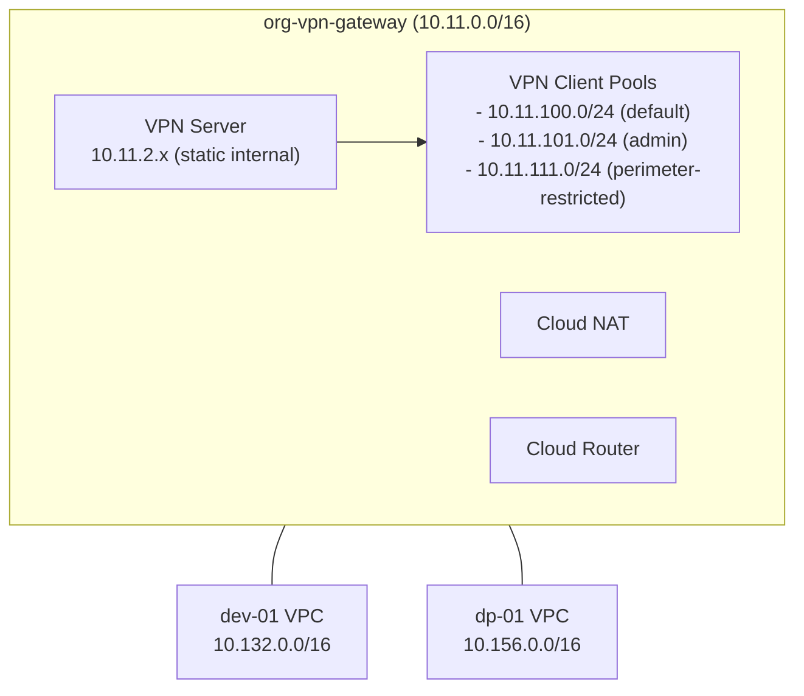

<!-- Space: PE -->
<!-- Title: VPC Peering and VPN Gateway -->
<!-- Parent: Network Design -->
<!-- Label: network -->
<!-- Label: vpc-peering -->
<!-- Label: vpn -->
<!-- Label: architecture -->
<!-- Label: operations -->

# VPC Peering and VPN Gateway Infrastructure (Primary)

## Executive Summary

This document describes the primary network connectivity architecture for the repository: a star VPC Network Peering topology centered on the VPN Gateway VPC, combined with a VPN server for authenticated remote access. It replaces the day-to-day role previously provided by NCC spokes, while retaining NCC documentation for legacy reference.

- Primary inter-VPC connectivity: VPC Network Peering
- Remote access: VPN server in the vpn-gateway VPC
- Access control: VPC firewall rules keyed on VPN client pool CIDRs
- Legacy reference: Network Connectivity Center (NCC) doc remains available at `docs/NCC_AND_VPN_GATEWAY.md`

## Table of Contents
- [Architecture Overview](#architecture-overview)
- [VPC Peering](#vpc-peering)
  - [Module and Template](#module-and-template)
  - [Resource Layout](#resource-layout)
  - [CI/CD Integration](#cicd-integration)
- [VPN Gateway Infrastructure](#vpn-gateway-infrastructure)
  - [VPN Server and Client Pools](#vpn-server-and-client-pools)
  - [Firewall Controls](#firewall-controls)
  - [Cloud Router and NAT](#cloud-router-and-nat)
- [Deployment Guide](#deployment-guide)
- [Operations and Management](#operations-and-management)
  - [Monitoring and Verification](#monitoring-and-verification)
  - [Troubleshooting](#troubleshooting)
- [Security Architecture](#security-architecture)
- [Cost Analysis](#cost-analysis)
- [Limitations and Alternatives](#limitations-and-alternatives)
- [Future Enhancements](#future-enhancements)
- [References](#references)

## Architecture Overview

Two core projects implement the hub of this connectivity pattern:

1. org-vpn-gateway: Hosts the VPN server and the star center of VPC peerings
2. Peered projects: dev-01 (10.132.0.0/16), dp-01 (10.156.0.0/16)



- Star peering: vpn-gateway <-> dev-01, vpn-gateway <-> dp-01
- Non-transitive: dev-01 does not transitively reach other VPCs via peering
- Access control: VPC firewall rules using the VPN pool CIDRs

## VPC Peering

### Module and Template
- Template: `_common/templates/vpc_peering.hcl`
- Upstream module: `terraform-google-modules/network/google//modules/network-peering` (version derived from `${include.base.locals.module_versions.network}`)
- Required inputs (Terragrunt):
  - `local_network` (self link) - vpn-gateway VPC
  - `peer_network` (self link) - peer VPC
- Defaults:
  - `export_local_custom_routes = false`
  - `export_peer_custom_routes = false`
  - `export_local_subnet_routes_with_public_ip = false`
  - `export_peer_subnet_routes_with_public_ip = false`
  - `stack_type = "IPV4_ONLY"`

### Resource Layout
- Live peering resources (one per peer VPC):
  - `live/non-production/hub/vpn-gateway/global/networking/vpc-peering/dev-01/terragrunt.hcl`
  - `live/non-production/hub/vpn-gateway/global/networking/vpc-peering/dp-01/terragrunt.hcl`
- Terragrunt pattern (example):

```hcl
include "root" {
  path = find_in_parent_folders("root.hcl")
}

include "base" {
  path   = "${get_repo_root()}/_common/base.hcl"
  expose = true
}

include "tpl" {
  path           = "${get_repo_root()}/_common/templates/vpc_peering.hcl"
  merge_strategy = "deep"
}

dependency "vpn_vpc"  { config_path = "../../../../vpc-network" }
dependency "peer_vpc" { config_path = "<path-to-peer>/vpc-network" }

inputs = {
  local_network = dependency.vpn_vpc.outputs.network_self_link
  peer_network  = dependency.peer_vpc.outputs.network_self_link

  export_local_custom_routes                = false
  export_peer_custom_routes                 = false
  export_local_subnet_routes_with_public_ip = false
  export_peer_subnet_routes_with_public_ip  = false
  stack_type                                = "IPV4_ONLY"
}
```

### CI/CD Integration
- Resource type: `vpc-peering` is included in PR and Apply engines
- Change detection:
  - Direct changes under `live/**/vpc-peering/**`
  - Template changes in `_common/templates/vpc_peering.hcl` fan out to all peering resources
- Ordering:
  - Runs after VPC networks exist; does not require a VPC diff to trigger
  - Engines ensure peering jobs execute one at a time per local VPC to respect provider limitation

## VPN Gateway Infrastructure

### VPN Server and Client Pools
- Internal IP reservation managed under `live/non-production/hub/vpn-gateway/europe-west2/networking/internal-ips/`
- VM Template and instance under `live/non-production/hub/vpn-gateway/europe-west2/compute/vpn-server/`
- Client pools modeled as subnets in the vpn-gateway VPC to ensure route propagation over peering:

| Pool | CIDR | Port | Routes | Purpose |
|------|------|------|--------|---------|
| Admin | 10.11.101.0/24 | 1194/udp | 10.0.0.0/8 (all) | Full network access |
| Development | 10.11.100.0/24 | 1198/udp | 10.132.0.0/16 (dev) + 10.156.0.0/16 (UAT) | Dev and UAT access |
| Perimeter-Restricted | 10.11.111.0/24 | 1195/udp | 10.254.0.0/16 (perimeter) | Limited perimeter access |

- Startup scripts: delivered via GCS objects (metadata `startup-script-url`)

### Firewall Controls
- Allow rules for client pools and management (IAP, HTTPS, SSH)
- Deny rules for restricted pools (e.g., perimeter-restricted pool to non-perimeter targets)
- Rules live under `live/**/networking/firewall-rules/*/terragrunt.hcl`

### Cloud Router and NAT
- Router and NAT live under `live/**/networking/cloud-router` and `cloud-nat`
- NAT provides outbound internet from the vpn-gateway VPC; not required for peering itself

## Deployment Guide

### Prerequisites
- Authenticate: `export GOOGLE_APPLICATION_CREDENTIALS=~/tofu-sa-org-key.json`
- Environment: `source setup_env.sh` (and `setup_secrets_env.sh` when needed)

### Order of operations (validate/plan/apply)
1) Ensure VPC networks exist in vpn-gateway, dev-01, and other peer projects
2) From peering directories:

```bash
# dev-01 peering
cd live/non-production/hub/vpn-gateway/global/networking/vpc-peering/dev-01
terragrunt run validate
terragrunt run plan
terragrunt run apply --auto-approve

# dp-01 peering
cd ../dp-01
terragrunt run validate
terragrunt run plan
terragrunt run apply --auto-approve
```

## Operations and Management

### Monitoring and Verification
```bash
# List peerings in a project
gcloud compute network peerings list --project=org-vpn-gateway

# Describe a specific peering
gcloud compute network peerings describe \
  network-peering-dev-01 \
  --network=org-vpn-gateway-vpc \
  --project=org-vpn-gateway

# Verify effective routes from vpn-gateway perspective
gcloud compute routes list --project=org-vpn-gateway --filter="network=org-vpn-gateway-vpc"
```

Connectivity tests from a VPN client (10.11.101.0/24 admin pool):
- Ping/SSH/RDP allowed targets in dev-01 and other peer projects according to firewall policy
- Confirm perimeter-restricted pool (10.11.111.0/24) cannot reach non-perimeter targets

### Troubleshooting
- Peering inactive: verify both sides exist and accept subnets
- Route visibility: confirm subnets modeled for client pools in vpn-gateway VPC
- Firewall denies: check rule priorities and target tags/service accounts

## Security Architecture
- Non-transitive by design (reduced blast radius)
- All subnet routes exchanged: enforce access strictly through VPC firewall rules
- No credentials written to disk on VPN nodes; use GSM for secrets
- IAP preferred for admin access where possible

## Cost Analysis
- VPC Peering: $0/hr; per-GB egress charges (intra-region discounted)
- NAT: gateway-hour + processed GB
- VPN server: VM instance + disk + static IP; GSM for secrets

## Limitations and Alternatives
- PSA endpoints are not reachable across VPC peering:
  - Use Cloud SQL Auth Proxy or Private Service Connect
  - Run client workloads in the target VPC
- GKE Pod and Service secondary CIDRs are reachable across peering (subject to firewall). Internal Load Balancer VIPs are also reachable across peering (subject to firewall and routing).

## Future Enhancements
- Private Service Connect front-ends for cross-VPC services
- Dual-stack peering (`stack_type = IPV4_IPV6`) where applicable
- VPN HA or managed alternative

## References
- VPC Peering (GCP): https://cloud.google.com/vpc/docs/vpc-peering
- terraform-google-network (network-peering): https://github.com/terraform-google-modules/terraform-google-network/tree/main/modules/network-peering
- VPC Peering Connectivity Guide (this repo): `docs/VPC_PEERING_GUIDE.md`
- NCC (legacy): `docs/NCC_AND_VPN_GATEWAY.md`
