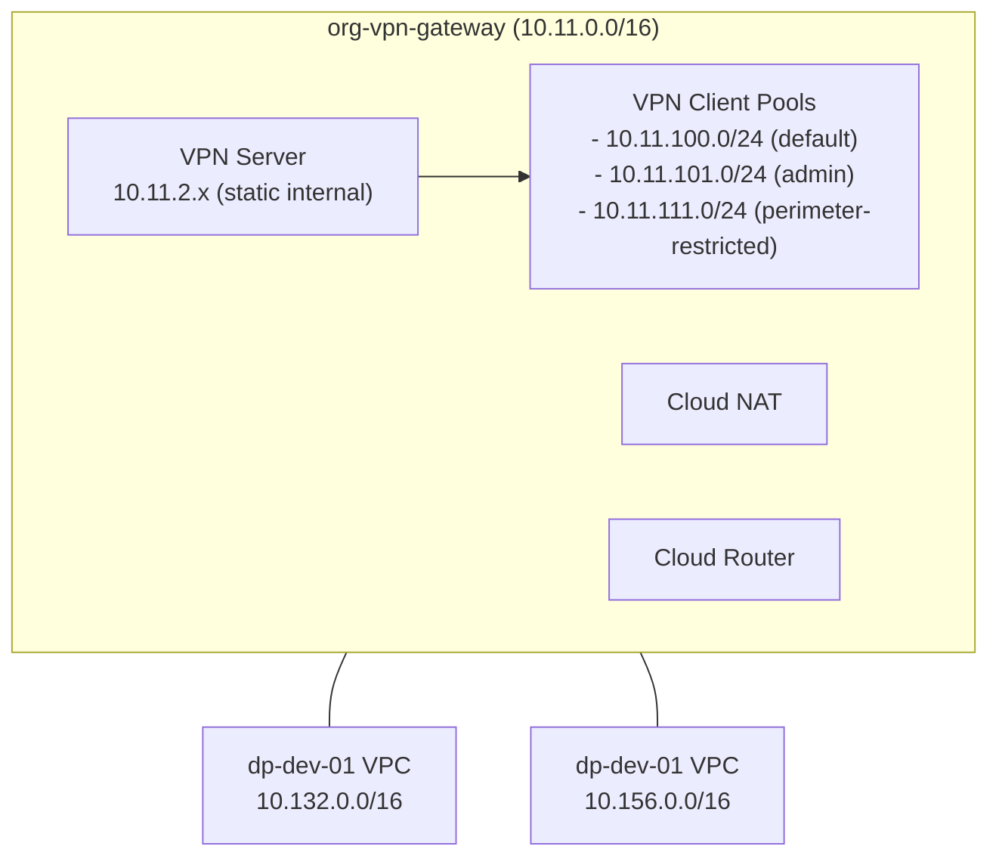

# VPC Peering and VPN Gateway Infrastructure

**Primary network connectivity architecture** for this repository: a star-topology VPC Network Peering centered on the VPN Gateway VPC, combined with a VPN server for authenticated remote access. This replaces the day-to-day role previously filled by NCC spokes (legacy reference: `docs/NCC_AND_VPN_GATEWAY.md`).

**Why VPC Peering over alternatives:**
- **Zero hourly cost** -- only per-GB egress charges (intra-region discounted)
- **Simple, low-ops** -- no control plane; predictable behavior
- **Security via firewall rules** -- all subnet routes are exchanged, access is controlled at the firewall layer
- **Works with VPN clients** -- client pools are subnets in the vpn-gateway VPC, so routes propagate over peering automatically

## Overview

| Component | Purpose |
|-----------|---------|
| **VPC Peering** | Inter-VPC connectivity (star topology from vpn-gateway hub) |
| **VPN Server** | Authenticated remote access into the hub VPC |
| **Firewall Rules** | Access control keyed on VPN client pool CIDRs |
| **Cloud Router + NAT** | Outbound internet from vpn-gateway VPC |

Two core projects implement the hub:

1. **org-vpn-gateway** -- hosts VPN server and is the star center of all VPC peerings
2. **Peered projects** -- dp-dev-01 (10.132.0.0/16), dp-dev-01 (10.156.0.0/16)

## Architecture


```mermaid
graph TB
  subgraph Hub["org-vpn-gateway (10.11.0.0/16)"]
    VPN_SERVER["VPN Server\n10.11.2.x (static internal)"]
    POOLS["VPN Client Pools\n- 10.11.100.0/24 (default)\n- 10.11.101.0/24 (admin)\n- 10.11.111.0/24 (perimeter-restricted)"]
    NAT["Cloud NAT"]
    ROUTER["Cloud Router"]
  end

  DEV["dp-dev-01 VPC\n10.132.0.0/16"]
  UAT["dp-dev-01 VPC\n10.156.0.0/16"]

  VPN_SERVER --> POOLS
  Hub --- DEV
  Hub --- UAT
```

- **Star peering**: vpn-gateway <-> dp-dev-01, vpn-gateway <-> dp-dev-01
- **Non-transitive**: dp-dev-01 cannot transitively reach other VPCs via peering (reduced blast radius)
- **Access control**: VPC firewall rules using the VPN pool CIDRs

### VPN Client Pools

Client pools are modeled as subnets in the vpn-gateway VPC to ensure route propagation over peering:

| Pool | CIDR | Port | Routes | Purpose |
|------|------|------|--------|---------|
| Admin | 10.11.101.0/24 | 1194/udp | 10.0.0.0/8 (all) | Full network access |
| Development | 10.11.100.0/24 | 1198/udp | 10.132.0.0/16 (dev) + 10.156.0.0/16 (UAT) | Dev and UAT access |
| Perimeter-Restricted | 10.11.111.0/24 | 1195/udp | 10.254.0.0/16 (perimeter) | Limited perimeter access |

### Firewall Controls

- **Allow rules** for client pools and management (IAP, HTTPS, SSH)
- **Deny rules** for restricted pools (e.g., perimeter-restricted pool to non-perimeter targets)
- Rules live under `live/**/networking/firewall-rules/*/terragrunt.hcl`

### Cloud Router and NAT

- Router and NAT live under `live/**/networking/cloud-router` and `cloud-nat`
- NAT provides outbound internet from the vpn-gateway VPC; not required for peering itself

## Configuration

### Module and Template

- **Template**: `_common/templates/vpc_peering.hcl`
- **Upstream module**: `terraform-google-modules/network/google//modules/network-peering` (version from `module_versions.network` in `_common/common.hcl`)

### Resource Layout

One directory per peer VPC:
- `live/non-production/hub/vpn-gateway/global/networking/vpc-peering/dp-dev-01/terragrunt.hcl`

### HCL Example

```hcl
include "root" {
  path = find_in_parent_folders("root.hcl")
}

include "base" {
  path   = "${get_repo_root()}/_common/base.hcl"
  expose = true
}

include "tpl" {
  path           = "${get_repo_root()}/_common/templates/vpc_peering.hcl"
  merge_strategy = "deep"
}

dependency "vpn_vpc"  { config_path = "../../../../vpc-network" }
dependency "peer_vpc" { config_path = "<path-to-peer>/vpc-network" }

inputs = {
  local_network = dependency.vpn_vpc.outputs.network_self_link
  peer_network  = dependency.peer_vpc.outputs.network_self_link

  export_local_custom_routes                = false
  export_peer_custom_routes                 = false
  export_local_subnet_routes_with_public_ip = false
  export_peer_subnet_routes_with_public_ip  = false
  stack_type                                = "IPV4_ONLY"
}
```

### VPN Server Resources

- **Internal IP reservation**: `live/non-production/hub/vpn-gateway/europe-west2/networking/internal-ips/`
- **VM Template and instance**: `live/non-production/hub/vpn-gateway/europe-west2/compute/vpn-server/`
- **Startup scripts**: delivered via GCS objects (`startup-script-url` metadata)

## Usage

### Prerequisites

```bash
export GOOGLE_APPLICATION_CREDENTIALS=~/tofu-sa-org-key.json
source scripts/setup_env.sh
```

### Deployment Order

1. Ensure VPC networks exist in vpn-gateway, dp-dev-01, and other peer projects
2. From each peering directory, run validate then plan then apply:

```bash
cd live/non-production/hub/vpn-gateway/global/networking/vpc-peering/dp-dev-01
terragrunt validate
terragrunt plan
terragrunt apply -auto-approve
```

### CI/CD Integration

- **Resource type**: `vpc-peering` is registered in both PR and Apply engines
- **Change detection**: direct changes under `live/**/vpc-peering/**` or template changes in `_common/templates/vpc_peering.hcl` (fans out to all peering resources)
- **Ordering**: runs after VPC networks exist; does not require a VPC diff to trigger
- **Concurrency constraint**: only one peering to the same local VPC can be applied at a time; the engine processes sequentially to respect the provider limitation

### Monitoring and Verification

```bash
# List peerings in a project
gcloud compute network peerings list --project=org-vpn-gateway

# Describe a specific peering
gcloud compute network peerings describe \
  network-peering-dp-dev-01 \
  --network=org-vpn-gateway-vpc \
  --project=org-vpn-gateway

# Verify effective routes
gcloud compute routes list --project=org-vpn-gateway --filter="network=org-vpn-gateway-vpc"
```

### Troubleshooting

- **Peering inactive**: verify both sides exist and accept subnets
- **Route visibility**: confirm subnets modeled for client pools in vpn-gateway VPC
- **Firewall denies**: check rule priorities and target tags/service accounts
- **PSA endpoints unreachable across peering**: use Cloud SQL Auth Proxy, Private Service Connect, or run clients inside the target VPC

### Operational Notes

- **PSA limitation**: Private Service Access endpoints are not reachable across peering. Use proxies or place clients in the target VPC.
- **GKE secondary CIDRs**: Pod and Service CIDRs are reachable over peering (subject to firewall). Internal Load Balancer VIPs are also reachable.
- **Non-transitive**: A<->B and A<->C does not imply B<->C. This is by design for security isolation.
- **No credentials on disk**: use Google Secret Manager for secrets on VPN nodes. Prefer IAP for admin access where possible.

### Cost

- **VPC Peering**: $0/hr; per-GB egress charges (intra-region discounted)
- **NAT**: gateway-hour + processed GB
- **VPN server**: VM instance + disk + static IP; GSM for secrets

## References

- [VPC Peering (GCP)](https://cloud.google.com/vpc/docs/vpc-peering)
- [terraform-google-network peering module](https://github.com/terraform-google-modules/terraform-google-network/tree/main/modules/network-peering)
- NCC (legacy): `docs/NCC_AND_VPN_GATEWAY.md`
