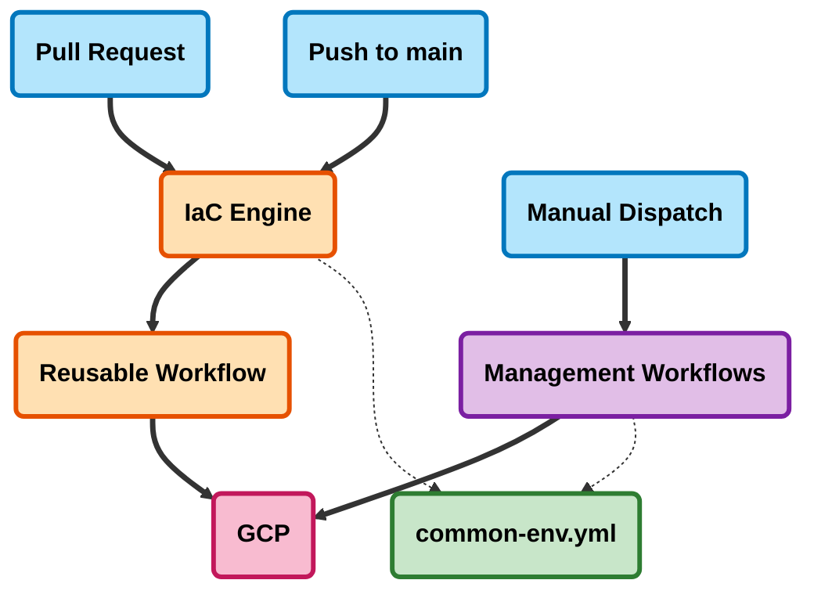
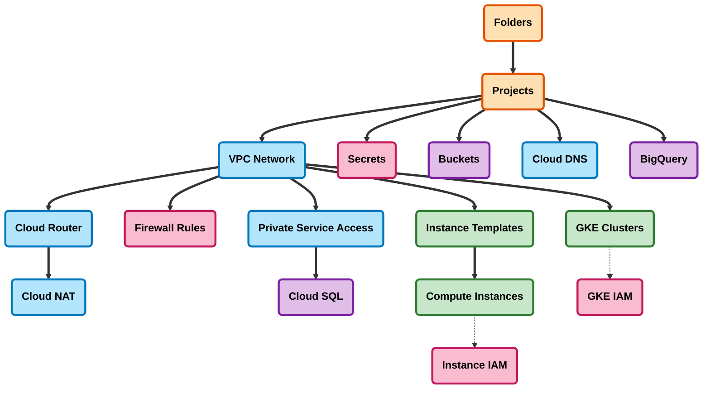

# GitHub Workflows Documentation

This document describes the GitHub Actions CI/CD system that validates and deploys Terragrunt infrastructure changes.

> **Workflows are currently DISABLED.** All workflow files live in `.github/workflows.disabled/`. To activate them, move files to `.github/workflows/` and configure the required secrets.

## Overview

The system has three tiers:

| Tier | Purpose | Trigger |
|------|---------|---------|
| **IaC Engine** (`terragrunt-main-engine.yml`) | Validates PRs and applies on merge | `pull_request` / `push` to main |
| **Reusable workflow** (`terragrunt-reusable.yaml`) | Executes plan/apply for a single resource type | Called by the engine |
| **Management workflows** | Manual operations for compute, SQL, GKE, and script uploads | `workflow_dispatch` |

All workflows share environment config via `common-env.yml` (Terragrunt 0.97.1, OpenTofu 1.11.3, region `europe-west2`).

## Architecture


```mermaid
flowchart TB
    PR("
<b>Pull Request</b>
") ==> ENGINE("
<b>IaC Engine</b>
")
    PUSH("
<b>Push to main</b>
") ==> ENGINE
    MANUAL("
<b>Manual Dispatch</b>
") ==> MGMT("
<b>Management Workflows</b>
")

    ENGINE ==> REUSABLE("
<b>Reusable Workflow</b>
")
    REUSABLE ==> GCP("
<b>GCP</b>
")
    MGMT ==> GCP

    ENGINE -.-> ENV("
<b>common-env.yml</b>
")
    MGMT -.-> ENV

    style PR fill:#b3e5fc,stroke:#0277bd,stroke-width:3px,color:#000
    style PUSH fill:#b3e5fc,stroke:#0277bd,stroke-width:3px,color:#000
    style MANUAL fill:#b3e5fc,stroke:#0277bd,stroke-width:3px,color:#000
    style ENGINE fill:#ffe0b2,stroke:#e65100,stroke-width:3px,color:#000
    style REUSABLE fill:#ffe0b2,stroke:#e65100,stroke-width:3px,color:#000
    style MGMT fill:#e1bee7,stroke:#7b1fa2,stroke-width:3px,color:#000
    style GCP fill:#f8bbd0,stroke:#c2185b,stroke-width:3px,color:#000
    style ENV fill:#c8e6c9,stroke:#2e7d32,stroke-width:3px,color:#000
```

## IaC Engine Flow

The engine (`terragrunt-main-engine.yml`) handles both PR validation and post-merge apply using the same workflow file. The mode is selected by event type:

| Event | Mode | Action |
|-------|------|--------|
| `pull_request` | validate | Runs `terragrunt plan` and posts results to the PR |
| `push` to main | apply | Runs `terragrunt apply -auto-approve` |

### Change Detection

1. Git diff identifies changed files between base and head commits.
2. File paths are matched against patterns in `.github/workflow-config/resource-definitions.yml`.
3. Changed resources are grouped by type, and the engine invokes `terragrunt-reusable.yaml` for each type in dependency order.
4. If a common template changes, all resources of that type are reprocessed.

### Resource Dependency Order

Resources defined in `resource-definitions.yml` are deployed in dependency order. The engine runs independent resource types in parallel within each tier:


```mermaid
flowchart TB
    FOLDER("
<b>Folders</b>
") ==> PROJECT("
<b>Projects</b>
")

    PROJECT ==> VPC("
<b>VPC Network</b>
")
    PROJECT ==> SECRETS("
<b>Secrets</b>
")
    PROJECT ==> BUCKETS("
<b>Buckets</b>
")
    PROJECT ==> DNS("
<b>Cloud DNS</b>
")
    PROJECT ==> BQ("
<b>BigQuery</b>
")

    VPC ==> ROUTER("
<b>Cloud Router</b>
")
    VPC ==> FW("
<b>Firewall Rules</b>
")
    VPC ==> PSA("
<b>Private Service Access</b>
")
    VPC ==> ITMPL("
<b>Instance Templates</b>
")

    ROUTER ==> NAT("
<b>Cloud NAT</b>
")
    PSA ==> SQL("
<b>Cloud SQL</b>
")
    ITMPL ==> COMPUTE("
<b>Compute Instances</b>
")
    VPC ==> GKE("
<b>GKE Clusters</b>
")

    COMPUTE -.-> IIAM("
<b>Instance IAM</b>
")
    GKE -.-> GIAM("
<b>GKE IAM</b>
")

    style FOLDER fill:#ffe0b2,stroke:#e65100,stroke-width:3px,color:#000
    style PROJECT fill:#ffe0b2,stroke:#e65100,stroke-width:3px,color:#000
    style VPC fill:#b3e5fc,stroke:#0277bd,stroke-width:3px,color:#000
    style ROUTER fill:#b3e5fc,stroke:#0277bd,stroke-width:3px,color:#000
    style NAT fill:#b3e5fc,stroke:#0277bd,stroke-width:3px,color:#000
    style FW fill:#f8bbd0,stroke:#c2185b,stroke-width:3px,color:#000
    style PSA fill:#b3e5fc,stroke:#0277bd,stroke-width:3px,color:#000
    style SECRETS fill:#f8bbd0,stroke:#c2185b,stroke-width:3px,color:#000
    style BUCKETS fill:#e1bee7,stroke:#7b1fa2,stroke-width:3px,color:#000
    style DNS fill:#b3e5fc,stroke:#0277bd,stroke-width:3px,color:#000
    style BQ fill:#e1bee7,stroke:#7b1fa2,stroke-width:3px,color:#000
    style SQL fill:#e1bee7,stroke:#7b1fa2,stroke-width:3px,color:#000
    style ITMPL fill:#c8e6c9,stroke:#2e7d32,stroke-width:3px,color:#000
    style COMPUTE fill:#c8e6c9,stroke:#2e7d32,stroke-width:3px,color:#000
    style GKE fill:#c8e6c9,stroke:#2e7d32,stroke-width:3px,color:#000
    style IIAM fill:#f8bbd0,stroke:#c2185b,stroke-width:3px,color:#000
    style GIAM fill:#f8bbd0,stroke:#c2185b,stroke-width:3px,color:#000
```

Execution stops at the first failure to prevent cascading issues.

## Management Workflows

These are manual-dispatch workflows for operating individual resources outside the main engine.

| Workflow | File | Input format | Notes |
|----------|------|-------------|-------|
| **Compute Instance** | `manage-compute-instance.yml` | `project/instance` | Destroy requires typing "DESTROY" |
| **SQL Instance** | `manage-sql-instance.yml` | `project/instance` | Manages SQL Server VMs (not Cloud SQL) |
| **GKE Cluster** | `manage-gke-cluster.yml` | `project/cluster` | Supports plan / apply / destroy |
| **VM Scripts** | `upload-vm-scripts.yml` | Automatic detection | Also triggers on push when scripts change |

## Configuration

### Workflow Files

```
.github/
  workflows.disabled/
    common-env.yml                  # Shared environment variables
    terragrunt-main-engine.yml      # IaC Engine (PR + apply)
    terragrunt-reusable.yaml        # Reusable per-resource-type workflow
    manage-compute-instance.yml     # Manual: VM operations
    manage-sql-instance.yml         # Manual: SQL VM operations
    manage-gke-cluster.yml          # Manual: GKE operations
    upload-vm-scripts.yml           # Auto/manual: script sync to GCS
  workflow-config/
    resource-definitions.yml        # Resource types, patterns, dependencies
  scripts/
    detect_changes.py               # Change detection logic
    add_resource.py                 # Helper to add new resource types
```

### Required Secrets

| Secret | Description |
|--------|-------------|
| `TF_GOOGLE_CREDENTIALS` | Service account JSON key for GCP authentication |
| `ORG_GITHUB_TOKEN` | GitHub token for accessing private module repos (optional) |

### Concurrency

| Workflow | Group | Cancel in-progress |
|----------|-------|--------------------|
| IaC Engine | `terragrunt-main-engine` | No |
| Management workflows | Per-workflow name | No |

## Enabling Workflows

1. Move files from `workflows.disabled/` to `workflows/`:
   ```bash
   mv .github/workflows.disabled/* .github/workflows/
   ```

2. Configure repository secrets:
   - `TF_GOOGLE_CREDENTIALS` -- service account JSON key
   - `ORG_GITHUB_TOKEN` -- if using private Terraform module repos

3. Set branch protection rules:
   - Require PR reviews before merge
   - Add the IaC Engine as a required status check

4. Test with a non-production PR first; review the plan output before enabling auto-apply.

### Adding a New Resource Type

1. Create a template in `_common/templates/`.
2. Add an entry to `.github/workflow-config/resource-definitions.yml` with `path_pattern`, `dependencies`, and `template_path`.
3. Add a corresponding job block in `terragrunt-main-engine.yml` that calls `terragrunt-reusable.yaml`.
4. Test with a PR to verify detection and plan output.

## Troubleshooting

- **Workflow not triggering** -- Confirm files are in `.github/workflows/` (not `workflows.disabled/`). Check that GitHub Actions is enabled in repository settings.
- **Authentication failures** -- Verify `TF_GOOGLE_CREDENTIALS` is set and the service account has the required project-level roles.
- **Wrong deployment order** -- Review dependency declarations in `resource-definitions.yml`. Use `terragrunt graph-dependencies` locally to verify.
- **State lock conflicts** -- Another workflow or local session may hold the lock. Check with `terragrunt state list` and wait or force-unlock if safe.
- **Parallel execution failures** -- Check GCP quota limits and ensure resource names are unique across parallel jobs.

## References

- Resource definitions: `.github/workflow-config/resource-definitions.yml`
- Change detection script: `.github/scripts/detect_changes.py`
- [GitHub Actions reusable workflows](https://docs.github.com/en/actions/using-workflows/reusing-workflows)
- [Terragrunt documentation](https://terragrunt.gruntwork.io/docs/)
