# GitHub Workflows Documentation

This document provides comprehensive information about the GitHub Actions workflows that manage CI/CD and infrastructure operations for the Terragrunt GCP infrastructure.

## ⚠️ Workflow Status

**Current State**: Workflows are currently **DISABLED** and located in `.github/workflows.disabled/`

To enable workflows:
1. Move workflow files from `.github/workflows.disabled/` to `.github/workflows/`
2. Ensure GitHub Actions is enabled in repository settings
3. Configure required secrets (see Security Configuration section)

## Overview

The repository uses a sophisticated GitHub Actions workflow system that provides both automated infrastructure management and manual operational controls. The system is designed to:

- **Validate infrastructure changes** on pull requests
- **Deploy infrastructure changes** automatically on pushes to main/develop branches
- **Respect dependency order** for resource deployment
- **Provide parallel execution** where possible
- **Fail fast** to prevent cascading issues
- **Provide detailed reporting** for each operation
- **Support manual infrastructure operations** for specific resources

## Workflow Architecture

### System Architecture Overview


### Three-Tier System

The workflow system operates on three tiers:

1. **🔄 Automatic Engine Workflows** - Handle automated CI/CD for infrastructure changes
2. **🎮 Manual Management Workflows** - Provide controlled operations for specific resources
3. **📦 Reusable Component Workflows** - Shared components used by other workflows

## Workflow Configuration

### Common Environment Variables

All workflows use centralized environment configuration through `common-env.yml`:

| Variable | Default Value | Description |
|----------|--------------|-------------|
| `TERRAGRUNT_VERSION` | 0.81.0 | Terragrunt CLI version |
| `TOFU_VERSION` | 1.9.1 | OpenTofu version |
| `GCP_PROJECT_ID` | automation | Default GCP project |
| `GCP_REGION` | europe-west2 | Default region |
| `TG_EXPERIMENT_MODE` | true | Terragrunt experimental features |
| `TG_NON_INTERACTIVE` | true | Non-interactive mode |
| `TG_BACKEND_BOOTSTRAP` | true | Auto-create backend bucket |

## Automatic Engine Workflows

These workflows handle the automated CI/CD pipeline for infrastructure changes.

### Core Engine Workflows

| Workflow | Purpose | Trigger | File | Concurrency |
|----------|---------|---------|------|-------------|
| **Validation Engine** | Validate changes before merge | `pull_request` | `terragrunt-pr-engine.yml` | PR-based |
| **Deployment Engine** | Deploy infrastructure changes | `push` to main/develop | `terragrunt-apply-engine.yml` | Sequential |

### CI/CD Pipeline Flow

```mermaid
flowchart LR
    subgraph "CI/CD Pipeline"
        subgraph DEV["Developer"]
            CODE["📝 Code Changes"]
            COMMIT["💾 Commit"]
        end
        
        subgraph PR_PHASE["Pull Request Phase"]
            CREATE_PR["Create PR"]
            DETECT_CHG["Detect Changes"]
            VALIDATE["Validate Resources"]
            PR_CHECK["PR Checks"]
        end
        
        subgraph MERGE_PHASE["Merge Phase"]
            APPROVE["Approve PR"]
            MERGE["Merge to main"]
        end
        
        subgraph DEPLOY_PHASE["Deployment Phase"]
            DETECT_DEPLOY["Detect Changes"]
            ORDER["Order Resources"]
            DEPLOY["Deploy in Order"]
            VERIFY["Verify Deployment"]
        end
    end
    
    CODE --> COMMIT --> CREATE_PR
    CREATE_PR --> DETECT_CHG --> VALIDATE --> PR_CHECK
    PR_CHECK -->|Pass| APPROVE
    APPROVE --> MERGE
    MERGE --> DETECT_DEPLOY --> ORDER --> DEPLOY --> VERIFY
    
    classDef dev fill:#e3f2fd,stroke:#1976d2,stroke-width:2px
    classDef pr fill:#fff3e0,stroke:#f57c00,stroke-width:2px
    classDef merge fill:#f3e5f5,stroke:#7b1fa2,stroke-width:2px
    classDef deploy fill:#e8f5e9,stroke:#388e3c,stroke-width:2px
    
    class CODE,COMMIT dev
    class CREATE_PR,DETECT_CHG,VALIDATE,PR_CHECK pr
    class APPROVE,MERGE merge
    class DETECT_DEPLOY,ORDER,DEPLOY,VERIFY deploy
```



### Supported Resource Types

The engine workflows support the following GCP resource types:

| Resource Type | Icon | Description | Template Path | Detection Pattern |
|---------------|------|-------------|---------------|-------------------|
| **Folder** | 📁 | GCP organizational folders | `_common/templates/folder.hcl` | `live/**/folder/` |
| **Project** | 📦 | GCP projects | `_common/templates/project.hcl` | `live/**/project/` |
| **VPC Network** | 🌐 | Virtual Private Cloud networks | `_common/templates/network.hcl` | `live/**/*vpc-network/` |
| **External IP** | 🌍 | Static external IP addresses | `_common/templates/external_ip.hcl` | `live/**/external-ips/*/` |
| **Cloud Router** | 🔄 | BGP routers for NAT | `_common/templates/cloud_router.hcl` | `live/**/cloud-router/` |
| **Cloud NAT** | 🚪 | Network Address Translation | `_common/templates/cloud_nat.hcl` | `live/**/cloud-nat/` |
| **Firewall Rules** | 🔥 | VPC firewall rules | `_common/templates/firewall_rules.hcl` | `live/**/firewall-rules/*/` |
| **Private Service Access** | 🔗 | Private service connections | `_common/templates/private_service_access.hcl` | `live/**/*-psa/` |
| **Buckets** | 🪣 | Cloud Storage buckets | `_common/templates/cloud_storage.hcl` | `live/**/buckets/*/` |
| **Secrets** | 🔐 | Secret Manager secrets | `_common/templates/secret_manager.hcl` | `live/**/secrets/*/` |
| **BigQuery** | 📊 | BigQuery datasets | `_common/templates/bigquery.hcl` | `live/**/bigquery/*/` |
| **Cloud SQL** | 🗄️ | Cloud SQL databases | `_common/templates/cloud_sql.hcl` | `live/**/cloud-sql/*/` |
| **Instance Templates** | 🚀 | Compute Engine templates | `_common/templates/instance_template.hcl` | `live/**/compute/*/` |
| **Compute Instances** | 💻 | Virtual machine instances | `_common/templates/compute_instance.hcl` | `live/**/compute/*/vm/` |
| **GKE Clusters** | ⚙️ | Kubernetes clusters | `_common/templates/gke.hcl` | `live/**/gke/*/` |
| **IAM Bindings** | 👤 | IAM role bindings | `_common/templates/iam_bindings.hcl` | `live/**/iam-bindings/` |

### Resource Dependency Order

```mermaid
flowchart TB
    subgraph "Resource Deployment Order"
        FOLDER["📁 Folder<br/>Step 1"]
        PROJECT["📦 Project<br/>Step 2"]
        
        subgraph PARALLEL_1["Step 3 (Parallel)"]
            VPC["🌐 VPC Network"]
            SECRETS["🔐 Secrets"]
            BUCKETS["🪣 Buckets"]
            BIGQUERY["📊 BigQuery"]
        end
        
        subgraph PARALLEL_2["Step 4 (Parallel)"]
            EXT_IP["🌍 External IPs"]
            ROUTER["🔄 Cloud Router"]
            FW_RULES["🔥 Firewall Rules"]
            PSA["🔗 Private Service Access"]
            INST_TPL["🚀 Instance Templates"]
        end
        
        subgraph PARALLEL_3["Step 5 (Parallel)"]
            NAT["🚪 Cloud NAT"]
            SQL["🗄️ Cloud SQL"]
        end
        
        subgraph PARALLEL_4["Step 6 (Parallel)"]
            COMPUTE["💻 Compute Instances"]
            GKE["⚙️ GKE Clusters"]
        end
        
        subgraph PARALLEL_5["Step 7 (Parallel)"]
            PROJ_IAM["👤 Project IAM"]
            INST_IAM["👤 Instance IAM"]
            GKE_IAM["👤 GKE IAM"]
        end
    end
    
    FOLDER --> PROJECT
    PROJECT --> PARALLEL_1
    VPC --> PARALLEL_2
    ROUTER --> NAT
    PSA --> SQL
    INST_TPL --> COMPUTE
    VPC --> GKE
    EXT_IP --> GKE
    COMPUTE --> INST_IAM
    GKE --> GKE_IAM
    PROJECT --> PROJ_IAM
    
    classDef step1 fill:#ffebee,stroke:#c62828,stroke-width:2px
    classDef step2 fill:#fff3e0,stroke:#e65100,stroke-width:2px
    classDef step3 fill:#f3e5f5,stroke:#6a1b9a,stroke-width:2px
    classDef step4 fill:#e8f5e9,stroke:#2e7d32,stroke-width:2px
    classDef step5 fill:#e3f2fd,stroke:#1565c0,stroke-width:2px
    classDef step6 fill:#fff9c4,stroke:#f57f17,stroke-width:2px
    classDef step7 fill:#f1f8e9,stroke:#558b2f,stroke-width:2px
    
    class FOLDER step1
    class PROJECT step2
    class VPC,SECRETS,BUCKETS,BIGQUERY step3
    class EXT_IP,ROUTER,FW_RULES,PSA,INST_TPL step4
    class NAT,SQL step5
    class COMPUTE,GKE step6
    class PROJ_IAM,INST_IAM,GKE_IAM step7
```



### Engine Workflow Features

#### Change Detection Process


**Key Features:**
- **File-based detection** using git diff
- **Template change handling** - if common templates change, all resources of that type are processed
- **Dependency-aware** - understands relationships between resource types
- **Deletion detection** - identifies removed resources for cleanup

#### Parallel Execution Strategy

- **Step 3** resources run in parallel (VPC Networks, Secrets, Buckets, BigQuery)
- **Step 4** resources run in parallel after VPC dependencies are met
- **Steps 5-7** run based on specific dependencies
- **Execution stops** at the first failure to prevent cascading issues

## Manual Management Workflows

These workflows provide controlled operations for specific infrastructure resources that require manual intervention.

### Available Management Workflows

| Workflow | Purpose | Trigger | Resources | Input Format |
|----------|---------|---------|-----------|--------------|
| **Manage Compute Instance** | Apply/destroy specific VM instances | Manual | Compute Engine VMs | `project/instance` |
| **Manage SQL Instance** | Apply/destroy SQL Server instances | Manual | SQL Server VMs | `project/instance` |
| **Manage GKE Cluster** | Plan/apply/destroy GKE clusters | Manual | GKE clusters | `project/cluster` |
| **Upload VM Scripts** | Upload VM scripts to GCS buckets | Auto/Manual | Script files | Automatic detection |

### Manual Workflow Interaction Flow

```mermaid
flowchart TB
    subgraph "Manual Workflow Execution"
        USER["👤 User"]
        INPUT["Input Parameters"]
        VALIDATE["Validate Inputs"]
        AUTH["GCP Authentication"]
        EXECUTE["Execute Terragrunt"]
        REPORT["Generate Report"]
        
        USER --> INPUT
        INPUT --> VALIDATE
        VALIDATE -->|Valid| AUTH
        VALIDATE -->|Invalid| ERROR["❌ Error"]
        AUTH --> EXECUTE
        EXECUTE --> REPORT
        REPORT --> USER
    end
    
    classDef user fill:#e3f2fd,stroke:#1976d2,stroke-width:2px
    classDef process fill:#fff3e0,stroke:#f57c00,stroke-width:2px
    classDef error fill:#ffebee,stroke:#c62828,stroke-width:2px
    
    class USER user
    class INPUT,VALIDATE,AUTH,EXECUTE,REPORT process
    class ERROR error
```



### Compute Instance Management

**File**: `manage-compute-instance.yml`  
**Trigger**: Manual (`workflow_dispatch`)

**Features**:
- Project/instance format validation
- Destroy confirmation requirement (must type "DESTROY")
- Concurrency protection
- Detailed execution reporting
- Binary caching for Terragrunt and OpenTofu

**Example Instances**:
```yaml
- web-project/web-server-01
- org-dp-dev-01/app-server-01
```

### SQL Instance Management

**File**: `manage-sql-instance.yml`  
**Trigger**: Manual (`workflow_dispatch`)

**Features**:
- Manages SQL Server VMs (not Cloud SQL instances)
- No destroy confirmation required
- Project validation
- Execution summary generation

**Example Instances**:
```yaml
- org-dp-dev-01/sql-server-01
- org-prod-01/sql-server-main
```

### GKE Cluster Management

**File**: `manage-gke-cluster.yml`  
**Trigger**: Manual (`workflow_dispatch`)

**Operations**:
- **Plan**: Preview changes without applying
- **Apply**: Deploy or update cluster
- **Destroy**: Remove cluster (handles deletion protection)

**Features**:
- Environment-based path resolution
- Cluster credential retrieval after deployment
- Deletion protection handling for destroy operations
- Detailed summary output

**Input Parameters**:
- `action`: plan/apply/destroy
- `cluster`: project/cluster-name format
- `environment`: development/staging/production

### VM Script Upload

**File**: `upload-vm-scripts.yml`  
**Triggers**: 
- Automatic on push (when scripts change)
- Manual with force upload option

**Features**:
- Automatic detection of changed scripts
- Bucket discovery using naming patterns
- Multi-project support
- Force upload capability
- Version tracking with timestamps

## Workflow Execution Details

### Binary Caching Strategy


**Cached Binaries**:
- Terragrunt (0.81.0)
- OpenTofu (1.9.1)
- Cache key: `terragrunt-{version}-tofu-{version}-{os}`

### Concurrency Control

| Workflow Type | Concurrency Group | Strategy |
|--------------|------------------|----------|
| PR Validation | `pr-engine-{pr-number}` | Cancel in-progress |
| Deployment | Sequential | No parallel runs |
| Compute Management | `manage-compute-instance` | No cancellation |
| SQL Management | `manage-sql-instance` | No cancellation |
| Script Upload | `upload-vm-scripts` | No cancellation |

### Error Handling


## Security Configuration

### Required Secrets

| Secret Name | Description | Usage |
|------------|-------------|-------|
| `TF_GOOGLE_CREDENTIALS` | Service account JSON key | GCP authentication |
| `TF_SA_KEY` | Alternative SA key | Legacy workflows |
| `GITHUB_TOKEN` | GitHub access token | Repository operations |

### Authentication Flow


## Troubleshooting Guide

### Common Issues and Solutions

#### 1. Workflow Not Triggering

**Issue**: Workflows don't run when expected

**Solutions**:
- Check if workflows are in `.github/workflows/` (not `.github/workflows.disabled/`)
- Verify GitHub Actions is enabled in repository settings
- Check branch protection rules
- Verify file path patterns match your changes

#### 2. Authentication Failures

**Issue**: GCP authentication errors

**Solutions**:
- Verify `TF_GOOGLE_CREDENTIALS` secret is set correctly
- Check service account permissions
- Ensure service account has required roles
- Verify project ID is correct

#### 3. Terragrunt Errors

**Issue**: Terragrunt plan or apply failures

**Solutions**:
- Check for dependency cycles
- Verify all required inputs are provided
- Check for state lock conflicts
- Review Terragrunt version compatibility

#### 4. Resource Order Issues

**Issue**: Resources deployed in wrong order

**Solutions**:
- Review dependency declarations in terragrunt.hcl
- Check execution order in workflow
- Verify mock outputs for dependencies
- Use manual workflows for specific resources

#### 5. Parallel Execution Failures

**Issue**: Parallel steps interfering with each other

**Solutions**:
- Check for resource name conflicts
- Verify unique state paths
- Review GCP quota limits
- Consider sequential execution for problematic resources

### Debug Commands

```bash
# Check workflow syntax
act --list

# Test workflow locally (requires act tool)
act -j job-name

# Validate Terragrunt configuration
terragrunt validate

# Check dependency graph
terragrunt graph-dependencies

# View state lock status
terragrunt state list
```

## Best Practices

### 1. Workflow Usage

- **Use PR validation** for all infrastructure changes
- **Never bypass** the PR process for production changes
- **Use manual workflows** for emergency operations
- **Monitor workflow runs** for failures
- **Review logs** for detailed error information

### 2. Resource Management

- **Follow naming conventions** for resources
- **Use appropriate resource types** from templates
- **Declare dependencies** explicitly
- **Test in development** before production
- **Document custom configurations**

### 3. Security

- **Rotate service account keys** regularly
- **Use least privilege** for service accounts
- **Never commit secrets** to repository
- **Review workflow permissions** periodically
- **Audit workflow executions**

### 4. Performance

- **Use binary caching** to speed up workflows
- **Leverage parallel execution** where possible
- **Minimize unnecessary validations**
- **Clean up old workflow runs**
- **Monitor workflow duration trends**

## Migration Guide

### Enabling Workflows

To enable the workflows from their disabled state:

1. **Move workflow files**:
   ```bash
   mv .github/workflows.disabled/* .github/workflows/
   ```

2. **Configure secrets** in GitHub repository settings:
   - Add `TF_GOOGLE_CREDENTIALS` with service account JSON
   - Ensure `GITHUB_TOKEN` is available

3. **Update branch protection**:
   - Require PR reviews
   - Require status checks to pass
   - Include validation workflow as required check

4. **Test with non-production**:
   - Start with development environment
   - Verify workflows trigger correctly
   - Check execution logs

5. **Roll out gradually**:
   - Enable for specific resource types first
   - Monitor for issues
   - Expand coverage progressively

### Customization Options

#### Modify Execution Order

Edit the execution order in engine workflows:
```yaml
# In terragrunt-apply-engine.yml
EXECUTION_ORDER: ["folder", "project", "vpc-network", ...]
```

#### Add New Resource Types

1. Create template in `_common/templates/`
2. Add pattern to `RESOURCE_PATTERNS` in workflows
3. Update execution order if needed
4. Test with PR validation

#### Customize Environments

Modify `common-env.yml` defaults:
```yaml
TERRAGRUNT_VERSION: "0.81.0"  # Update version
TOFU_VERSION: "1.9.1"         # Update version
GCP_REGION: "us-central1"     # Change region
```

## Monitoring and Metrics

### Workflow Metrics to Track

- **Execution Duration**: Average time per workflow
- **Success Rate**: Percentage of successful runs
- **Failure Patterns**: Common failure points
- **Resource Coverage**: Resources managed by workflows
- **Manual Interventions**: Frequency of manual workflow usage

### GitHub Actions Dashboard

Monitor workflows through:
- Repository Actions tab
- Workflow run history
- Job execution details
- Artifact downloads
- Log analysis

## Appendix

### Workflow File Reference

| File | Type | Purpose |
|------|------|---------|
| `common-env.yml` | Reusable | Shared environment configuration |
| `terragrunt-pr-engine.yml` | Engine | PR validation |
| `terragrunt-apply-engine.yml` | Engine | Deployment automation |
| `manage-compute-instance.yml` | Manual | VM management |
| `manage-sql-instance.yml` | Manual | SQL VM management |
| `manage-gke-cluster.yml` | Manual | GKE cluster operations |
| `upload-vm-scripts.yml` | Auto/Manual | Script synchronization |

### Resource Type Matrix

| Resource | Create | Update | Delete | Dependencies |
|----------|--------|--------|--------|--------------|
| Folder | ✅ | ✅ | ✅ | None |
| Project | ✅ | ✅ | ✅ | Folder |
| VPC Network | ✅ | ✅ | ✅ | Project |
| External IP | ✅ | ✅ | ✅ | Project |
| Cloud Router | ✅ | ✅ | ✅ | VPC Network |
| Cloud NAT | ✅ | ✅ | ✅ | Cloud Router |
| Firewall Rules | ✅ | ✅ | ✅ | VPC Network |
| Private Service Access | ✅ | ✅ | ✅ | VPC Network |
| Buckets | ✅ | ✅ | ✅ | Project |
| Secrets | ✅ | ✅ | ✅ | Project |
| BigQuery | ✅ | ✅ | ✅ | Project |
| Cloud SQL | ✅ | ✅ | ✅ | Private Service Access |
| Instance Templates | ✅ | ✅ | ✅ | VPC Network |
| Compute Instances | ✅ | ✅ | ✅ | Instance Templates |
| GKE Clusters | ✅ | ✅ | ✅ | VPC Network, External IP |
| IAM Bindings | ✅ | ✅ | ✅ | Parent Resource |

### Version History

| Version | Date | Changes |
|---------|------|---------|
| 1.0.0 | Initial | Original workflow system |
| 1.1.0 | Current | Added GKE management, NAT gateway support, enhanced IAM bindings |

---

*Last Updated: 2025-08-30*
*Workflows Status: Disabled (in `.github/workflows.disabled/`)*