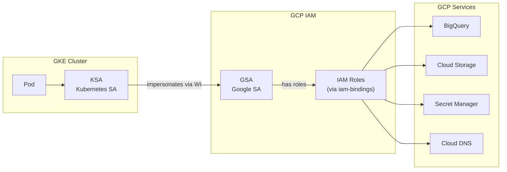
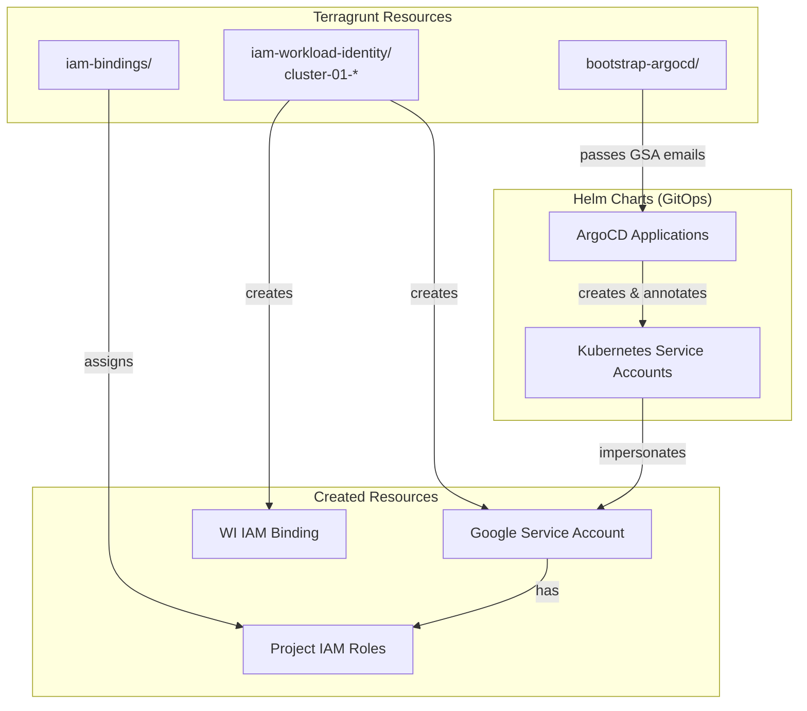
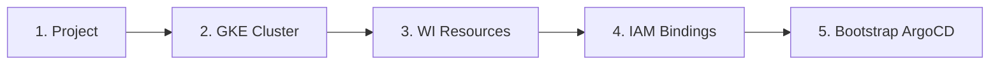

<!-- Space: PE -->
<!-- Title: Workload Identity Template -->
<!-- Parent: Compute Resources -->
<!-- Label: template -->
<!-- Label: gke -->
<!-- Label: workload-identity -->
<!-- Label: iam -->
<!-- Label: security -->
<!-- Label: howto -->
<!-- Label: intermediate -->

# GKE Workload Identity Template Guide

**Version**: 1.1.0
**Last Updated**: 2026-02-06
**Author**: Infrastructure Team

This document describes the Workload Identity template used to create Google Service Accounts (GSAs) with Workload Identity bindings for GKE workloads.

## Table of Contents
- [Overview](#overview)
- [Architecture](#architecture)
- [Template Location](#template-location)
- [Directory Structure](#directory-structure)
- [Configuration Pattern](#configuration-pattern)
- [IAM Role Assignment](#iam-role-assignment)
- [Usage Examples](#usage-examples)
- [Multi-Cluster Support](#multi-cluster-support)
- [Deployment](#deployment)
- [Verification](#verification)
- [Troubleshooting](#troubleshooting)
- [References](#references)

## Overview

The Workload Identity template (`_common/templates/workload_identity.hcl`) wraps the upstream module `terraform-google-kubernetes-engine//modules/workload-identity` to create GSAs with Workload Identity bindings for GKE workloads.

### What This Module Creates
- **GSA (Google Service Account)** - The GCP service account that pods will impersonate
- **IAM Binding** - `roles/iam.workloadIdentityUser` binding allowing KSA -> GSA impersonation

### What This Module Does NOT Create
- **KSA (Kubernetes Service Account)** - Created by Helm charts via ArgoCD
- **Project IAM Roles** - Managed centrally in `iam-bindings/` directory

### Key Principles
- **Separation of Concerns**: WI module handles identity, `iam-bindings` handles permissions
- **Helm-Managed KSAs**: Helm charts annotate KSAs with `iam.gke.io/gcp-service-account`
- **Cluster-Prefixed Naming**: GSA names include cluster ID for multi-cluster support
- **No Kubernetes Provider**: Uses `use_existing_k8s_sa=true` to avoid K8s API calls

## Architecture

### Workload Identity Flow


### Component Relationship


## Template Location

| Component | Path |
|-----------|------|
| Template | `_common/templates/workload_identity.hcl` |
| Version Pin | `_common/common.hcl` (`module_versions.gke` = v41.0.2) |
| WI Resources | `live/**/iam-workload-identity/cluster-*-*/` |
| IAM Roles | `live/**/iam-bindings/terragrunt.hcl` |

## Directory Structure

Workload Identity resources are placed at project level (not cluster level) to support multiple clusters:

```
live/<account>/<environment>/<project>/
├── project/                              # Project creation (dependency)
├── europe-west2/
│   └── gke/
│       ├── cluster-01/                   # GKE cluster (dependency)
│       │   ├── terragrunt.hcl
│       │   └── bootstrap-argocd/         # Consumes GSA emails
│       │       └── terragrunt.hcl
│       └── cluster-02/                   # Future cluster
│           └── ...
├── iam-workload-identity/                # Project-level WI resources
│   ├── cluster-01-argocd-server/         # cluster-01 workloads
│   │   └── terragrunt.hcl
│   ├── cluster-01-external-dns/
│   │   └── terragrunt.hcl
│   ├── cluster-01-cert-manager/
│   │   └── terragrunt.hcl
│   ├── cluster-01-external-secrets/
│   │   └── terragrunt.hcl
│   ├── cluster-01-monitoring/
│   │   └── terragrunt.hcl
│   ├── cluster-01-pipeline-sa/
│   │   └── terragrunt.hcl
│   ├── cluster-01-google-cas-issuer/     # Google CAS Issuer for PKI
│   │   └── terragrunt.hcl
│   ├── cluster-02-argocd-server/         # cluster-02 workloads (future)
│   │   └── terragrunt.hcl
│   └── ...
└── iam-bindings/                         # Central IAM role assignment
    └── terragrunt.hcl
```

### Naming Convention

GSA names follow the pattern: `{cluster-id}-{workload-name}`

| Directory Name | GSA Name | Namespace | KSA Name |
|----------------|----------|-----------|----------|
| `cluster-01-argocd-server` | cluster-01-argocd-server | argocd | argocd-server |
| `cluster-01-external-dns` | cluster-01-external-dns | external-dns | external-dns |
| `cluster-01-cert-manager` | cluster-01-cert-manager | cert-manager | cert-manager |
| `cluster-01-external-secrets` | cluster-01-external-secrets | external-secrets | external-secrets |
| `cluster-01-monitoring` | cluster-01-monitoring | monitoring | grafana |
| `cluster-01-pipeline-sa` | cluster-01-pipeline-sa | data-backend | pipeline-service-account |
| `cluster-01-google-cas-issuer` | cluster-01-google-cas-issuer | cert-manager | google-cas-issuer |

## Configuration Pattern

### Template: `_common/templates/workload_identity.hcl`

```hcl
# Workload Identity Template
# Creates GSA + WI binding for GKE workloads
# Uses terraform-google-kubernetes-engine workload-identity submodule

terraform {
  source = "git::https://github.com/terraform-google-modules/terraform-google-kubernetes-engine.git//modules/workload-identity?ref=${local.module_versions.gke}"
}

locals {
  common_vars     = read_terragrunt_config(find_in_parent_folders("_common/common.hcl"))
  module_versions = local.common_vars.locals.module_versions
}

inputs = {
  # Do NOT create KSA - Helm charts handle KSA creation
  use_existing_k8s_sa             = true
  annotate_k8s_sa                 = false
  automount_service_account_token = false

  # Do NOT assign project roles here - use iam-bindings instead
  roles = []
}
```

### Individual WI Resource: `iam-workload-identity/cluster-01-argocd-server/terragrunt.hcl`

```hcl
# ArgoCD Server Workload Identity for cluster-01
# GSA: cluster-01-argocd-server -> KSA: argocd/argocd-server
# IAM roles assigned via iam-bindings

include "root" {
  path = find_in_parent_folders("root.hcl")
}

include "base" {
  path   = "${get_repo_root()}/_common/base.hcl"
  expose = true
}

include "workload_identity_template" {
  path           = "${get_repo_root()}/_common/templates/workload_identity.hcl"
  merge_strategy = "deep"
  expose         = true
}

locals {
  # Parse cluster ID from directory name (cluster-01-argocd-server -> cluster-01)
  dir_name   = basename(get_terragrunt_dir())
  cluster_id = join("-", slice(split("-", local.dir_name), 0, 2))
}

dependency "project" {
  config_path = "../../project"
  mock_outputs = {
    project_id = "dp-01-a"
  }
  mock_outputs_allowed_terraform_commands = ["validate", "plan", "init"]
}

dependency "gke_cluster" {
  config_path = "../../europe-west2/gke/${local.cluster_id}"
  mock_outputs = {
    name     = "dp-01-ew2-cluster-01"
    location = "europe-west2"
  }
  mock_outputs_allowed_terraform_commands = ["validate", "plan", "init"]
}

inputs = {
  project_id = dependency.project.outputs.project_id

  # GSA name derived from directory: cluster-01-argocd-server
  name      = local.dir_name
  namespace = "argocd"

  # KSA name for WI binding
  k8s_sa_name = "argocd-server"

  # Required for WI binding
  cluster_name = dependency.gke_cluster.outputs.name
  location     = dependency.gke_cluster.outputs.location
}
```

## IAM Role Assignment

IAM roles are assigned centrally in `iam-bindings/terragrunt.hcl`, NOT in the workload identity module:

```hcl
# iam-bindings/terragrunt.hcl

locals {
  # Service accounts (SA -> [roles])
  service_account_roles = {
    # GKE Workload Identity Service Accounts for cluster-01

    # ArgoCD Server - container operations
    "serviceAccount:cluster-01-argocd-server@dp-01-a.iam.gserviceaccount.com" = [
      "roles/container.developer",
    ]

    # External DNS - DNS record management
    "serviceAccount:cluster-01-external-dns@dp-01-a.iam.gserviceaccount.com" = [
      "roles/dns.admin",
    ]

    # Cert Manager - DNS challenges for certificates
    "serviceAccount:cluster-01-cert-manager@dp-01-a.iam.gserviceaccount.com" = [
      "roles/dns.admin",
    ]

    # NOTE: External Secrets uses per-secret IAM bindings (not project-level)
    # See: europe-west2/secrets/gke-*/terragrunt.hcl for secret_accessors_list

    # Monitoring - Grafana/Prometheus
    "serviceAccount:cluster-01-monitoring@dp-01-a.iam.gserviceaccount.com" = [
      "roles/monitoring.viewer",
    ]

    # Data pipeline SA - Data pipelines
    "serviceAccount:cluster-01-pipeline-sa@dp-01-a.iam.gserviceaccount.com" = [
      "roles/bigquery.dataEditor",
      "roles/bigquery.jobUser",
      "roles/storage.objectAdmin",
      "roles/monitoring.metricWriter",
    ]

    # Google CAS Issuer - Certificate Authority Service
    "serviceAccount:cluster-01-google-cas-issuer@dp-01-a.iam.gserviceaccount.com" = [
      "roles/privateca.certificateRequester",
    ]
  }
}
```

### Standard Roles by Workload

| Workload | Roles | Purpose | IAM Scope |
|----------|-------|---------|-----------|
| argocd-server | `roles/container.developer` | Deploy to GKE | Project |
| external-dns | `roles/dns.admin` | Manage DNS records | Project |
| cert-manager | `roles/dns.admin` | DNS-01 challenges | Project |
| external-secrets | `roles/secretmanager.secretAccessor` | Read secrets | **Per-secret** |
| monitoring | `roles/monitoring.viewer` | Query metrics | Project |
| pipeline-sa | `roles/bigquery.*`, `roles/storage.objectAdmin` | Data pipelines | Project |
| google-cas-issuer | `roles/privateca.certificateRequester` | Request certificates from CAS | Project |

**Note**: The `external-secrets` workload uses **per-secret IAM bindings** instead of project-level access. Each `gke-*` secret explicitly includes the external-secrets SA in its `secret_accessors_list`. This follows the principle of least privilege. See [Secret Management](SECRET_MANAGEMENT.md#external-secrets-per-secret-iam) for configuration details.

## Usage Examples

### Adding a New Workload Identity

1. **Create WI directory**:
```bash
mkdir -p live/non-production/uat/data-platform/dp-01/iam-workload-identity/cluster-01-my-app
```

2. **Create terragrunt.hcl**:
```hcl
# cluster-01-my-app Workload Identity
# GSA: cluster-01-my-app -> KSA: my-namespace/my-app-sa

include "root" {
  path = find_in_parent_folders("root.hcl")
}

include "base" {
  path   = "${get_repo_root()}/_common/base.hcl"
  expose = true
}

include "workload_identity_template" {
  path           = "${get_repo_root()}/_common/templates/workload_identity.hcl"
  merge_strategy = "deep"
  expose         = true
}

locals {
  dir_name   = basename(get_terragrunt_dir())
  cluster_id = join("-", slice(split("-", local.dir_name), 0, 2))
}

dependency "project" {
  config_path = "../../project"
  # ... mock outputs ...
}

dependency "gke_cluster" {
  config_path = "../../europe-west2/gke/${local.cluster_id}"
  # ... mock outputs ...
}

inputs = {
  project_id   = dependency.project.outputs.project_id
  name         = local.dir_name
  namespace    = "my-namespace"
  k8s_sa_name  = "my-app-sa"
  cluster_name = dependency.gke_cluster.outputs.name
  location     = dependency.gke_cluster.outputs.location
}
```

3. **Add IAM roles in iam-bindings**:
```hcl
service_account_roles = {
  # ... existing SAs ...

  "serviceAccount:cluster-01-my-app@PROJECT_ID.iam.gserviceaccount.com" = [
    "roles/storage.objectViewer",
  ]
}
```

4. **Annotate KSA in Helm chart**:
```yaml
# In your Helm values or chart
serviceAccount:
  annotations:
    iam.gke.io/gcp-service-account: cluster-01-my-app@PROJECT_ID.iam.gserviceaccount.com
```

## Multi-Cluster Support

The naming convention `{cluster-id}-{workload}` supports multiple clusters in the same project:

```
iam-workload-identity/
├── cluster-01-argocd-server/    # cluster-01 ArgoCD
├── cluster-01-external-dns/     # cluster-01 External DNS
├── cluster-02-argocd-server/    # cluster-02 ArgoCD (future)
├── cluster-02-external-dns/     # cluster-02 External DNS (future)
└── ...
```

Each cluster's bootstrap-argocd depends on its own WI resources:
- `bootstrap-argocd/` for cluster-01 depends on `cluster-01-*` WI resources
- `bootstrap-argocd/` for cluster-02 depends on `cluster-02-*` WI resources

## Deployment

### Deployment Order



### Commands

```bash
# 1. Deploy workload identity resources
cd live/non-production/uat/data-platform/dp-01/iam-workload-identity

for sa in cluster-01-*; do
  echo "=== Init $sa ==="
  cd $sa && terragrunt run init && cd ..
done

# Plan all
terragrunt run-all plan

# Apply all (after commit)
terragrunt run-all apply --terragrunt-parallelism 6

# 2. Deploy IAM bindings
cd ../iam-bindings
terragrunt run plan
terragrunt run apply

# 3. Deploy bootstrap (requires GITHUB_TOKEN)
export GITHUB_TOKEN="ghp_..."
cd ../europe-west2/gke/cluster-01/bootstrap-argocd
rm -rf .terragrunt-cache
terragrunt run apply
```

## Verification

### Verify GSAs Created

```bash
# List GSAs with cluster prefix
gcloud iam service-accounts list \
  --project=PROJECT_ID \
  --filter="email~cluster-01"
```

### Verify WI Bindings

```bash
# Check WI binding for specific GSA
gcloud iam service-accounts get-iam-policy \
  cluster-01-argocd-server@PROJECT_ID.iam.gserviceaccount.com \
  --format="table(bindings.role,bindings.members)"

# Expected output:
# ROLE                              MEMBERS
# roles/iam.workloadIdentityUser    serviceAccount:PROJECT_ID.svc.id.goog[argocd/argocd-server]
```

### Verify Project IAM Roles

```bash
# Check project IAM for GSA
gcloud projects get-iam-policy PROJECT_ID \
  --flatten="bindings[].members" \
  --filter="bindings.members~cluster-01-argocd-server" \
  --format="table(bindings.role)"
```

### Verify Pod Can Access GCP

```bash
# Get cluster credentials
gcloud container clusters get-credentials CLUSTER_NAME \
  --region=europe-west2 --project=PROJECT_ID

# Test from pod
kubectl run test-wi --rm -it \
  --image=google/cloud-sdk:slim \
  --serviceaccount=argocd-server \
  --namespace=argocd \
  -- gcloud auth list
```

## Troubleshooting

### GSA Not Found

**Problem**: `Error: service account not found`

**Solution**: Deploy WI resource first
```bash
cd iam-workload-identity/cluster-01-<workload>
terragrunt run apply
```

### Permission Denied

**Problem**: Pod gets `403 Forbidden` when accessing GCP API

**Causes**:
1. IAM roles not assigned in `iam-bindings`
2. KSA not annotated with GSA email
3. WI binding not created

**Verification**:
```bash
# Check IAM roles
gcloud projects get-iam-policy PROJECT_ID \
  --filter="bindings.members~GSA_EMAIL"

# Check KSA annotation
kubectl get sa KSA_NAME -n NAMESPACE -o yaml | grep annotations -A5

# Check WI binding
gcloud iam service-accounts get-iam-policy GSA_EMAIL
```

### WI Module Creates KSA

**Problem**: Module tries to create KSA (requires K8s provider)

**Solution**: Ensure template has:
```hcl
inputs = {
  use_existing_k8s_sa = true
  annotate_k8s_sa     = false
}
```

## CI/CD Integration

The IaC Engine handles workload identity as a dedicated resource type:

| Setting | Value |
|---------|-------|
| Resource Type | `iam-workload-identity` |
| Path Pattern | `live/**/iam-workload-identity/**` |
| Dependencies | `projects`, `gke` |
| Bootstrap Depends On | `iam-workload-identity`, `project-iam-bindings` |

Changes to `iam-workload-identity/` directories trigger CI validation and apply.

## References

- [GKE Workload Identity](https://cloud.google.com/kubernetes-engine/docs/concepts/workload-identity)
- [terraform-google-kubernetes-engine workload-identity](https://github.com/terraform-google-modules/terraform-google-kubernetes-engine/tree/master/modules/workload-identity)
- [Bootstrap ArgoCD](./BOOTSTRAP_ARGOCD.md)
- [IAM Bindings Template](./IAM_BINDINGS_TEMPLATE.md)
- [GKE Template](./GKE_TEMPLATE.md)
