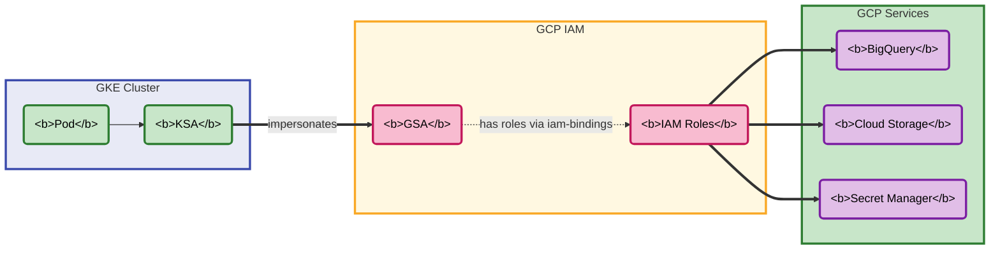

# GKE Workload Identity Template Guide

The Workload Identity template (`_common/templates/workload_identity.hcl`) wraps the upstream `terraform-google-kubernetes-engine//modules/workload-identity` (v41.0.2) to create Google Service Accounts (GSAs) with Workload Identity bindings for GKE workloads.

## Overview

### What This Module Creates

- **GSA (Google Service Account)** -- the GCP identity that pods impersonate
- **IAM Binding** -- `roles/iam.workloadIdentityUser` allowing KSA to impersonate GSA

### What This Module Does NOT Create

- **KSA (Kubernetes Service Account)** -- created by Helm charts via ArgoCD
- **Project IAM Roles** -- managed centrally in `iam-bindings/`

### Key Principles

- **Separation of Concerns**: WI module handles identity; `iam-bindings` handles permissions
- **Helm-Managed KSAs**: Helm charts annotate KSAs with `iam.gke.io/gcp-service-account`
- **Cluster-Prefixed Naming**: GSA names include cluster ID for multi-cluster support
- **No Kubernetes Provider**: Uses `use_existing_k8s_sa=true` to avoid K8s API calls

## Architecture


```mermaid
graph LR
    subgraph GKE["GKE Cluster"]
        POD("&lt;b&gt;Pod&lt;/b&gt;") --> KSA("&lt;b&gt;KSA&lt;/b&gt;")
    end

    subgraph IAM["GCP IAM"]
        KSA ==>|"impersonates"| GSA("&lt;b&gt;GSA&lt;/b&gt;")
        GSA -.->|"has roles via iam-bindings"| ROLES("&lt;b&gt;IAM Roles&lt;/b&gt;")
    end

    subgraph SVC["GCP Services"]
        ROLES ==> BQ("&lt;b&gt;BigQuery&lt;/b&gt;")
        ROLES ==> GCS("&lt;b&gt;Cloud Storage&lt;/b&gt;")
        ROLES ==> SM("&lt;b&gt;Secret Manager&lt;/b&gt;")
    end

    style GKE fill:#e8eaf6,stroke:#3949ab,stroke-width:3px
    style IAM fill:#fff8e1,stroke:#f9a825,stroke-width:3px
    style SVC fill:#c8e6c9,stroke:#2e7d32,stroke-width:3px
    style POD stroke-width:3px,color:#000,fill:#c8e6c9,stroke:#2e7d32
    style KSA stroke-width:3px,color:#000,fill:#c8e6c9,stroke:#2e7d32
    style GSA stroke-width:3px,color:#000,fill:#f8bbd0,stroke:#c2185b
    style ROLES stroke-width:3px,color:#000,fill:#f8bbd0,stroke:#c2185b
    style BQ stroke-width:3px,color:#000,fill:#e1bee7,stroke:#7b1fa2
    style GCS stroke-width:3px,color:#000,fill:#e1bee7,stroke:#7b1fa2
    style SM stroke-width:3px,color:#000,fill:#e1bee7,stroke:#7b1fa2
```

## Directory Structure

Workload Identity resources live at project level to support multiple clusters:

```
live/<account>/<environment>/<project>/
├── project/
├── europe-west2/gke/
│   ├── cluster-01/
│   │   └── bootstrap-argocd/           # Consumes GSA emails
│   └── cluster-02/                     # Future cluster
├── iam-workload-identity/              # All WI resources here
│   ├── cluster-01-argocd-server/
│   ├── cluster-01-external-dns/
│   ├── cluster-01-cert-manager/
│   ├── cluster-01-external-secrets/
│   ├── cluster-01-monitoring/
│   ├── cluster-01-pipeline-sa/
│   ├── cluster-01-google-cas-issuer/
│   └── cluster-02-*/                   # Future cluster WI
└── iam-bindings/                       # Central role assignment
```

GSA names follow the pattern `{cluster-id}-{workload-name}`. The cluster ID is automatically parsed from the directory name.

## Configuration

### Canonical Usage Example

```hcl
# iam-workload-identity/cluster-01-argocd-server/terragrunt.hcl

include "root" {
  path = find_in_parent_folders("root.hcl")
}

include "base" {
  path   = "${get_repo_root()}/_common/base.hcl"
  expose = true
}

include "workload_identity_template" {
  path           = "${get_repo_root()}/_common/templates/workload_identity.hcl"
  merge_strategy = "deep"
  expose         = true
}

locals {
  dir_name   = basename(get_terragrunt_dir())
  cluster_id = join("-", slice(split("-", local.dir_name), 0, 2))
}

dependency "project" {
  config_path = "../../project"
  mock_outputs = {
    project_id = "dp-dev-01-a"
  }
  mock_outputs_allowed_terraform_commands = ["validate", "plan", "init"]
}

dependency "gke_cluster" {
  config_path = "../../europe-west2/gke/${local.cluster_id}"
  mock_outputs = {
    name     = "dp-dev-01-ew2-cluster-01"
    location = "europe-west2"
  }
  mock_outputs_allowed_terraform_commands = ["validate", "plan", "init"]
}

inputs = {
  project_id   = dependency.project.outputs.project_id
  name         = local.dir_name          # cluster-01-argocd-server
  namespace    = "argocd"
  k8s_sa_name  = "argocd-server"
  cluster_name = dependency.gke_cluster.outputs.name
  location     = dependency.gke_cluster.outputs.location
}
```

### IAM Role Assignment

Roles are assigned centrally in `iam-bindings/terragrunt.hcl`, not in the WI module:

```hcl
locals {
  service_account_roles = {
    "serviceAccount:cluster-01-argocd-server@PROJECT.iam.gserviceaccount.com" = [
      "roles/container.developer",
    ]
    "serviceAccount:cluster-01-external-dns@PROJECT.iam.gserviceaccount.com" = [
      "roles/dns.admin",
    ]
    "serviceAccount:cluster-01-pipeline-sa@PROJECT.iam.gserviceaccount.com" = [
      "roles/bigquery.dataEditor",
      "roles/bigquery.jobUser",
      "roles/storage.objectAdmin",
      "roles/monitoring.metricWriter",
    ]
  }
}
```

### Standard Roles by Workload

| Workload | Roles | IAM Scope |
|----------|-------|-----------|
| argocd-server | `roles/container.developer` | Project |
| external-dns | `roles/dns.admin` | Project |
| cert-manager | `roles/dns.admin` | Project |
| external-secrets | `roles/secretmanager.secretAccessor` | Per-secret |
| monitoring | `roles/monitoring.viewer` | Project |
| pipeline-sa | `roles/bigquery.*`, `roles/storage.objectAdmin` | Project |
| google-cas-issuer | `roles/privateca.certificateRequester` | Project |

The `external-secrets` workload uses per-secret IAM bindings instead of project-level access for least privilege.

## Usage

### Deployment Order

Project --> GKE Cluster --> WI Resources --> IAM Bindings --> Bootstrap ArgoCD

### Adding a New Workload Identity

1. Create directory: `mkdir -p iam-workload-identity/cluster-01-my-app`
2. Create `terragrunt.hcl` following the canonical example, setting `namespace` and `k8s_sa_name`
3. Add IAM roles in `iam-bindings/terragrunt.hcl`
4. Annotate the KSA in your Helm chart:
   ```yaml
   serviceAccount:
     annotations:
       iam.gke.io/gcp-service-account: cluster-01-my-app@PROJECT_ID.iam.gserviceaccount.com
   ```

### Multi-Cluster Support

The `{cluster-id}-{workload}` naming convention supports multiple clusters in the same project. Each cluster's `bootstrap-argocd` depends only on its own `cluster-*` WI resources.

## Verification

```bash
# List GSAs with cluster prefix
gcloud iam service-accounts list --project=PROJECT_ID --filter="email~cluster-01"

# Check WI binding for a specific GSA
gcloud iam service-accounts get-iam-policy \
  cluster-01-argocd-server@PROJECT_ID.iam.gserviceaccount.com \
  --format="table(bindings.role,bindings.members)"

# Check project IAM for a GSA
gcloud projects get-iam-policy PROJECT_ID \
  --flatten="bindings[].members" \
  --filter="bindings.members~cluster-01-argocd-server" \
  --format="table(bindings.role)"

# Test from inside a pod
kubectl run test-wi --rm -it \
  --image=google/cloud-sdk:slim \
  --serviceaccount=argocd-server \
  --namespace=argocd \
  -- gcloud auth list
```

## Troubleshooting

- **GSA Not Found** -- deploy the WI resource before IAM bindings or bootstrap-argocd.
- **Pod gets 403 Forbidden** -- check: (1) IAM roles assigned in `iam-bindings`, (2) KSA annotated with GSA email, (3) WI binding exists on the GSA.
- **Module tries to create KSA** -- ensure template has `use_existing_k8s_sa = true` and `annotate_k8s_sa = false`.
- **Namespace mismatch** -- the `namespace` input must match the Kubernetes namespace where the KSA lives.

## References

- [GKE Workload Identity](https://cloud.google.com/kubernetes-engine/docs/concepts/workload-identity)
- [terraform-google-kubernetes-engine workload-identity](https://github.com/terraform-google-modules/terraform-google-kubernetes-engine/tree/master/modules/workload-identity)
- [IAM Bindings Template](./IAM_BINDINGS_TEMPLATE.md)
- [Bootstrap ArgoCD](./BOOTSTRAP_ARGOCD.md)
